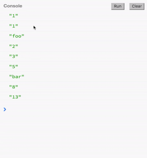

Let's talk about "Reactive Programming." You may have heard of [The Introduction to Reactive Programming You've Been Missing](https://gist.github.com/staltz/868e7e9bc2a7b8c1f754), a gist which I wrote. Maybe it's too long for you to read the whole thing. It's all right. We can explain it through this series of lessons.

A lot of people have heard of **Reactive**, but it sounds too cryptic, too scary, and advanced. For instance, sometimes you see a piece of documentation that looks like this, `flatMapLatest` with `Observable` sequences. This can get really confusing.

#### Documentation
```javascript
Rx.Observable.prototype.flatMapLatest(selector, [thisArg])
```

This series of lessons is here mainly to help you to grasp the core idea in Reactive Programming and to help you how to think in Reactive Programming in order to apply it to a real code base.

What is it? Well, it's mainly programming with **event streams**. Now, what is an event stream? It's a sequence of events happening over time. You can kind of think of it as an asynchronous array.


Here's time, and it goes forward, to the right. Events happen over time, and we can add an event listener to this whole sequence. Whenever an event happens, we can react to it by doing something. That is the main idea.

Another type of sequence that you see in JavaScript, just, for instance, arrays. How do event streams relate to arrays? Well, arrays are sequences in space. All of these items in this array exist now in memory.

#### jsbin
```javascript
console.clear();

var source = ['1', '1', 'foo', '2', '3', '5', 'bar', '8', '13'];

var result = source;

console.log(result);
```

On the other hand, event streams don't have that property. So, the events might happen over time, and you don't even know what are the items that might happen.

```javascript
console.clear();

var source = Rx.Observable.interval(400).take(9)
				.map(i => ['1', '1', 'foo', '2', '3', '5', 'bar', '8', '13'][i]);

var result = source;

result.subscribe(x => console.log(x));
```

Here we have those same items that happened in the array, but we have them happening over time every 400 milliseconds, like this. We add an event listener to the source, event stream, by calling `subscribe`. Whenever an event happens, we just `console.log()` that out, and we saw it happening every 400 milliseconds.



It's different than arrays, because here if we just `console.log()` the array, we see the whole thing at once. The nice thing with event streams is that they have similar functions to arrays.

Let's say that our problem is to add all the numbers in this array. Right? As you can see, they're not actually numbers. They're strings that look like numbers, we have to do some transformations here. 

```
var source = ['1', '1', 'foo', '2', '3', '5', 'bar', '8', '13'];
```

You might want to feel like using `for` loops for doing this, but we're going to use `map` and `filter` and these stuff, which is the functional approach.

Let's take this `source` array, and we will `map` each of these items to their `parseInt` version. This will return a new array. That is important. `source` did not change. We just made a new array that will be called `result` where each of these items is mapped. If we log that `result` array, we get this.

```javascript
var result = source
	.map(x => parseInt(x));
```

#### results
```
[1, 1, NaN, 2, 3, 5, NaN, 8, 13]
```

Sometimes, it was not able to parse it, so we saw not a number. That's how we use `filter` in order to ignore those which are not a number. Then we get yet a new array with only numbers.

```javascript
var result = source
	.map(x => parseInt(x))	
	.filter(x => !isNaN(x));
```

#### results
```
[1, 1, 2, 3, 5, 8, 13]
```

Now, since we want to add all those numbers, we need to call `reduce` by giving `x` and `y`, where `x` is the previous item and `y` is the current item while we're iterating over the array. We can add them. This reduces instead of returning an array, it will return us a number, which is what `result` is. Then finally, we see that we added all the numbers.

```javascript
var result = source
	.map(x => parseInt(x))	
	.filter(x => !isNaN(x))
	.reduce((x, y) => x + y);
```

#### results
```
33
```

We can do the same thing with event streams, actually. Here, we can get this source event stream. It's not an array. We can `map` over it, getting each event `x` and mapping it to `parseInt(x)`. We see basically the same thing, but happening over time.

```javascript
var result = source 
	.map(x => parseInt(x));
```

Obviously we can call `filter`. And then we want to add all those numbers, so we're going to call `reduce`. There we go.

```javascript
var result = source 
	.map(x => parseInt(x))
	.filter(x => !isNaN(x))
	.reduce((x, y) => x + y);
```	

Now, it's ticking over time, adding all those numbers. When it ends, it returns us 33. That is basically programming with event streams.