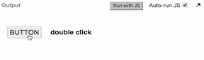
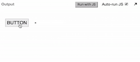
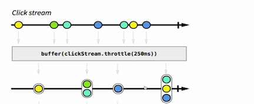
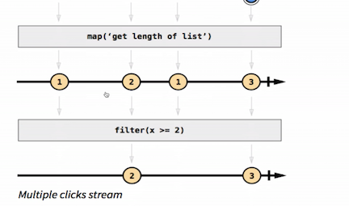
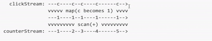

We just saw previously how to transfer event streams of strings emitted over time using `.map` and `.filter`.

Let's take a look at a more useful example. Say we have this `<button>` on the DOM, which can be clicked. Our challenge is to detect when double-clicks happen on this `<button>`. I know the DOM already has the `dblclick` type of event, but let's not use that. Let's actually suppose that the DOM wouldn't give that to us. The question is, "How would you typically solve this without event streams?"

```javascript
var button = document.querySelector('.button');
var label = document.querySelector('h4');
```

Maybe you would `addEventListener()` to this `<button>` for the click events, and maybe when that event listener triggers, you would increment a `counter`, which was initialized to zero. Maybe you would `setTimeout` to later clear that `counter` back to zero, that type of approach. This is what typically most of us would do if we didn't know event streams.

```javascript
var counter = 0;

button.addEventListener()

setTimeout(() ); 

// This code is immediately deleted
```

It wouldn't take three lines of code in this approach. It would take a bit more than that. Let's see the event stream approach instead, which is reactive programming. Say we somehow are 	able to get the event stream of single clicks by just giving the DOM element and the event type. We just `'click'`, and this will create for us that event stream based on the DOM `addEventListener()`.

```javascript
var clickStream = Rx.Observable.fromEvent(button, 'click');

var doubleClickStream;
```

Now we just need to create `doubleClickStream`. We `addEventListener()` to that, and whenever we see a `'double click'` event, we will set the `label` content to `'double click'`. After a second, we're going to clear that out, just for the UI purpose.

```javascript
doubleClickStream.subscribe(event => {
	label.textContent = 'double click';
});

doubleClickStream
	.throttle(1000)
	.subscribe(suggestion => {
		label.textContent = '-';
	});
```

It's actually pretty simple to achieve this with event streams. It's a matter of three operations. We `.buffer()` all of those clicks, and we end that `.buffer()` after 250 milliseconds of silence. Then these buffers return arrays for us, so we `.map` each of these arrays to their `.length`, and then we `.filter` for those `.length`, which are exactly size two.

```javascript
var doubleClickStream  = clickStream
	.buffer(() => clickStream.throttle(250))
	.map(arr =>  arr.length)
	.filter(len => len === 2);
```

That's it. `'double click'` event stream is now ready. When we listen to this, we will see this happening. I double-clicked it, and it set the `label` to `'double click'`, and after one second it cleared it, and that's it. 





If I click just one, nothing happens. If I click three times or many times, then nothing happens. I need to `'double click'`, and then it sets. Nice.

How did we do this? These operators, as you can see, they look important, and maybe you don't even know what they're doing here. How do we understand these operators? It's normally by using marble diagrams. What is that?



Basically, imagine the simple click stream where each of these balls is the click event happening over time. The arrow indicates time. When we called `.buffer()` click stream throughout the whole 250 milliseconds, what it was it waited to 250 milliseconds of event silence to happen on this simple click event stream, and then it accumulated everything from the past into an array.

Here we just had one. Then in this case, after 250 milliseconds of event silence happened, we accumulated all of these events into an array, and that's why we get that array, and so forth. Then we get, as a result, an event stream, which has arrays inside them, containing all of these accumulated clicks.

Then what we do is just `.map` the `.length` of these arrays. Here there's just one in that array, here there's two, and then we're finally able to `.filter` for only those `.length` that are exactly two.



These marble diagrams also come in their ASCII form. We might write them like this, so we might be using this type of notation also in some other examples. 



Even though you probably don't understand all of these operations now, the point is that you can create really powerful constructs with just simple operations in a short amount of code.

This is just the tip of the iceberg of what event streams can accomplish.