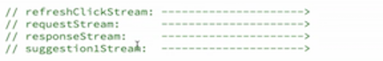
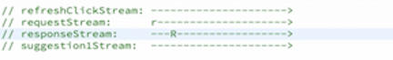
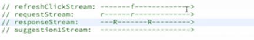
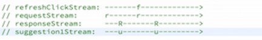
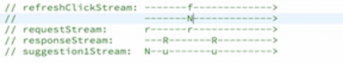
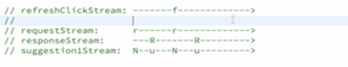
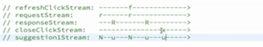

There's one last feature that we haven't implemented yet, and that would be the small X button near each user. When this X is clicked, we're supposed to replace the user with another one. I already made it easy for us by selecting from the DOM each of these three X buttons and creating their respective event streams for clicks.

```javascript
var closeButton1 = document.querySelector('.close1');
var closeButton2 = document.querySelector('.close2');
var closeButton3 = document.querySelector('.close3');

...

var close1Clicks = Rx.Observable.fromEvent(closeButton1, 'click');
var close2Clicks = Rx.Observable.fromEvent(closeButton2, 'click');
var close3Clicks = Rx.Observable.fromEvent(closeButton3, 'click');
```

The feature is supposed to work in a similar way that refresh does, except it's supposed to refresh one user. That's the idea.

Let's take a look at how refresh was done. It was here in this `createSuggestionStream` function. This will return to us this event stream of the suggested user data for one user. That's why we have three of them, because we have three users.

```javascript
function createSuggestionStream(responseStream) {
  return responseStream.map(getRandomUser)
	  .startWith(null)
	  .merge(refreshClickEvent.map(ev => null));
}
```

How does this whole thing work? Let's recap it using marble diagrams. We have `refreshClickStream`, which is an event stream over time, and we also have `requestStream`. Which, by the way, this represents both of these different types of requests. We can even separate that into a dedicated event stream, just a minor refactor.

```javascript
var requestStream = startupRequestStream.merge(requestOnRefreshStream);

var responseStream = requestStream
	.flatMap(requestUrl => {
		return Rx.Observable.fromPromise(jQuery.getJSON(requestUrl))
	})
	.shareReplay(1);
```

This represents either start up requests -- that's what `.merge` accomplishes -- or request on refresh. We also have the `responseStream`. We have the `suggestion1Stream`, which is the output of our `createSuggestionStream` here.



How does it work? Well, initially we start with the start up request, which is `r`. It happens in the beginning. Then after a short while we get the response for that request.



If we click the general refresh button, this event will be mapped to request here from the request on refresh to an `r`. Then after a while, the response for that refresh will arrive.



How does `suggestion1Stream` use those event streams? Well, it maps each of these `responseStream` arrays. This is emitting this big `r`. It means an array full of users. We `.map` that to one random user. That's what we get here. We `.map` this one to a random user, and we `.map` that one to a random user.



Then we prepend this observable with a `null`, here. We're just saying that we start with a `null` user data. Then we `.merge` with the `refreshClickStream` `.map` to `null`. What does that mean? We get this refresh event. We `.map` it to a `null`. Then we get an observable that looks like this, 



so we `.map` that to a `null`. Then we `.merge` this thing into the output here. Then we get that.



OK. Let's try to read this as the output to our function. Initially we have empty user data for the first user. That's correct. Then after a short while, we get the random user on start up. `// suggestion1Stream: N--u---N---u--------->`

Whenever we refresh, we should immediately empty that user data. Then after a while, that random user from the response will arrive.

How do we include the closing with the X button here? Let's write it here together with the others, `closeClickStream`. Since we have three different buttons, we have three different event streams for clicks. We need to use them in order to produce the respective user data.

```javascript
var suggestion1Stream = createSuggestionStream(responseStream, close1Clicks);
var suggestion2Stream = createSuggestionStream(responseStream, close2Clicks);
var suggestion3Stream = createSuggestionStream(responseStream, close3Clicks);
```

It means we are only using clicks from the first button for the first user. The second button's clicks will be used for the second user's data, and so forth.

Now that we have this here, we can include it in the function arguments. Now, we can do something with it.

```javascript
function createSuggestionStream(responseStream, closeClickStream) {
  return responseStream.map(getRandomUser)
	  .startWith(null)
	  .merge(refreshClickEvent.map(ev => null));
}
```

What are we supposed to do? Let's imagine after a while, here we go and we're going to press X on that button. What are we supposed to do? We're supposed to simply replace the user with a new user immediately here. We're looking for this `u` here.



We want to `.map` this `closeClickStream` to a random user. How do we do that? Well, we can just get `closeClickStream`, and `.map` it to a random user. We can call `getRandomUser`, giving it the list of users.

```javascript
function createSuggestionStream(responseStream, closeClickStream) {
	closeClickStream.map(ev => getRandomUser(listUsers));

  	return responseStream.map(getRandomUser)
		.startWith(null)
  		.merge(refreshClickEvent.map(ev => null));
}
```

But, here we have a problem, right? We don't have a list of users available in the scope. Why? Because it's sort of trapped inside of the `responseStream`. I mean, the `responseStream` emits these Rs. These Rs are exactly what I mean with this list of users. So, passing in `R` is the same as saying `listUsers`. 

This is the `listUsers`, and it's sort of trapped inside the `responseStream`. We want to get that. How do we do that? Well, what if we had an operator that would be called, `mapButPleaseAlsoUseTheLatestValueFromThatStream`? You give that here, which would be in our case the `responseStream`.

Now, that's a really long name for an operator. People have made a nice name for this, which is called `.withLatestFrom`. You can specify the sort of sister stream, the `responseStream`. And then we can get that value here.

```javascript
function createSuggestionStream(responseStream, closeClickStream) {
	closeClickStream.withLatestFrom(responseStream,
									(ev, listUsers) => getRandomUser(listUsers))

  	return responseStream.map(getRandomUser)
		.startWith(null)
  		.merge(refreshClickEvent.map(ev => null));
}
```

Whenever an `x` happens here, we're going to use the latest value from the `responseStream`. That's why it's called `.withLatestFrom`. We're going to join this `r` and this `x`. I can actually name this `x` and `r`. And we're going to create a random user here.


That's what we're going to use to `.merge` this into here, and then we finally get that `u` that we wanted. Cool. We just need to `.merge` this guy into our output, like that.

OK, let's see. We can refresh everything, and we can replace one user.