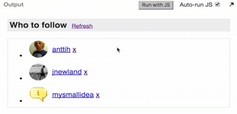
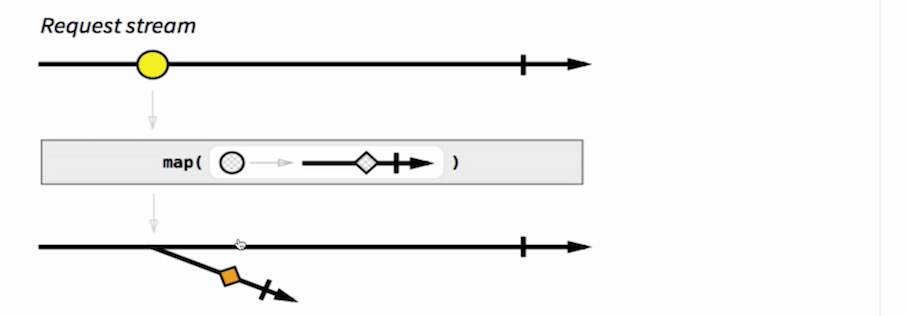
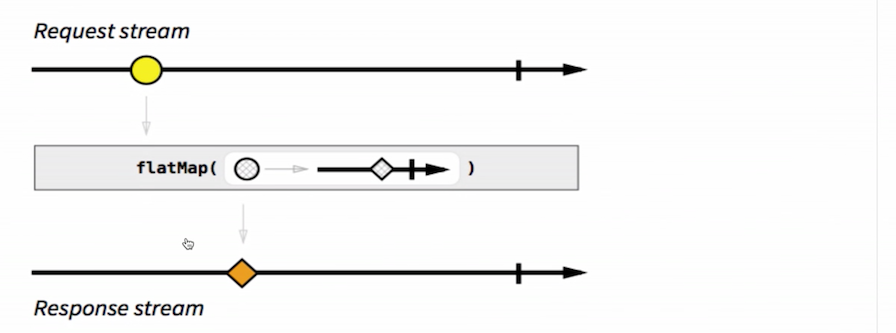

Now we will see how to use reactive programming in practice. We are going to use RxJS as the tool, which is one of the most popular reactive programming libraries out there. We will build a small piece of user interface.

This here is a suggestions box showing a couple of GitHub users that you could follow. It has these features. On start up, it loads accounts from the API, and it displays three suggestions. Each of these rows is a user with their avatar and their username. When you click refresh, it should replace these users with more, three users, and if you click X, then it replaces that user with another suggested user to follow.



Let's start with the easiest feature, which is, on start up, load three user accounts from the back end. Now, this is really just about doing a request, getting a `response`, and rendering that `response`. We need somehow do that with event streams, and let's just start by representing our requests, which are an event stream of strings.

These strings, I mean the URL of GitHub's user endpoint.

```javascript
var requestStream = Rx.Observable.just('https://api.github.com/users');
```

This is just a stream of strings. It does really nothing. We need to somehow make something happen when this string is emitted. We do that by subscribing to that stream, and we get the `requestUrl` that the stream emits, and we do something inside here.

```javascript
requestStream.subscribe(requestUrl => {
	
});
```

How do we normally make network requests in JavaScript? Well, one of the options is to use jQuery to get a promise from this URL. Now this will return us a promise, and once you have the promise, you can give a `.done` handler for the `response`. Now, inside here, we can, for instance, `console.log()` that `response`.

```javascript
requestStream.subscribe(requestUrl => {
	jQuery.getJSON(requestUrl)
		.done(response => {
			console.log(response);
		});
});
```

But, wait a second. Why are we using this way of making network requests if observables can handle asynchronous data streams? Aren't these supposed to already handle this? Why are we using the solution that doesn't look like event streams?

We can try doing this with event streams by creating a `responseStream` event stream. The way we do that is by wrapping that promise from jQuery inside an `Observable` like this. 

```javascript
requestStream.subscribe(requestUrl => {
	var responseStream = Rx.Observable.fromPromise(jQuert.getJSON(requestUrl));
});
```

What we have here is a `responseStream` that will be created from that promise, and now we can `subsribe` to that `responseStream` and `console.log()` that.

```javascript
requestStream.subscribe(requestUrl => {
	var responseStream = Rx.Observable.fromPromise(jQuert.getJSON(requestUrl));

	responseStream.subsribe(response => {
		console.log(response);
	});
});
```

If you look at this, it means that the `Observable` can do whatever the promise is doing. Does this mean that a promise is like a simplified version of an `Observable`? You can put one thing in the other. In a way, yeah. Promises are basically a simplified version of an event stream that can have only one value or only one event, which is either the resolved value or an error. They can have only one.

Observables go beyond that. Of course, they can have just one event happening on them, but they can also have multiple. That's why observables are more powerful than promises because they can have multiple events. This is pretty nice, and it shows how observables are more powerful.

We still have a problem with our example here, because we have a `subsribe` inside another `subsribe` and this reminds us of callback hell. We don't want to go to that direction, definitely. How can we solve this?

We know that `Rx.Observable` has operators such as `.map` and things like that. What if we were to try mapping the request to the `response`? That makes some sense. Let's create a `responseStream` that will be the `requestStream` mapped. It means that we're mapping each of these `requestUrl` strings to...

```javascript
var responseStream = requestStream
	.map(requestUrl => 

	);
```

Well, we need to `.map` it somehow to the `response`, and the only way that we can get a `response` is by waiting for that network request to happen. I just wrote this, but I will explain what it means. 

```javascript
var responseStream = requestStream
	.map(requestUrl => 
		Rx.Observable.fromPromise(jQuery.getJSON(requestUrl));
	);
```

Usually, we are mapping from a string to a number or a string to an object or something. Now we have to `.map` from a string to something that will happen later in time.

Usually, we don't `.map` from simple objects and numbers to observables, but this is what we're doing here now. We're mapping to an `Observable`. This looks a bit different to what you're used to, because this is what the marble diagram would look like. This yellow circle is the `requestUrl` string, and it's being mapped to an `Observable` of that `response`. This is what we're doing here.



What you get, as a result, is basically an `Observable` of observables and we call this sometimes **meta stream**. You are probably confused right now, and that's OK. We normally don't work with this, because gladly we have a way of solving this, and that is by calling `.flatMap`. When we call `.flatMap`, instead of getting an output that looks like this, we get an output that looks flat, like that.



What's `.flatMap` do? It basically flattens the meta stream that we got as output here, after it maps. That's basically what it does. In other words, it's emitting on the trunk stream everything that happens on these branch streams, and then it looks nice. `.flatMap` is kind of like `promise.then`. You can think of it as that.

Now that we have this `responseStream` built from the `requestStream`, we can just `subsribe` to that `responseStream` and we can put it in the console. Now we have only one `subsribe`. We don't have that mess of a `subsribe` inside another `subsribe`. And, this works.

```javascript
responseStream.subscribe(response => {
	console.log(response);
});
```

That's part one. Keep on watching, and we're going to see how to build the whole user interface.