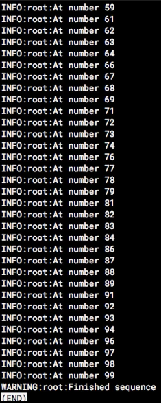
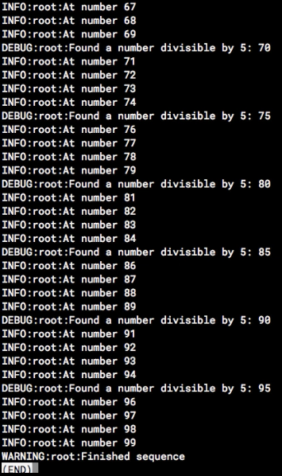
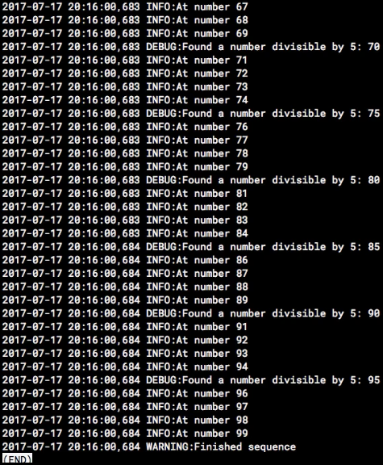
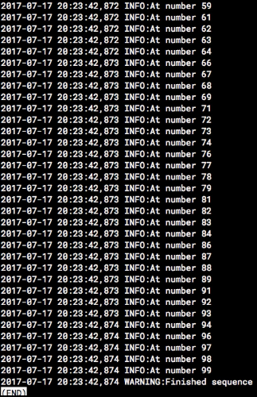
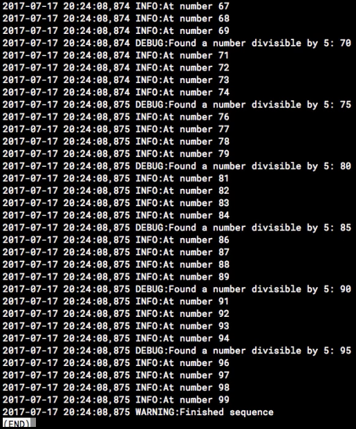

For a lot of us, whenever we think about logging, we think about doing something like this. We just write out a print statement, and then print it out to a console. That works as long as you're running your application interactively, or you take the time to write out that `print` statement to a log file.

#### Terminal
```bash
$ python3
Python 3.7.0 (default, Sep 18 2018, 18:48:06) 
[Clang 8.0.0 (clang-800.0.42.1)] on darwin
Type "help", "copyright", "credits" or "license" for more information.
>>> print('Oops, an error!')
Oops, an error!
```

With Python, though, it's really easy to make professional style logs, and we start by importing the `logging` module. With that imported, we can create a log just by typing `log.warning`, and then the error message or the warning statement, or whatever message it is that you're trying to log.

```bash
>>> import logging
>>> logging.warning('This is a warning')
WARNING:root:This is a warning
```

It writes it out with the severity, the application scope, and then the warning message. It comes with different built-in logging levels, so we start off with critical, which is the most severe, and then we have the error, which is next severe, followed by warning, then info and debug.

When you initialize the logging module just as we did here, just by importing it directly, the default level is set to warning. If I type out an info message, it's not returned because info is a lower threshold than the default setting of warning.

```bash
>>> # critical
... # error
... # warning
... # info
... # debug
... 
>>> logging.info('Info message')
```

That's the way the logging module works, is you set it for the threshold that you want, and it prints out messages at that severity, or of a higher severity. Let's put that into a practical application.

I'm going to create a file called `log_demo.py`. 

```bash
$ vim log_demo.py
```

In it, we will `import` the `logging` module, and then I want to configure it. You do that by typing `logging`, and then use the base config. I'm going to configure it to write to a file name, which we'll call `demo.log`, and then I'm going to set the logging to the `INFO` level.

#### log_demo.py
```python
import logging

logging.basicConfig(filename='./demo.log', level=logging.INFO
```

To create a loop, we'll just do for `i in range(0, 100)`. Then we'll say `if i % five == 0`, so in other words, if the number is evenly divisible by five, we're going to write out a debug statement. Otherwise, we'll just write out an info statement to show what number we're at.

```python
for i in range(0, 100):
  if i % 5 == 0:
    logging.debug('Found a number divisible by 5: {0}'.format(i))
  else:
    logging.info('At number {0}'.format(i))
```

Finally, we'll write out a warning message to show you that it's completed the loop, and it has run out of numbers. 

```python
logging.warning('Finished sequence')
```
We can execute that by providing the `Python 3` command and the name of our file, and it's going to execute.

#### Terminal
```bash
$ python3 log_demo.py
$ less demo.log
```

Now, if we take a look at the log file that was generated, we can see that it iterated through all of the numbers, and when it finished, it wrote out the warning message. 



What it didn't do is it didn't write out any of the debug statements, because if you look right here, we had our logging level set to info.

Let's change that to the `DEBUG` level. 

#### log_demo.py
```python
logging.basicConfig(filename='./demo.log', level=logging.DEBUG
```

We'll save that, run the command again, 

#### Terminal
```bash
$ python3 log_demo.py
$ less demo.log
```

and then take a look at our log file again. 



Now, we see that we changed our logging level, so the debug statements are written every time it encountered a number that was evenly divisible by five.

That's not too bad, but logs really need the time stamp of when the event happened, because it could have been minutes ago, seconds ago, or days ago. We need to know what that is.

Let's go back in, and we'll go back to our basic config here, and we can add the time by changing the default `format` to include the time. Then we will include the level of the log followed by a colon, and then include the log `message` itself.

#### log_demo.py
```python
logging.basicConfig(filename='./demo.log', level=logging.DEBUG, format='%(asctime)s %(levelname)s:%(message)s')
```

We'll save that, run our script again, 

#### Terminal
```bash
$ python3 log_demo.py
$ less demo.log
```

and then take a look at our log file. Now look at these logs. We've got the time stamp, the severity, and the log message there.



This is nicely formatted so that we can send this log file over to Logstash or Splunk, or AWS Cloud Logs, and it's going to be able to parse this easily and aggregate that so that we can take a look at a high level and see the number of error messages by type aggregated over a specific time window.

We can look at the number of logs by severity, and we can drill down and see the counts based on the type of message that it is or specific error message even, which is a really professional feature to have built into your application.

Let's add one more little feature to our script. Let's add the ability to specify the log level on the command line. Doing this is going to allow us to have a default log level, but then whenever we need some extra detail of our logs, we can just specify that log level via the command line and get the extra logging.

I'm going to start by `import sys`, which is going to allow us to read the command line arguments, and then I'm going to `import getopt`, which is going to give me a nice way to parse the command line arguments.

#### log_demo.py
```python
import sys
import getopt
```

Arguments are passed to Python as a list, and the first argument name is the name of the script being executed, which we don't really care about. I'm going to create two variables here, `ops` and `args`, and then use `getopt` to parse `sys.argv`, which is our system arguments.

Because we know that the first argument's the name of the script, I'm going to slice that list to exclude the first character, or the first argument. Then I'm going to look for two parameters, either an `l` or the text `log=`, and I'll show you how to utilize both of those.

```python
opts, args = getopt.getopt(sys.argv[1:], "l:", ["log="])
```

We're going to iterate over the arguments that we captured, and then if the opt value is one of either a `-l` or `--log`, that indicates we've got a log level parameter supplied to our application.

```python
for opt, arg in opts:
  if opt in ("-l", "--log"):
```

We're going to set our log level equal to `getattr`, get attribute, for the upper case value of the argument that was passed in. 

```python
for opt, arg in opts:
  if opt in ("-l", "--log"):
    log_level = getattr(logging, arg.upper())
```

Let's recap that real quick.

We got the options that were passed to our command line using the getopt module, and then we iterated through that. For each of the options that were passed to it, if the option was a `-l` or `--log`, we're going to assume that that's the new log level for our application.

```python
log_level = getattr(logging, arg.upper())
```

Then we do this get attribute thing to get the numeric value for the level that was passed in. I'll show you how that works in just a minute. 

The last thing we need to do is change our logging level to our variable that we created there, `log_level`. We also need to specify a default log level, so that should do it.

```python
log_level="INFO"

logging.basicConfig(filename='./demo.log', level=log_level, format='%(asctime)s %(levelname)s:%(message)s')
```

Let me show you that get attribute thing real quick. I'm just going to a Python console here. I'm going to `import logging`, so all of the logging levels have a numeric value. If I do get the attribute from `logging` and then specify info, it returns `20`, or if I specify debug, it returns 10. Critical returns `50`, so basically, all of these different log levels have a numeric value. What we're doing in our application here is we're getting the text value that we've passed in through the command line, converting that to the numeric value for our log level, and using that as our log level.

#### Terminal
```bash
$ python3
Python 3.7.0 (default, Sep 18 2018, 18:48:06) 
[Clang 8.0.0 (clang-800.0.42.1)] on darwin
Type "help", "copyright", "credits" or "license" for more information.
>>> import logging
>>> getattr(logging, "INFO")
>>> 20
>>> getattr(logging, "DEBUG")
>>> 10
>>> getattr(logging, "CRITICAL")
>>> 50
```
We'll execute our script again. We'll use `-l`, and then specify `info`. 

```bash
$ python3 log_demo.py -L info
$ less demo.log
```

If we take a look at our log, we can see that just the info statements were iterated out, plus our warning sequence.



If we do it with `--log`, which was the other option that we provided, and we set that to debug, 

```bash
$ python3 log_demo.py --log debug
$ less demo.log
```

looking at our log file now, we've included the debug statements in there just by passing the log value into a command line.



Finally, if we do it with just warning and then take a look at our log file again, the only thing that was written out that time was just a warning message itself.