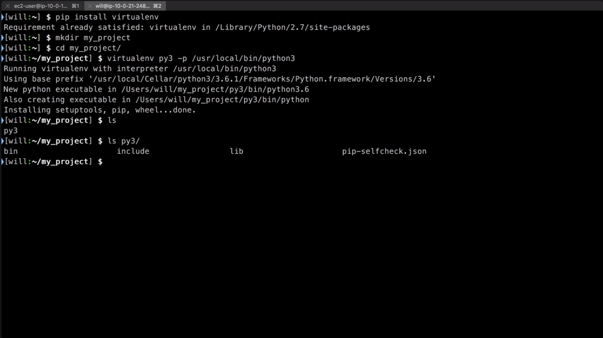

Virtual environments allow us to keep dependencies for different projects in separate places. To use it, we need to install it, so we'll type `pip install virtualenv`, and I've already got it installed, so there's nothing for it to do.

### Terminal
```bash
$ pip install virtualenv
```

To get started using it, I'll create a directory for my project, change into that directory, and then create the virtual environment with the virtual env command, and a name for my virtual environment.

``` bash 
$ mkdir my_project
$ cd my_project/
```

At the same time, I can also tell it which Python I want to use, whether it's Python 2 or Python 3. Since my system defaults to Python 2, I want to use Python 3, so I'll provide the path to Python 3, `/usr/local/bin/python3`.

```bash
$ virtualenv py3 -p /usr/local/bin/python3
```

If we take a look at the directory here, there's a new directory called py3, and if we look inside that directory, there's all of the Python requirements to run that virtual environment.



Look at this. I can type `python --version`, and it shows I'm running Python 2.7. To activate this virtual environment, I'll type `source`, the name we gave it, the `bin` directory, and the `activate` command.

```bash
$ python --version
Python 2.7.13
$ source py3/bin/activate
[py3] $ 
```

Notice that it changed my prompt there to show that I'm now working from the py3 virtual environment. If I run the same command, python --version, I'm now running Python 3.6.1.

```bash
[py3] $ python --version
Python 3.6.1
```

I can use Python like I normally would, including installing packages using pip. I can `pip install request` to install Request Library. That gets installed, and now watch this.

```bash
[py3] $ pip install request   
```

I can type `pip freeze`, and pipe the output of that to a file called `requirements.txt`. If we take a look at that, it's listed all of the libraries that I have installed in this virtual environment, as well as their version.

```bash
[py3] $ pip freeze > requirements.txt
[py3] $ cat requirements.txt
certifi==2017.4.17
chardet==3.0.3
idna==2.5
jmespath==0.9.3
requests==2.17.3
urllib3==1.22.1
```

What that means is I can include this requirements.txt as part of my repo for this. Whenever someone else checks out this repo, they can type `pip install -r requirements.txt`, and pip will install the exact same requirements that this virtual environment specifies so that we know that everyone's running on the same dependency versions.

```bash
[py3] $ pip install -r requirements.txt
```

When I'm all done, I can just type `deactivate`. Notice that my cursor changed back to remove me from the virtual environment, and I can type `python --version`, and I'm back on Python 2.7.

```bash
[py3] $ deactivate 
$ python --version
Python 2.7.13
```

One thing you'll want to do, though, is be sure that you exclude this `py3`, or whatever name you gave your virtual environment, from your source control system so that the virtual environment itself isn't included in your repository chest or `requirements.txt` specifying the library versions.