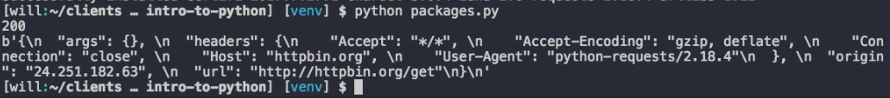

You should never need to install pip. It's available on Python 2.7 and later and Python 3.4 and later by default. It's also installed when using a virtual environment, which you should always be using so that you isolate your dependencies and prevent one package dependency from clobbering the same dependency in another application.

Remember, you can create a new virtual environment using the `virtualenv` command, with a `-p` and then the path to Python on your system and in the name of the virtual environment that you want to create.

#### Terminal
```bash
$ virtualenv -p /usr/local/bin/python3 venv
```

You can then activate it by typing `source` [the directory that you installed it in] `/bin/activate`. To install package, you'll type `pip install` and then the name of the package. For example, to install a package request, which allows you to make HTTP requests from your application, we'll type `pip install request.`

```bash
$ source venv/bin/activate
$ pip install requests
```

That's now installed. We can use it in our application by importing it. To show you a quick example of how it works, we can type `request.get` or `httpbin.org/get` Then we'll just print status code. We'll print the content.

#### packages.py
```python
import requests

r = requests.get('http://httpbin.org/get')
print(r.status_code)
print(r.content)
```

Now when I execute it, 

#### Terminal
```bash
$ python packages.py
```

the request library is used to execute the get request against the httpbin.org. The status code is printed out. Then the contents of the response are printed out. 



Knowing which package to install is a different matter. If you know you need to communicate with your AWS assets, you might do a Google search on Python AWS. That's going to lead you to the Amazon SDK for Python. When you click that link right here in the right hand corner, we have the instructions to install it, `pip install boto3.`

```bash
$ pip install boto3
```

You can also use pip to search with `pip search` command and then the search term that you're looking for. 

```bash
$ pip search aws
```

Sometimes this is a little less effective, because, in the list of everything that's returned here, it may be difficult to find what you're actually looking for.

For the example of trying to use our AWS assets, we were actually looking for the package boto3. But we didn't know that right up front. We searched for AWS. This is everything that was returned. Eventually in here we'll find the package boto3.

You can use the command `pip list` and it'll show you all the packages that have been installed in your Python environment. 

```bash
$ pip list
```

You can also use `pip list --outdated.` That will show you the packages installed that are not at the latest stable version.

```bash
$ pip list --oudated
```

It's a great way to ensure your packages are up-to-date and have the latest features and security updates available. To uninstall a package, you can use `pip uninstall` and then the name of the package, for example, requests. You get prompted for confirmation. It's removed. If we type `pip list` again, we can see that requests is no longer in the environment.

```bash
$ pip uninstall requests

Proceed (y/n)? y

$ pip lists
```

I mentioned at the beginning of this lesson that virtual environments can help you prevent clobbering different dependency versions by isolating your Python installation. Let me show you how that works.

I'm going to install the pip requests library again. I'm also going to `install` the boto3 library. 

```bash
$ pip install requests
$ pip install boto3
```

If I do a `pip list`, you can see all the different packages that are installed in my Python installation. Now I'm going to freeze dependencies. I'm going to do that by typing `pip freeze`. Then pipe the output to a file called "requirements.txt."

```bash
$ pip list
$ pip freeze > requirements.txt
```
What that's going to do is it takes all of the packages I have installed and grabs not only the package but also its version number and puts it in this file called "requirements.txt." Let me show you why that's important. I'm going to deactivate my virtual environment, which means I'm leaving the virtual environment. It was in the directory called `venv`. I'm going to remove that directory. To show you that worked, I can type `which Python.` It's just pointing to `usr/local/bin/python` on my system.

```bash
$ deactivate
$ rm -rf venv
$ which python
/usr/local/bin/python
```

I'm going to create a new virtual environment, specify the path to my Python environment, making sure I pick Python 3. Then give it a name. We'll give it `venv` again. We're going to activate that virtual environment by typing `source venv/bin/activate`. If I do `which Python`, it points to my virtual environment.

```bash
$ virtualenv -p /usr/local/bin/python3 venv
$ source venv/bin/activate
$ which python
```

And if I run `pip list`, the packages that I had previously are no longer there. 

```bash
$ pip list
```

Now I'm going to type `pip install -r` and then point it to that `requirements.txt` file.

```bash
$ pip install -r requirements.txt
```

Let that run. When I type `pip list` again, 

```bash
$ pip list
```

all of my dependencies along with the correct version are there. Now my entire team can work on the same application and avoid any issues that may have resulted from having different dependency versions being installed in different systems.