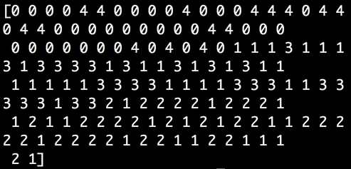
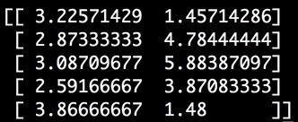
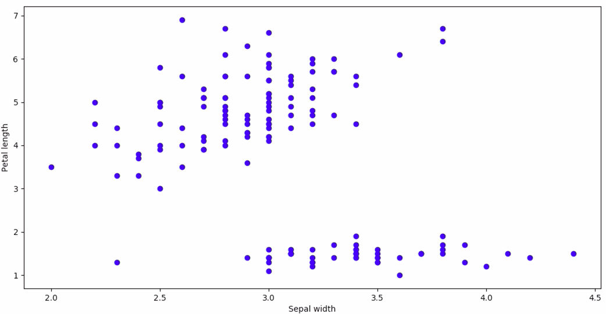
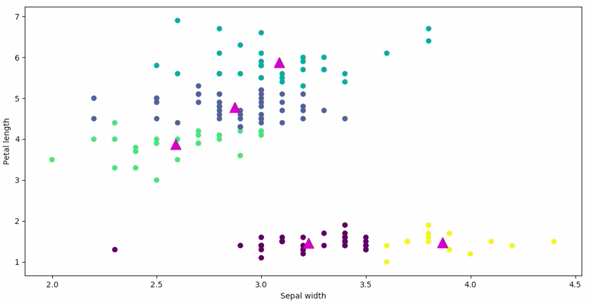

Instructor: [00:00] From `sklearn`, we'll `import datasets`. From `sklearn.cluster`, we'll `import KMeans`. We'll `import matplotlib.pyplot as plt`. We'll be working with the `iris` dataset, which is `datasets.load_iris`. Let's `print` out our `feature_names`.

```python
from sklearn import datasets
from sklearn.cluster import KMeans
import matplotlib.pyplot as plt

iris = datasets.load_iris()

print iris.feature_names
```

[00:28] We can see we have four features here. `KMeans` is an unsupervised algorithm, which means that it's used on data that doesn't have labels. Even though this dataset has target labels, we're going to be ignoring it for the purpose of teaching `KMeans`.


[00:43] We'll assign our `X` to be `iris.data`. For simplicity's sake, we're just going to take two features to work with. We'll take the middle two features. From here, we can say `model = KMeans()`.

```python
X = iris.data[:, 1:3]

model = KMeans()
```

[01:01] `KMeans` is a clustering algorithm, which means that we give it a number of clusters, and it figures out how to divide the data into that many clusters. It does this by creating centroids which are set to the mean of the cluster that it's defining. Let's see how that works.

[01:18] If we say `n_clusters`, our number of clusters, equals `5`, and we'll also pass in a `random_state`, which will be `0`, and then we say `model.fit` and pass it our `X` data, then we `print model.labels`. 

```python
model = KMeans(n_clusters=5, random_state=0)
model.fit(X)

print model.labels_
```

We can see the k-means model has taken our `X` data and assigned a label from 0 to 4 for each data point.



[01:50] Even though `KMeans` is not a classification tool, `print model.labels_` is the same as saying `print model.predict(X)`. We can also `print model.cluster_centers_`. These are the centroids of each delineated cluster. 



Let's visualize these.

[02:18] We'll say `plt.scatter`. First, let's plot our `X` data, the first variable and the second variable. We'll say the `color` is `blue`. We'll do an `xlabel` and a `ylabel`. Then we'll say `plt.show`. 

```python
plt.scatter(X[:, 1], c='b')
plt.xlabel("Sepal width")
plt.ylabel("Petal length")
plt.show()
```

This is how two features of the data look plotted. 



If we want to add our `centroids`, we can say `plt.scatter(centroids)`, first variable, and second variable.

[03:11] We can say `marker` equals and then whatever shape we want it to look like, `size` equals `170`, `zorder` equals `10` so that it will come to the top, and then `color` equals `magenta`. Let's also change our data color to be the `model.labels_`. This will be the color of the cluster that k-means has put the data point into.

```python
plt.scatter(centroid[:, 0], centroids[:, 1], marker='^', s=170, zorder=10, c='m')
plt.scatter(X[:, 0], X[:, 1], c=model.labels_)
plt.xlabel("Sepal width")
plt.ylabel("Petal length")
plt.show()
```

[03:41] Here we can see the five groups that `KMeans` has clustered this dataset into. 



If you thought this looked good, you could investigate further, and look for patterns and similar variables, and try to find connections that you might not have otherwise, but looking at this, it looks a little arbitrary.

[03:58] It's also worth playing around with the number of clusters. `KMeans` is a good tool for exploring your data and for creating classes and labels if your dataset doesn't have them.