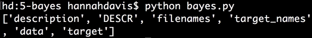
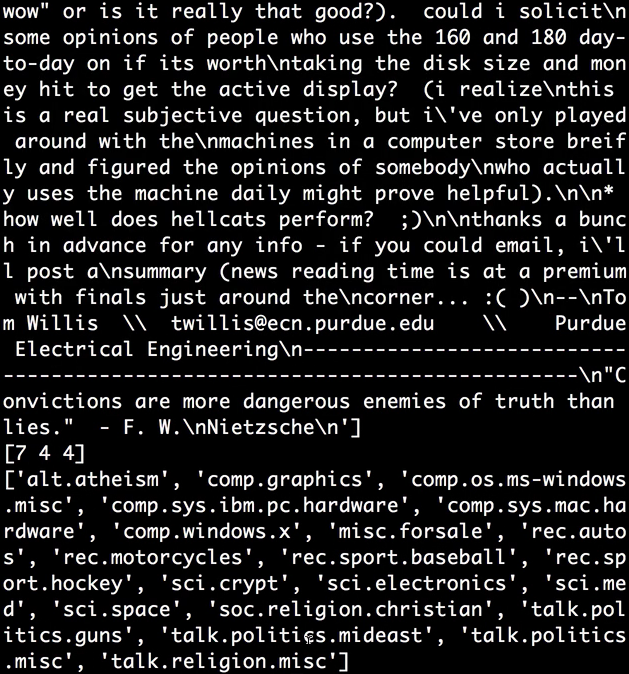
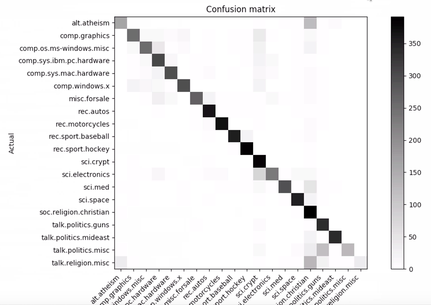

Instructor: [00:00] From `sklearn`, we'll `import` our `datasets`. We'll `import metrics`. From `sklearn.feature_extraction.text`, we'll `import` the `TfidfVectorizer`, which will help make our text understandable to the model. Then from `sklearn.naive_bayes`, we'll `import` the `MultinomialNB`.

[00:36] We'll also `import matplotlib.pyplot as plt`. If you'd like to visualize the confusion matrix at the end of this, `from pandas_ml import ConfusionMatrix`.

```python
from sklearn import datasets
from sklearn import metrics
from sklearn.feature_extraction.text import TfidfVectorizer
from matplotlib.pyplot as plt
from pandas_ml import CnofusionMatrix
```

[00:54] We're going to be working with the newsgroups dataset. We access this a little differently. `newsgroups_train` will be `datasets.fetch_20newsgroups()`, and we'll pass in an argument `subset='train'`, and `newsgroups_test = datasets.fetch_20newsgroups(subset='test')`. The data has already been split into training and test datasets for us. Let's explore this dataset a little bit.

```python
newsgroups_train = datasets.fetch_20newsgroups(subset='train')
newsgroups_test = datasets.fetch_20newsgroups(subset='test')

print newsgroups_train.keys()
```

[01:37] We see the common keys. 



Let's print now a couple items of the data and a couple target labels. Let's `print` our category names or `target_names`. 

```python
print newsgroups_train.keys()
print newsgroups_train.data[:3]
print newsgroups_train.target[:3]
print newsgroups_train.target_names
```

We can see that each data point is a bunch of text. We have three category labels in our target. The target names include these 20 categories of news text. We have 'baseball', 'for sale', 'motorcycles', 'religious talk', 'political talk', etc.



[02:18] The next thing we need to do is vectorize our text, and this means turn it from words into a model understandable vector of features represented by numbers. To do this, we can say `vectorizer = TfidfVectorizer`. `Tfidf` stands for term frequency-inverse document frequency. It's a metric commonly used for analyzing text. We'll be using this as the lens through which to examine our text.

[02:49] We'll say `X_train = vectorizer.fit_transform(newsgroups_train.data)`. `X_test = vectorizer.transform(newsgroups_test.data)`. Our `y_train = newsgroups_train.target`. Our `y_test = newsgroups_test.target`. From there, we can say `model = MultinomialNB`.

[03:31] We can say `model.fit(X_train, y_train)` data. Then our `predictions` will be `model.predict` our `X_test` data. We can `print` our `model.score` and `metrics.classification_report` with our accurate labels and our `predictions`. 

```python
vectorizer = TfidfVectorizer
X_train = vectorizer.fit_transform(newsgroups_train.data)
X_test = vectorizer.transform(newsgroups_test.data)

y_train = newsgroups_train.target
y_test = newsgroups_test.target

model = MultinomialNB
model.fit(X_train, y_train)

predictions = model.predict(X_test)

print model.score(X_test, y_test)
print metrics.classification_report(y_test, predictions)
```

For 20 classes, that's not bad.


[04:09] One last thing we can do is visualize our confusion matrix. For this many classes, let's make the visualization a little bit better. We'll use `pandas_ml` to do that.

[04:19] First, we're going to make a variable called `labels`, which is a `list` of our `newsgroups_train.target_names`, so those are the category names, and then our `cm = ConfusionMatrix`. We pass in `y_test`, our `predictions`, and the `labels` names. We say `cm.plot()` and, finally, `plt.show()`.

```python
labels = list(newsgroups_train.target_names)
cm = ConfusionMatrix(y_test, predictions, labels)
cm.plot()
plt.show()
```

[04:55] This confusion matrix helps us a lot. 



We can see that in general the model does a decent job predicting most of these categories. It also highlights areas where there was confusion very easily.

[05:07] We can see that there were a lot of predictions for 'religion.christian' for other categories. Looking at the categories, it kind of makes sense. The 'atheism' category probably has a big overlap, 'medicine' a tiny bit. General, miscellaneous 'religious' talk will also have a lot of overlap. This is a great tool to see what you can focus on and optimize next.