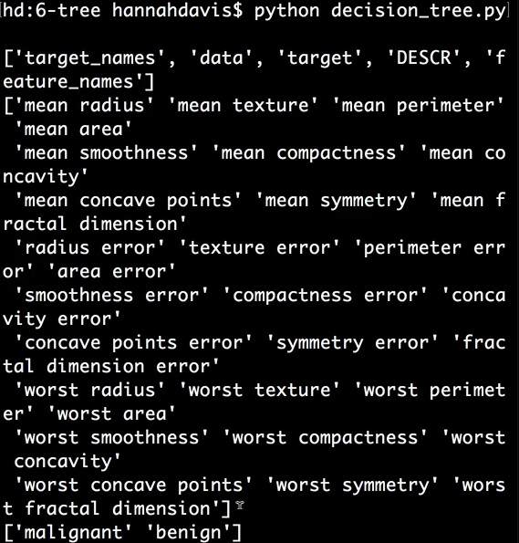
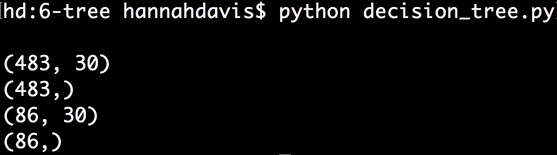
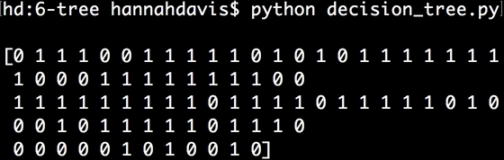
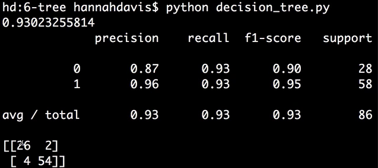
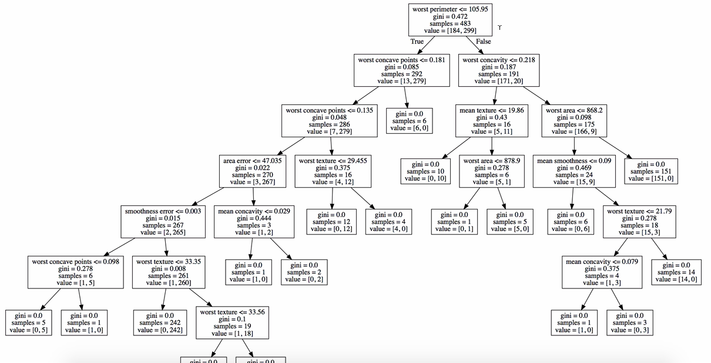
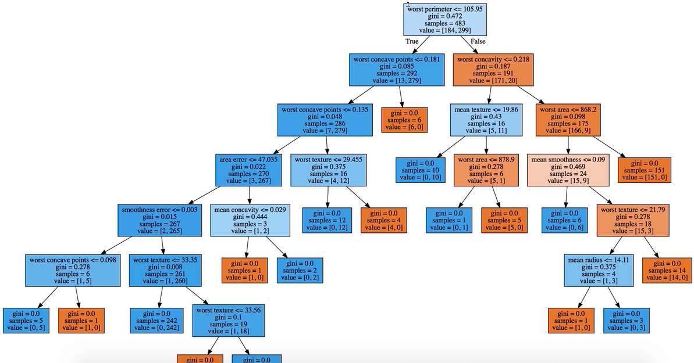

Instructor: [00:00] From `sklearn`, we'll `import datasets`. We'll `import` our `metrics`. We'll `import` the `train_test_split` function. From `sklearn`, we'll `import tree` for our decision tree. We'll also `import graphviz`. We'll be working with the `breast_cancer` dataset, which is `datasets.load_breast_cancer`.

```python
from sklearn import datasets
from sklearn import metrics
from sklearn.model_selection import train_test_split
from sklearn import tree
import graphviz

breast_cancer = datasets.load_breast_cancer()
```

[00:36] Let's print some information about this dataset. We can print the `keys()`. We'll print the `feature_names` and the `target_names`. 

```python
print breast_cancer.keys()
print breast_cancer.feature_names
print breast_cancer.target_names
```

We can see we have quite a few features here describing the tumor. Our target categories are whether the tumor is malignant or benign.



[01:10] We'll assign `X` to be `breast_cancer.data`. y is `breast_cancer.target`. Then we'll make our training and test data by saying `X_train, X_test, y_train, and y_test = train_test_split`, pass it our `X` and `y`, and a `test_size`, which is the amount of data that we want to go into the test dataset, so we'll say `15` percent, and a random_state, which will be `33`.

```python
X_train, X_test, y_train, and y_test = train_test_split(X, y, text_size=0.15, random_state=33)
```

[01:46] We can `print X_train.shape`, and `y_train.shape`, and `X_test.shape`, and `y_test.shape`. 

```python
print X_train.shape
print y_train.shape
print X_test.shape
print y_test.shape
```

We can see that our data is '483' data points with '30' features each. Our test data is '86' data points with '30' features each. We have '483' target labels and '86' target labels for the test data.



[02:23] From here, we can say `model = tree.decision_tree_classifier`. Then we can say `model.fit` and pass our training data. We can make some `predictions` by saying `model.predict` and pass in our `X_test` data. 

```python
model = tree.decision_tree_classifier
model.fit(X_train, y_train)

predictions = model.predict(X_test)

print predictions
```

If we `print` those `predictions`, we can see a whole bunch of labels labeled either malignant or benign.



[02:55] Like usual, we can `print` our `model.score` with our `X_test` and `y_test` variables. We can `print` our `metrics.classification_report` with our accurate labels and our `predictions`. We can `print` our `confusion.`matrix with our accurate labels and our `predictions`. 

```python
print model.score(X_test, y_test)
print metrics.classification_report(y_test, predictions)
print metrics.confusion_matrix(y_test, predicitons)
```

We can see the model got most right but misclassified a couple in each class.

 

[03:33] But what decision trees are really good for is helping us figure out which variables are most important. To help understand this, we're going to visualize the decision tree. We'll do this by saying `graph_data = tree.export_graphviz`. We pass our `model`.

[03:55] We say `out_file = None`. We'll say `feature_names = breast_cancer.feature_names`. Then we'll say `graph = graphviz.Source`, our `graph_data`. Then we'll say `graph.render("breast_cancer", view = True)`. 

```python
graph_data = tree.export_graphviz(model, out_file = None, feature_names = breast_cancer.feature_names)
graph = graphviz.Source(graph_data)
graph.render("breast_cancer", view = True)
```

What this will do, it will immediately create and pop up a PDF of our decision tree.



[04:26] How the decision tree works is it evaluates each variable that we have according to some metric. One popular one is called information gain. Another one is the value genie. This basically tells us which of our features are most helpful to predict these classes, with the most valuable features appearing toward the root of the decision tree.

[04:49] We can include more argument on our `graph_data`, which is filled=True. 

```python
graph_data = tree.export_graphviz(model, out_file = None, feature_names = breast_cancer.feature_names, filled=True)
```

The colors help show the majority class for each box.



[05:00] We can see in this top box at the root of the decision tree is checking if the worst parameter is smaller than 105.95. It's checking all 483 samples from our training data, and then showing that for 184 of those samples the value is True and for 299 of those samples the value of worst parameter being smaller than 105.95 is False.

[05:24] When the genie value gets to 0, that means all samples will be in either one class or another, as in the case of the middle, left, blue box where 0 of the samples are malignant and 12 are benign.