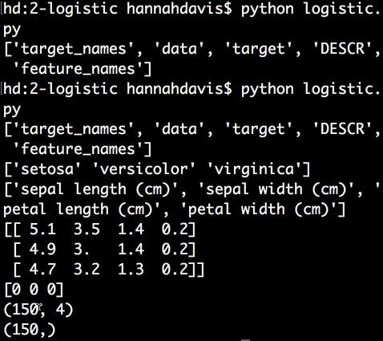
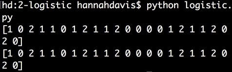
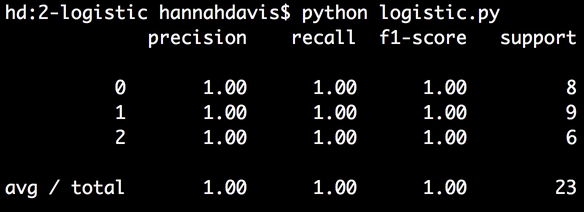
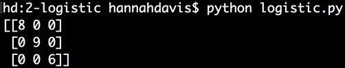

Instructor: [00:00] From `sklearn`, we'll `import datasets`. We'll `import metrics`. We'll `import train_test_split`. From `sklearn.linear_model`, we'll `import LogisticRegression`. We'll be working with the `iris` dataset which is `datasets.load_iris`.

```python
from sklearn import datasets
from sklearn import metrics
from sklearn.model_selection import train_test_split
from sklearn.linear_model import LinearRegression

iris = datasets.load_iris()
```

[00:32] Let's explore this. Let's `print iris.keys()`. We'll `print iris.target_names`. We'll `print iris.feature_names`. Let's `print` a couple lines of `iris.data` and a couple of the `target` labels. Let's also print the `shape` of the `data` and the `shape` of the `target`.

```python
print iris.keys()
print iris.target_names
print iris.feature_names
print iris.data[:3]
print iris.target[:3]
print iris.data.shape
print iris.target.shape
```

[01:05] We can see our three `iris` classes. We can see four features. We can see that each data point has a value for each feature. We can see that the first three targets are all class zero. We can see that our `data` is a 150 data points, with four features each, and our `target` also has 150 points.



[01:28] We'll assign `X` to our `iris.data` and `y` to `iris.target`. Then, we're going to split our data into training and test data sets. We say, `X_train, X_test, y_train, y_test = train_test_split()`. We pass it our `X`, and our `Y`, and a `test_size`, which is the percent of our data that we want to go into the test dataset, so we'll say `15` percent. Then our `random_state`, which we'll say is `42`.

```python
X_train, X_test, y_train, y_test = train_test_split(X, y, test_size=0.15, random_state=42)
```

[02:09] From there, we say `model = LogisticRegression()` and say `model.fit()`, pass it our training data, `(X_train, y_train)`. Then we can make `predictions` by saying `(model.predict, X_test)` data. Let's `print` our `Y_test` data, or the accurate labels and the `predictions` labels. We can see this looks well predicted.



[02:40] To evaluate the model, we can say `model.score` and pass it our `X_test` data and our `Y_test` data. We'll print that out, and that's a perfect score, `py, 1.0`. For `LogisticRegression`, the default score is called an `accuracy_score`. This is the same as doing `metrics.accuracy_score` and passing in the `Y_test` data, or the accurate labels and the predicted labels.

```python
print model.score(X_test, y_test)
print metrics.accuracy_score(y_test, predictions)
```

[03:16] Scikit-learn also comes with a classification report which you can access by typing `metrics.classification_report`, and passing in the accurate labels and the predicted labels. 

```python
print metrics.classification_report(y_test, predictions)
```

There are four variables here. 'precision' is the amount of true positive predictions over the amount of true positives and false positives.



[03:43] This (`precision`) is like the probability of a positive production being accurately positive. `recall` is the amount of true positives over the amount of true positives plus false negatives. This is basically saying, "What is the probability that the model will pick up on a true positive?" The `f1-score` is a combination of `precision` and `recall`, and `support` is the number of samples in each class in the dataset.

[04:10] One last tool that scikit-learn gives us is the confusion matrix. We can type `metrics.confusion_matrix`, pass in our accurate labels and our predicted labels. 

```python
metrics.confusion_matrix(y_test, predictions)
```

This is the matrix of how the model performed with the actual classes on the left and the predictions on the top.



[04:34] This confusion matrix shows a perfect prediction, where the eight samples in class zero were accurately predicted, the nine samples in class one were accurately predicted, and the six samples in class two were accurately predicted.