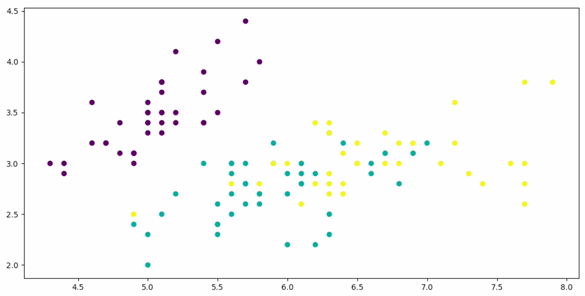
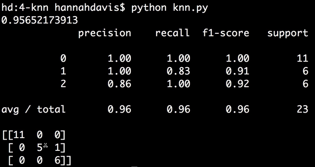

Instructor: [00:00] From sklearn, we'll `import datasets`. We'll `import` our `metrics`. We'll import our `train_test_split`. From sklearn, we'll `import` `neighbors`. We'll also import `matplotlib.pyplot as plt`. We're working with the `iris` dataset, which is `datasets.load_iris`. We'll assign our `X` to be `iris.data` and our `y` to be `iris.target`.

```python
from sklearn import datasets
from sklearn import metrics
from sklearn.model_selection import train_test_split
from sklearn import meighbors
from matplotlib.pyplot as plt

iris = datasets.load_iris()

X = iris.data
y = iris.target
```

[00:39] Then we'll split our dataset up into training and test datasets. We'll say `X_train, X_test, y_train, y_test = train_test_split()`, pass it our `X`, and `y`, and a `test_size` -- which is the percentage of the data that we want to go into our test dataset -- we'll say `15`, and our `random_state`, let's say `2`. 

```python
X_train, X_test, y_train, y_test = train_test_split(X, y, text_size=0.15, random_state=2)
```

Let's visualize how k-nearest neighbors works.

[01:12] Let's plot by saying `plt.scatter()`. Let's just plot the first two variables of X -- in Python, the syntax looks like that -- to take the first variable and the second variable. We could also pass in a color argument. The color will be based on the `y` labels. Then we have to type `plt.show()`.

```python
plt.scatter(X_train[:, 0], X_train[: 1], c=y_train)
```

Let's see how this looks. Here we can see our three classes of data.



[01:46] The way k-nearest neighbors works is that it looks at a certain number of neighbors and predicts the label based on the labels of those neighbors. Let's see how this works in practice. Into our scatter plot, we'll add our test data, again only using the first two variables for simplicity's sake. We'll `color` these `magenta`. 

```python
plt.scatter(X_test[:,0], X_test[:,1], c='m')
```

These are the data points we're making predictions for.


[02:15] If we wanted to predict this magenta data point, that the mouse is on in the picture above, using the three nearest neighbors, we would see a yellow data point, a yellow data point, and a yellow data point. The k-nearest neighbors model would predict that this magenta data point would be in the yellow class.

[02:32] For this one here, at 5.7 on the x-axis and 2.9 on the y-axis, if we used a k-nearest neighbors model with five neighbors, we would look at the four surrounding turquoise dots and the single yellow one. The model would predict that this magenta dot is turquoise.

[02:48] One other thing is that in order to prevent ties, it's a good idea to choose an even number of neighbors if you have an odd amount of classes and vice versa. It's also a good idea not to choose a number of neighbors that's a multiple of your amount of classes.

[03:04] From here, we can say `model = neighbors.KNeighborsClassifier()`. We pass it the number of neighbors by saying `n_neighbors = 10`. We can say `model.fit` and pass our `X_train` and `y_train` data. Then we can `print` the `model.score` by passing in the test data. 

```python
model = neighbors.KNeighborsClassifier(n_neighbors = 10)
model.fit(X_train, y_train)

print model.score(X_test, y_test)
```

Let's check that out. Not bad.

#### Terminal
```bash
hd:4-knn hannahdavis$ python knn.py
> 0.95652173913
```

[03:43] We can make our `predictions` by saying `model.predict` on our `X_test` data. We can also `print` our `metrics.classification_report` and passing in our accurate labels and our predicted labels. We can `print` our `confusion_matrix`.

```python
predicitons = model.predict(X_test)

print metrics.classification_report(y_test, predictions)
print metrics.confusion_matrix
```

[04:20] We can see the model looks pretty good. 



It predicted 11 out of 11 in class 0 correctly. In class 1, it predicted five correctly, but it predicted one item to be in class 2. For class 2, it predicted all six correctly.