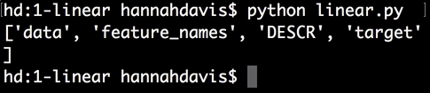
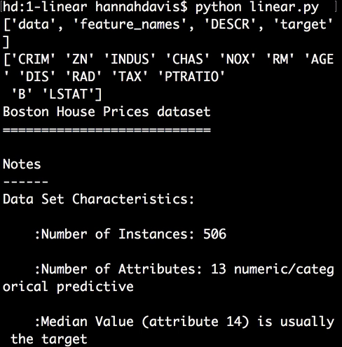
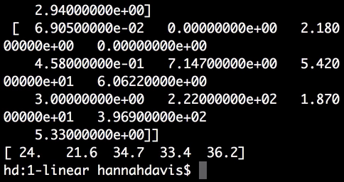
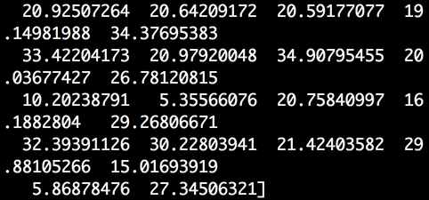
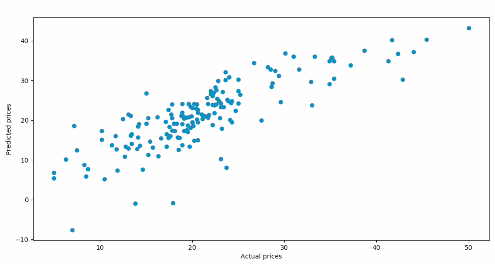
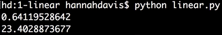

Instructor: [00:00] We're going to `import matlotlib.pyplot as plt` for visualization later. Then scikit-learn, `from sklearn`, we'll `import datasets`. We'll `import metrics` to evaluate our model. `from sklearn.model_selection  import train_test_split`, which will allow us to make training and test data. Finally, `from sklearn.linear_model import LinearRegression`.

#### linear.py
```python
import matplotlib.pyplot as plt
from sklearn import datasets
from sklearn import metrics
from sklearn.model_selection import train_test_split
from sklearn.linear_model import LinearRegression
```

[00:43] The first thing we want to do is load in our dataset, and scikit-learn has in-built datasets that we'll be using. First, we'll be working with Boston housing prices. To load this dataset, we say `boston = datasets.load_boston()`. It's always a good idea to explore the dataset a little bit, let's see what this dataset contains.

[01:04] We can `print boston.keys()`. 

```python
boston = datasets.load_boston()

print boston.keys()
```

My filename here is linear.py. We can see four keys here -- `data`, which is the data, our `feature_names`, which are the feature names, `DESCR`, which is the describing the data set, and `target`, which are our target labels.



[01:23] Let's example these a little bit more. We can say print `boston.feature_names`, and we can see 13 variables here. If we print `boston.DESCR`, we can take a look at some of these features. 




We can see that the features are things like crime rate, whether it's next to the river, the average number of rooms, the distance to work, et cetera.

[01:52] Let's also look at the `data`. We'll just look at the first five `data` points. Let's also look at the target values. 

```python
print boston.data[:5]
print boston.target[:5]
```

We can see that each `data` point has 13 variables and that the `target` is one number, which is the housing price, in the thousands. This is old data. We're using these 13 variables to predict the housing price in the thousands.



[02:20] One more thing we can do is we can `print boston.data.shape` and the `boston.target.shape`. We can see that there are 506 `data` points, with 13 variables each. For the `target`, there are 506 single `data` points. Great.

[02:42] We're going to assign `X` to be `boston.data`, and `y` will be `boston.target`, our target labels. One important component of machine learning is to have training data and test data. We can create this with the train-test split function. We'll say `X_train`, `X_test`, `y_train`, and `y_test` equals `train_test_split()`.

[03:12] This takes `X`, `y`, the proportion of data that we want to go into our test data, and this number can vary, though you want your training data to be significantly larger. We'll say a third of the data can go into testing, `0.33`. The last thing is to add this optional `random_state` argument. This will just make it deterministic so that the data will get split the same way every time we run it. This can be literally any number, we'll just say `16`.

```python
X_train, X_test, y_train, y_test = train_test_split(X, y, test_size=0.33, random_state=16)
```

[03:42] From there, we just say `model = LinearRegression()`, and `model.fit(X_train, y_train)`. 

```python
model = LinearRegression()
model.fit(X_train, y_train)
```

That's all there is to it. Then, if we want to use this model to make `predictions`, we say `model.predict` our `X_test` data. 

```python
predictions = model.predict(X_test)
print predictions
```

We can see a whole bunch of housing predictions here.



[04:10] We can visualize these by saying `plt.scatter`, our actual `y_test` data labels versus the `predictions` labels. We'll add an `xlabel`, which is the `"Actual prices"` and a `plt.ylabel`, which is the `"Predicted prices"`. Then, we say `plt.show()`. 

```python
plt.scatter(y_test, predictions)
plt.xlabel("Actual prices")
plt.ylabel("Predicted prices")
plt.show()
```

We can see here that this looks pretty good. It's not perfectly linear, but the model's predicting the prices OK.



[04:40] From here, we'll look at a couple of metrics that will help us evaluate this model. Most models have an in-built score, which you can access by typing `model.score` and passing in the `X_test` data and the `y_test` labels.

[04:53] For linear regression, the in-built score is based on r^2, also known as the coefficient of determination. This is a number between zero percent and 100 percent that basically describes how well the model fits the data. Generally, though not always, it's better to have a higher r^2 number, and that's worth reading more on.

[05:15] There's also the mean squared error, which can be found by typing `metrics.mean_squared_error` and passing the `y_test` data, or the actual labels, and the predicted labels, `predictions`. This is a metric that calculates the error of the model. It's generally better for it to be lower. 

```python
X_train, X_test, y_train, and y_test equals train_test_split(X, y, test_size=0.33, random_state=16)

model = LinearRegression()
model.fit(X_train, y_train)

predictions = model.predict(X_test)

print model.score(X_test, y_test)

print metrics.mean_squared_error(y_test, predictions)
```

Here, we can see our r^2 gave us about 64 percent, and our mean squared error is 23.4.

