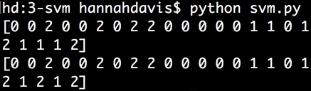
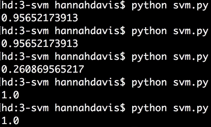

Instructor: [00:01] From scikit-learn, we'll `import` our `datasets`. We'll `import` our `metrics`. We'll `import` our `train_test_split` function. From `sklearn.svm`, we'll `import SVC`, which stands for support vector classifier. If we wanted to do regression, we would import SVR.

```python
from sklearn import datasets
from sklearn import metrics
from sklearn.model_selection import train_test_split
from sklearn.svm import SVC
```

[00:29] We're working with the `iris` dataset, which is `datasets.load_iris()`. We'll assign `X` to be our `iris.data`. Our `y` is `iris.target`. Then we'll split our data into training and test datasets, so `X_train, X_test, y_train, y_test = train_test_split()` that takes our `X` and `y` data, a `test_size`, which will be `15` percent, and a `random_state`, which will be `2`.

```python
iris = datasets.load_iris()
X = iris.data
y = iris.target

X_train, X_test, y_train, y_test = train_test_split(X, y, text_size=0.15, random_state=2)
```

[01:11] Then we'll say `model = SVC`. We can say `model.fit(X_train, y_train)`. We can make `predictions` on our test data by saying `model.predict` and passing in our `X_test` data. Then we can print our accurate labels and the predictions. 

```python
model = SVC()
model.fit(X_train, y_train)

predictions = model.predict(X_test)

print y_test
print predictions
```

We can see the model predicted most of those right.



[01:53] Let's `print` our `model.score`. For support vector machines, the default is the accuracy score. Pass it our `X_test` and `y_test` data, `print model.score(X_test, y_test)`. We can see it's about `95.65` percent accurate.

[02:09] Support vector machines can give us more complex decision boundaries. We get those by using kernels. The `SVC` function takes an argument called `kernel`. The default is `'rbf'`. That stands for 'radial basis function'.

[02:26] Scikit-learn has support for four kernels. You could think of these as kind of similarity functions, an indicator of how to measure the similarity between two data points. Our other options are `'sigmoid'`, `'linear'`, and `'poly'`, polynomial. You generally want to find the best kernel for your dataset.



[02:54] In addition to the model's score, we can also look at the `classification` report by passing in our accurate labels and our `predictions`. 

```python
print metrics.classification_report(y_test, predictions)
```

We can print our `confusion_matrix` by passing in our accurate labels and our `predictions`.