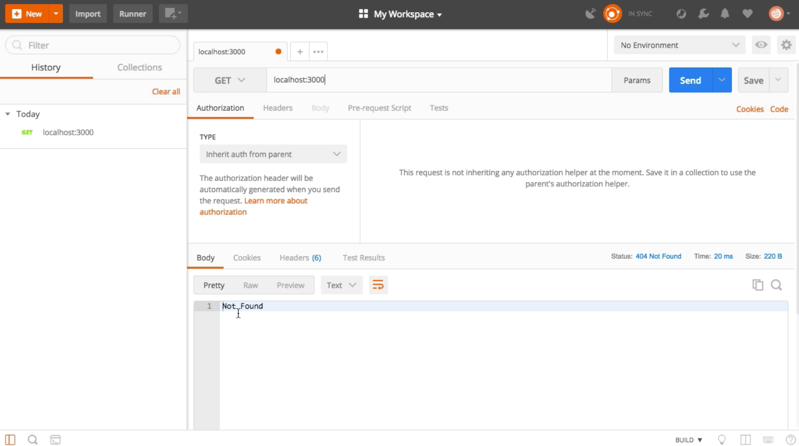

Instructor: 00:01 In order to handle our first post request, we will use Express' `POST` method. We will create a route that handles user logins.

00:08 The first argument is a route, which is `"/login"` in our case. The second argument is a callback with the `request` and `response` arguments.

00:15 Let's now define a `constant` that will contain the name of the `user` that was posted to this route. The `constant` name `user` will have the value of the `username` property that was passed in our `request` as a JSON object.

```javascript
app.post("/login", (req, res) => {
    const user = req.body.username;
})
```

00:27 At this point, Express can't read the body of their request. We will need to `require` an additional middleware call `"body-parser"`. 

```javascript
const bodyParser = require("body-parser");
```

We can also go into terminal to `install` this new library.

```bash
$ npm install body-parser
```

00:40 Now that it's installed, we can add the middleware to Express using the `use` method. We will specify that it will handle `JSON` responses.

```javascript
app.use(bodyParser.json());
```

00:49 We are now able to read the request body, so our constant contains the username that was passed into login route. We are ready to build our `response`, which has a `status` of `200` because this is a success.

01:01 We will send back a simple string that says, `You logged in with ${user}`. It will display the `username` that we just received.

```javascript
app.post("/login", (req, res) => {
    const user = req.body.username;

    res
    .status(200)
    .send(`You logged in with ${user}`);
})
```

01:08 Let's start our server using `node` and the name of the file. 

```bash 
$ node lesson3
```

This is now listening on `localhost:3000`, which was defined as an environment variable previously.

01:18 To test this new route, we can use postman. If we try to do a `get` request, we are getting a, "404, Page not found," because we don't handle that request anymore.



01:28 Now, we can do a `post` request to the login route. Let's start by specifying the body of our request. It will be a `JSON` object with a `username` property. Make sure that you changed the content type to `applications/json`.

01:43 If we run this, you get a, "You logged in with username," message. That is how you parse a post request and handle the request data.

