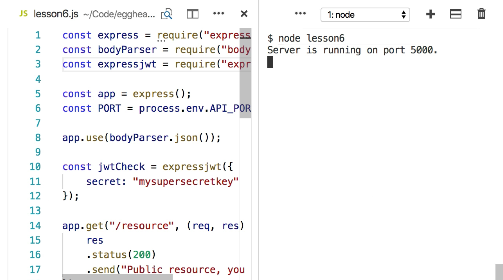
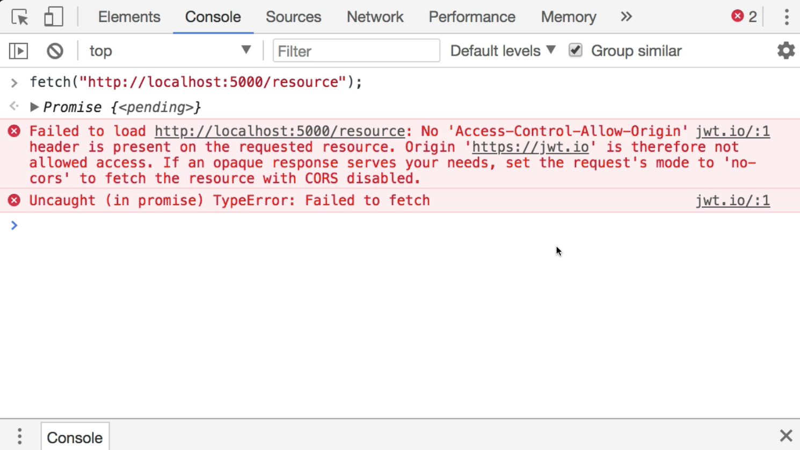

Instructor: 00:00 If you have an API that runs on a different `server` or even a different `port` than your application, and you try to do a `fetch`, you should see a message in your console complaining about `Access-Control-Allow-Origin`.





00:19 The fix for this in your Express server is very simple. First of all, you need to require the CORS library. 

```javascript
const cors = require("cors");
```

You'll also need to `install` it using `npm install cors`. 

```bash
$ npm install cors
```

Secondly, you need to tell your Express server to use this middleware by using app.use and the library that we've just installed.

```javascript
app.use(bodyParser.json());
```

00:46 Now, if you `restart` your `server` and try the same `fetch` call in your browser, you won't have that `CORS` error any more.