Instructor: 00:00 Since this lesson is aimed at using Auth0 for authentication, the first thing we'll need to do is to go to the auth0.com website and create a free account.

00:09 The sign-up process is fairly straightforward. You can use an email and password or you can use any of the social connections here. This free account will give you access to most of the Auth0 API for up to 7,000 users, which is more than enough for the purpose of this lesson.

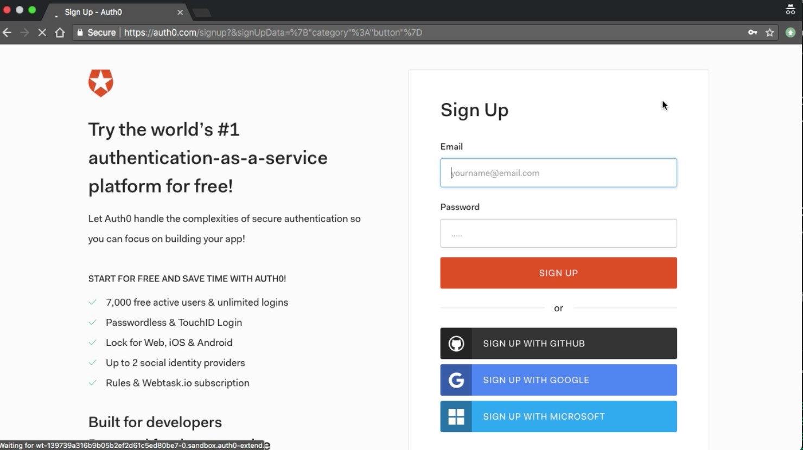

00:24 Once you're signed up, you can log into your account, and you will land on this `dashboard`. This shows you your active users and the number of logins in the last few days.

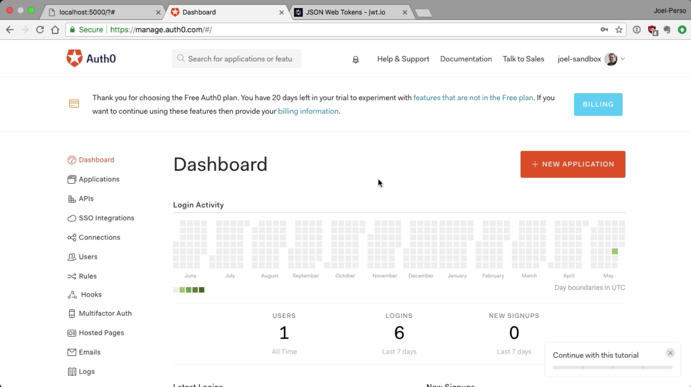

00:34 From here, we'll want to go to the `API section` to create a `new entry`. This is what will be used to protect our API.

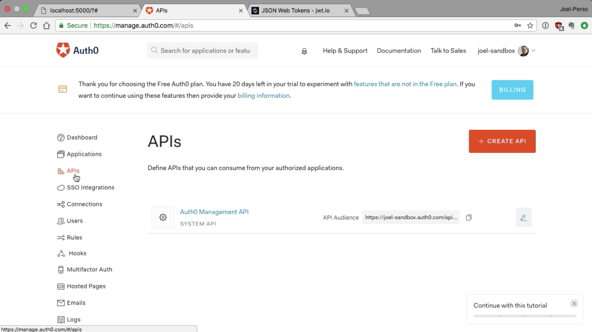

00:42 You can pick anything for the `name`. Let's just use `egghead-demo`. For the `identifier`, you can use anything, but it is recommended that you use the URL of your application. In this case, we don't have a URL, so we'll just use `egghead-demo` as well.

00:58 Finally, you will want to use `HS256` for the signing algorithm, because this is what we used in the previous lesson. 

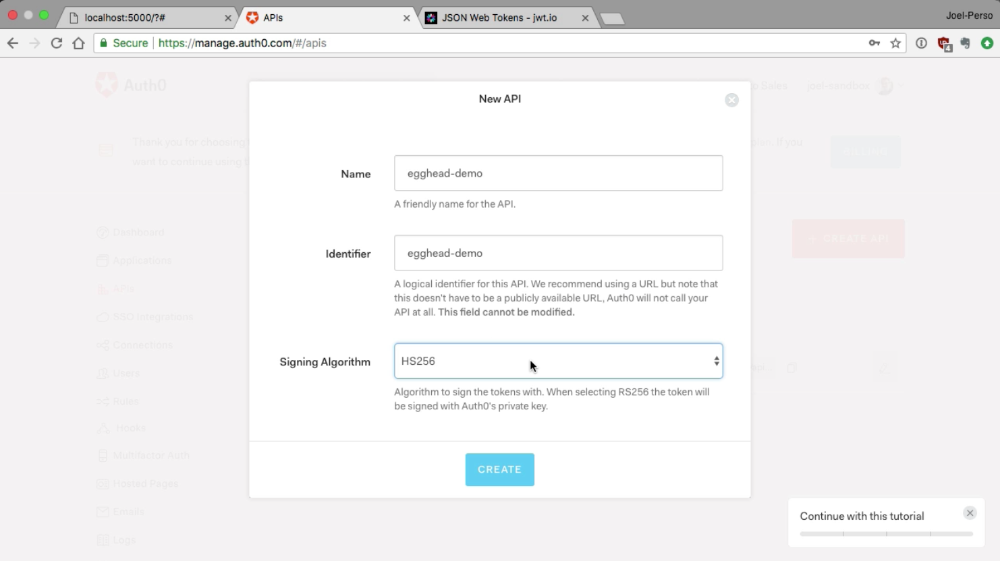

Once you have this, you `click` on `create`, and the modal is closed, and you get redirected to the quick start page.

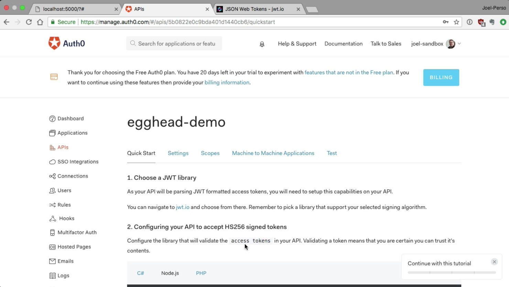

01:11 If you look at this page, you get `code examples` on how to implement this with your API. As you can see, it uses the same middleware as we currently use, the main difference being the settings for the middleware itself.

01:24 We will have a `secret key`, but we also check who is the token meant for, the `audience`, and who created this token, the `issuer`. Those are additional checks that will make your API even more secure. 

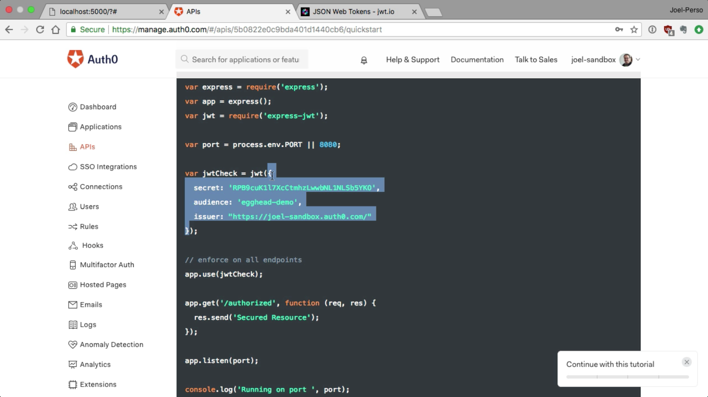

Let's now go back at our `code editor` and `open api.js`.

01:41 You can simply change the `settings` of the `middleware` by `pasting` the `values` you `copied` from the `Auth0` website. Note that those values will need to be the ones from your Auth0 account. If you try to copy the values that I just pasted in, this won't work for you.

#### api.js
```javascript
const jwtCheck = expressjwt({
  secret: 't2ABNgm7aB8YrMrnsutSB0bPNtLZbC7P',
  audience: 'secure-spa-auth0',
  issuer: "https://joel-1.auth0.com/"
});
```

01:56 We can now head to our `terminal` window and start our `API server` by running `node api`. Your server is now running on port 8888. 

```bash
$ node api
```

If you try this now, nothing will work. Your front end also needs to get a token from Auth0. Let's get back to our code and do those changes.

02:13 Because we won't be using our authorization server anymore, we can go ahead and `remove` the `auth.js file` from this folder altogether. 

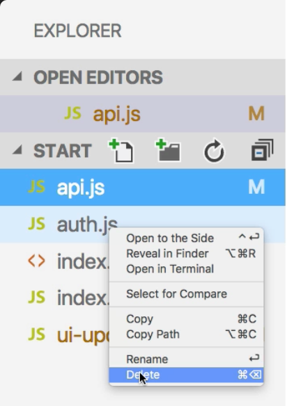

It's now time to edit our index.html page to use Auth0's authentication server instead of ours.

02:28 The first thing that we'll want to do is to `remove` the `login modal`. We will be using Auth0's login screen, so let's go to `line 21` and `remove` those `data tags` that were used to open the modal.

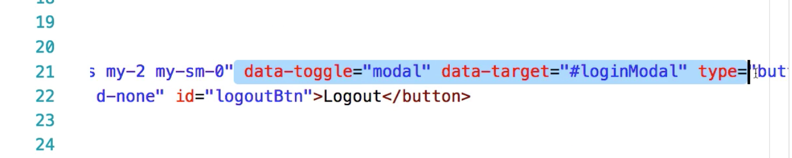

02:40 We can also `rename` this `button` to be `loginBtn` instead. 

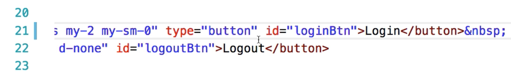

Since we won't be using the modal anymore, we can go down here and `delete` all of the `markup` for our `login modal`.

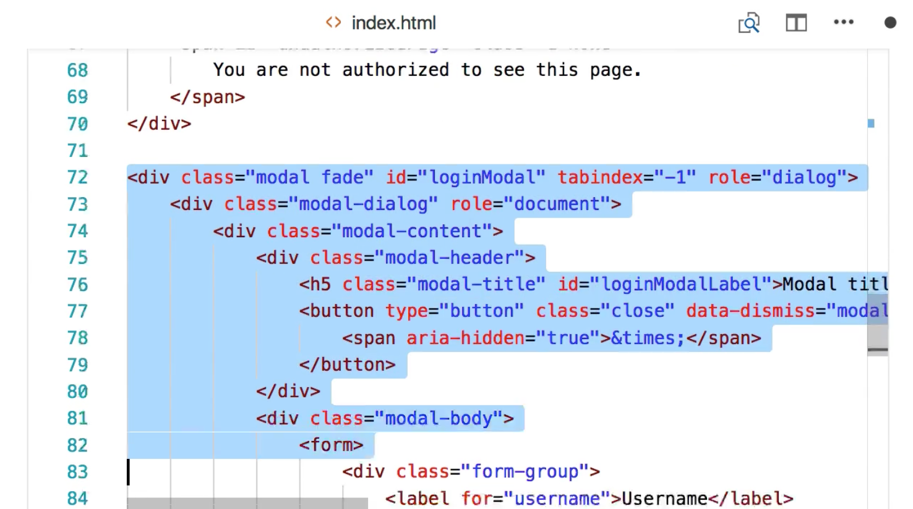

02:55 We will use Auth0's library, which we will get from their CDN. We can add a `script` tag. The `source` will be `https://cdn.auth0.com/js/auth0/` the version number, which is `9.5.1`, the latest at this moment, `/auth0.min.js`.

#### index.html
```html
<script src="https://cdn.auth0.com/js/auth0/9.5.1/auth0.min.js"></script>
```

03:21 Our `index.html` file is not ready, but to finish the UI changes, we will need to go to the `ui-update.js` file and do a few minor changes in there. Instead of showing and hiding the login modal button, we will do that on the `loginBtn`. Let's `change line 5` to use `loginBtn`, and same thing on `line 11`. We're almost done.

#### ui-update.js
```javascript
UIUpdate.loggedIn = function(token) {
  UIUpdate.alertBox(`Just logged in<br>Token:<br>${ACCESS_TOKEN}`);
  loginBtn.classList.add("d-none");
  logoutBtn.classList.remove("d-none");
};

UIUpdate.loggedOut = function() {
  localStorage.removeItem("access_token");
  loginBtn.classList.remove("d-none");
  logoutBtn.classList.add("d-none");
};
```

03:44 Let's open our `index.js` file to change our code to use Auth0's authentication server instead of the one we built. In here, we will need to use `Auth0's webAuth object`. First, we need to get the settings for this object. Let's go back to `Auth0's website` and go into the `Applications section`.

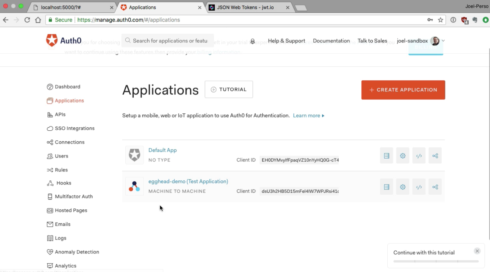

04:03 In here, we choose to `create` a `new application`. We can name it whatever, but we will use `egghead-demo` for consistency. This application is of `type` `single-page application`, so we can select this and `click` on `create`.

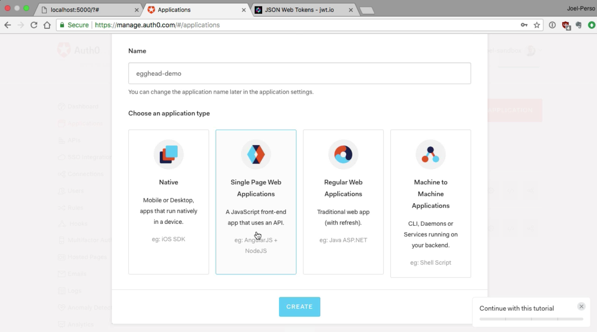

04:17 Similar to when we created the API, we get a screen that suggests us various quick starts. In here, you can find for most major JavaScript frameworks, but we are going to use plain `vanilla JavaScript` here.

04:30 If you `scroll down`, you will find a `section` which has all of your `settings` for your `application`. Once again, make sure that you copy those from your Auth0 account, and not those from this video. Let's copy that and go back to our code.

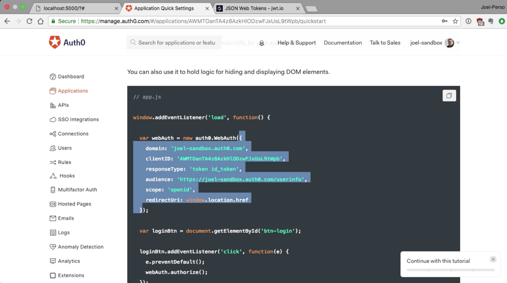

04:44 Now we can create a `webAuth` object using a `new` `auth0.WebAuth`, and we can `paste` the `settings` we got from the `quick start`.

#### index.js
```javascript
let webAuth = new auth0.WebAuth({
  domain: 'joel-1.auth0.com',
  clientID: '8vXPduLlATyDg69DF13J7JY4xN2vveOG',
  responseType: 'token id_token',
  audience: 'https://joel-sandbox.auth0.com/userinfo',
  scope: 'openid',
  redirectUri: window.location.href
});
```

04:52 If you use Auth0's application with a default setting, it is OpenID Connect-enabled, which is outside the scope of this lesson. We will need to tweak the settings of this application in order to be able to use it.

05:04 Going back to `Auth0` and into the `settings` of our `application`, the first thing that we will need to change is the `Callback URL`. 

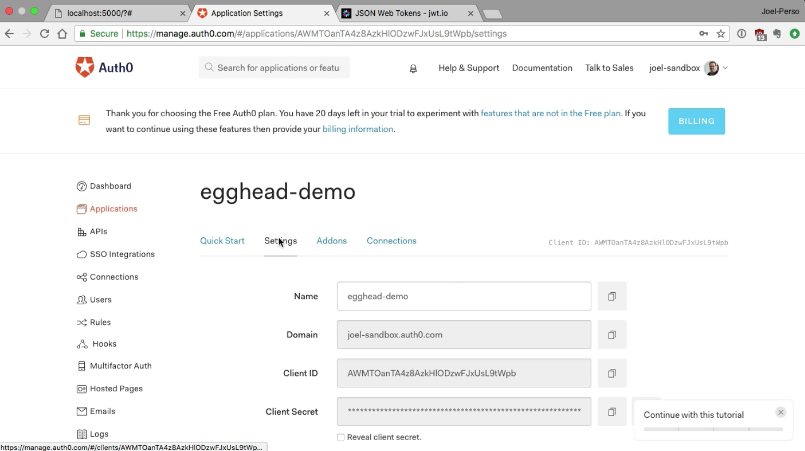

This is the page where users are redirected after they're logged in on Auth0. You can go to your `application`, get the `URL` from there, and simply `paste` it in the `settings`.

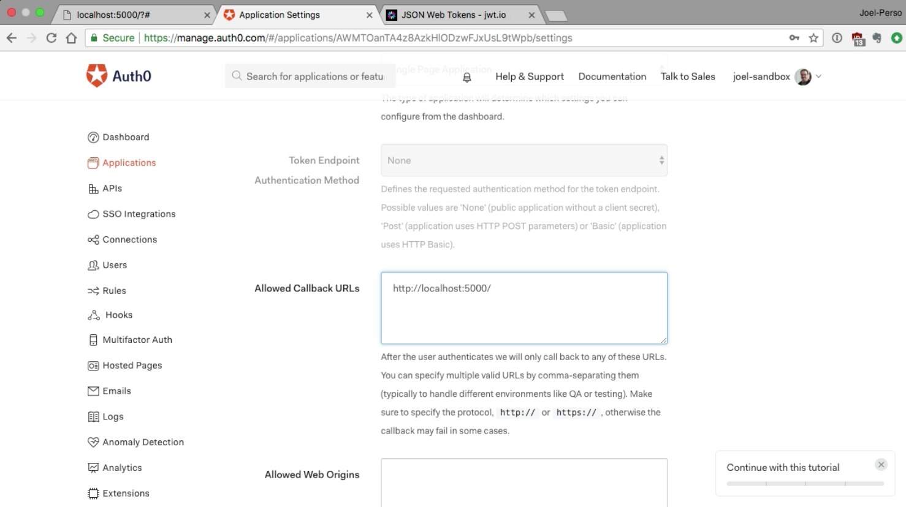

05:22 We will also need to go all the way down to the `Advanced settings`. This is not an OIDC conformant application, so we can `uncheck` this. We can `change` our `JWT signature` to also use `HS256`. We're good. Just save this, and we can head back to our code editor.

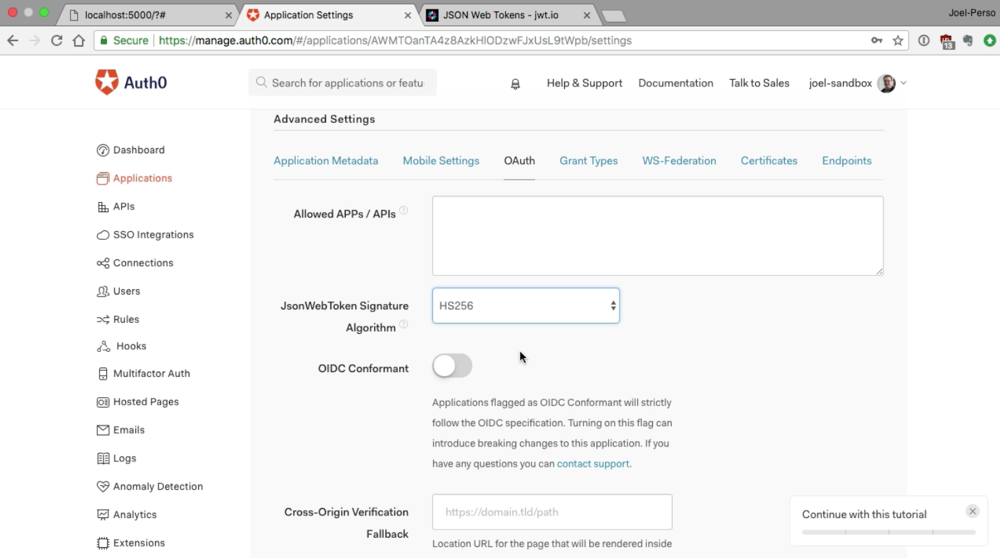

05:42 We need to tweak our settings just a little bit here. Our `domain` is the `issuer` of the `token`. It's what is referred to as tenant in Auth0's website. The `clientID` is found in your `settings`. This should be good.

05:54 In `responseType`, we won't need the `id_token`, so we can `remove` this. The `audience` is the `API` that we want to `connect` to. Let's `change` this to `egghead-demo`. Finally, the `scope` is `irrelevant` in this case, so we can simply `remove` this.

06:10 The `redirectUri` is where your user will be redirected afterwards. This URL has to be in your application settings in the allowed callback URL section, which we already took care of. 

```javascript
let webAuth = new auth0.WebAuth({
  domain: 'joel-1.auth0.com',
  clientID: '8vXPduLlATyDg69DF13J7JY4xN2vveOG',
  responseType: 'token',
  audience: 'egghead-demo',
  scope: '',
  redirectUri: window.location.href
});
```

Let's now change the logic behind our login button.

06:25 Right now, we had to get all of that info from the modal and post that to our authentication server, but we won't need any of this now. Let's just `remove` all of this and use `webAuth` with the `authorize` method instead. Save this, and you should be good to go.

```javascript
loginBtn.addEventListener("click", (event) => {
	webAuth.authorize();
});
```

06:40 If we go to our app and refresh it, and you try the public button, it should return you the data from our public endpoint. If you tried a private one, you should be getting an error message, which is normal, since we haven't logged in, yet.

06:53 Let's do that right away and click on the login button. You can see that we are redirected to the Auth0 login screen. You now have some social sign-ons, you have a sign-up page, you have a forgot password page. All of that for free just by using Auth0. I'll go ahead and log in with Google.


07:13 Now you get the consent UI screen asking you if you want to share the information with the application. 

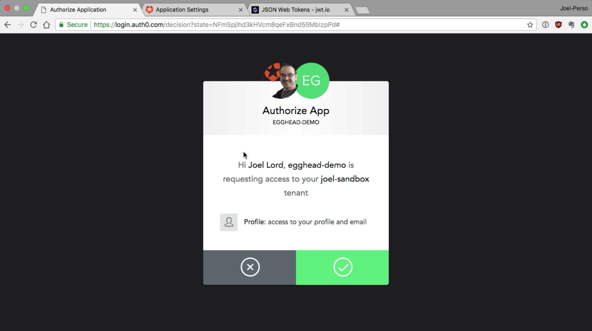

Let's go ahead and accept that, and we are sent back to our website.

07:23 As you can see, as part of my URL, now has a hash followed by an access token. 

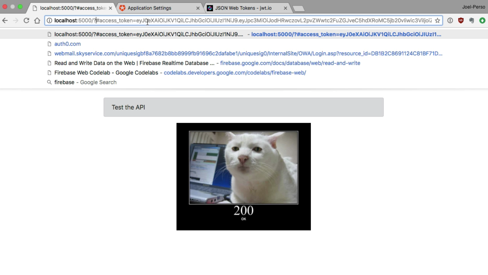

Now if I try my `Public button`, it still works, but if I use a `Private button`, I'm still getting the "`No authorization token was found`," error message. That's because we need to `parse` our `hash` and `extract` the `access token` from there, and store it so that it can be used by our fetch call.

07:43 Thankfully, there is a method in the Auth0 library to help us with that. Let's create a `parseHash` function here. This function will call `webAuth.parseHash` method, which takes a `callback` as an `argument`.

07:56 This `callback` has an `error`, and `authResult` arguments. Let's look at the happy path and check if we have an `authResult` and an `accessToken`.

08:04 We can remove the `hash` part of the `URL`. We can also store our `ACCESS_TOKEN` in our `accessToken` variable.

08:12 Finally, let's use our `UIUpdate helper` to `indicate` that we are `loggedIn`. This function will need to run at some point. Let's `addEventListener` to our window `object` for `"DOMContentLoaded"`, and run this function then.

```javascript

const parseHash = () => {
    webAuth.parseHash(function(err, authResult) {
        if (authResult && authResult.accessToken) {
            window.location.hash = '';
            ACCESS_TOKEN = authResult.accessToken;
            UIUpdate.loggedIn();
        }
    });
};

window.addEventListener("DOMContentLoaded", parseHash);
```

08:28 Let's go back to our application now and refresh this. We can try `Public` and `Private`, and we are getting the expected result. Let's go ahead and `Login`.

08:38 I'll login with Google again. You'll notice that I haven't been asked for my consent again, as I had given it previously and it remembers this.

08:48 Now I'm `redirected` back to the `application`, our `URL` is `clean`, it doesn't have `hash` in it anymore, and we have our `access token` right here. If you copied this `token`, you can go to the jwt.io website and `paste` it there.

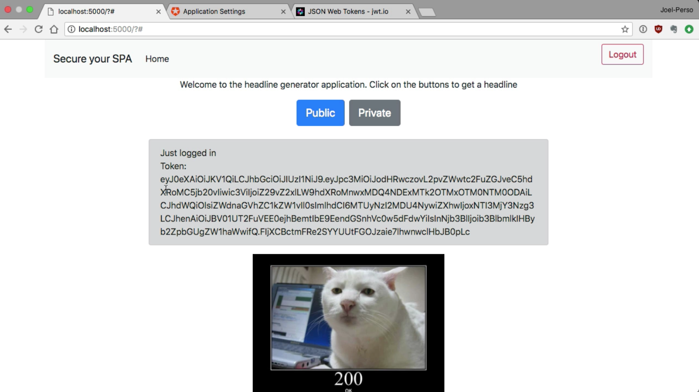

09:01 This will `decode` the `token` for you and show you all of the `details` of this `JWT`. You can see that it's an `HS256 encoded token`. You also have a bunch of stuff like the issuer -- so who created this token -- you have your `user ID`, and the `audience`, which is who this token is meant for. You also have your issued at and an expiry time-stamps, which can be very useful.


09:26 Now that you have this `token`, you can click on the `Private button` and you see the `response` from your `secured endpoint` in your `API`. That's how you make a real secure application with Auth0.

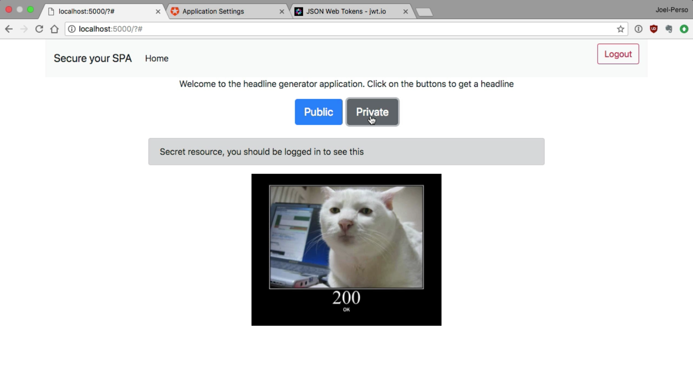