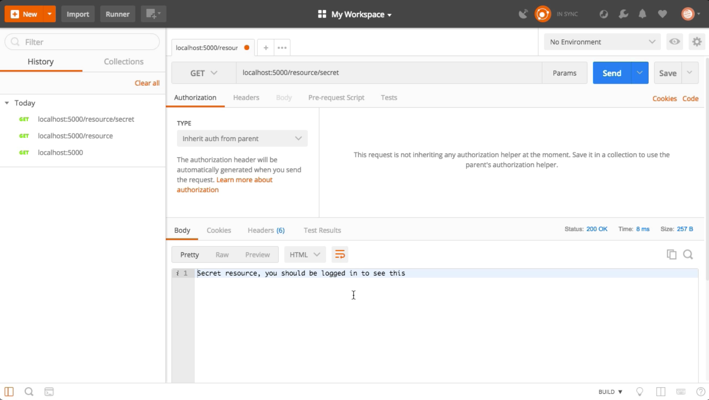
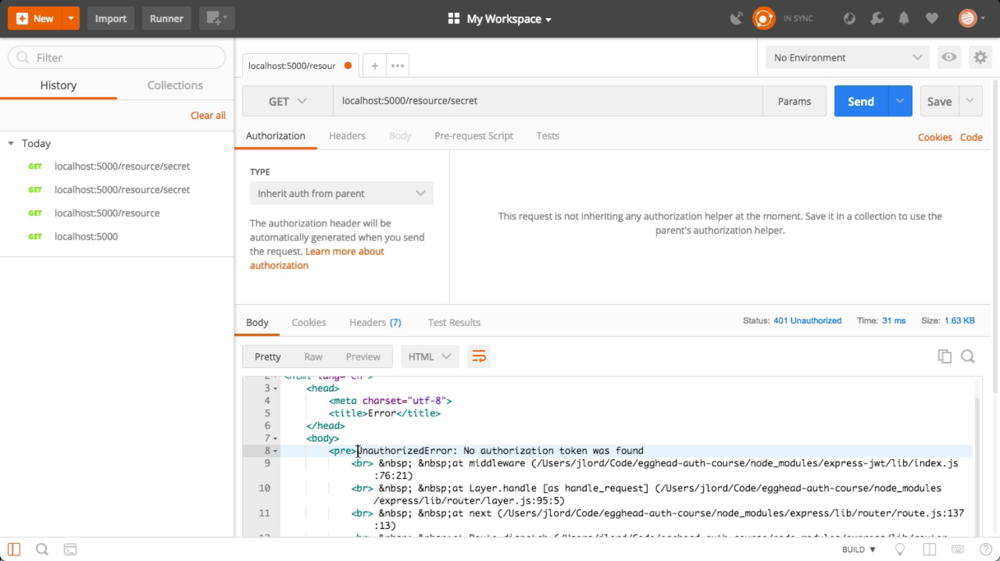
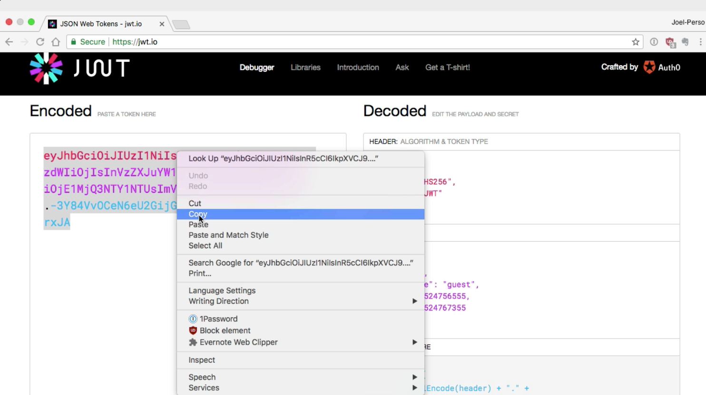
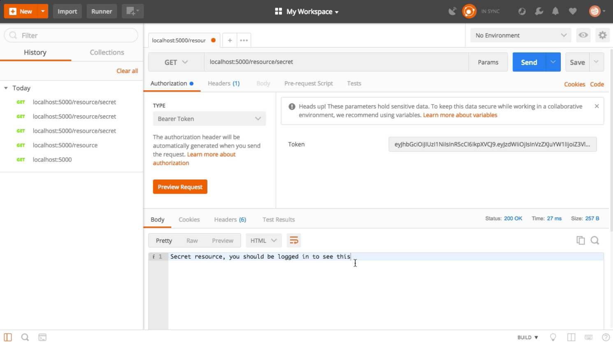

Instructor: 00:00 In this lesson, we will create an `API` with two routes. The first one for the `"/resource"` endpoint will be public, and simply `return` a `status` of `200`, and a `message` saying, `"Public resource, you can see this"`.

#### lesson5.js
```javascript
app.get("/resource", (req, res) => {
    res
    .status(200)
    .send("Public resource, you can see this");
});
```

00:22 Our second route will be for the `"/resource/secret"` endpoint. This will be a secured route. For this endpoint, we will `return` a `200`, as well as a `message` that says, `"Secret resource, you should be logged in to see this"`

```javascript
app.get("/resource/secret", jwtCheck, (req, res) => {
    res
    .status(200)
    .send("Secret resource, you should be logged in to see this");
});
```

00:42 This server will run on the port specified by the environment variable API port. Let's go into our `terminal`, set this using `export`, and set the `API_PORT` to `5000`. Now, we can run the server by using `node` and the `name` of the `file`.

#### Terminal
```bash
$ export API_PORT=5000
$ node lesson5
```

01:00 To `test` our `API`, we will use `Postman`. If we go to `localhost:5000`, we're getting a `404`, page not found, because that route was not defined. If we try `localhost:5000/resource`, we should see our `public resource` there. If we try `localhost:5000/resource/secret`, we can also see the content of this `resource`.



 Our next step will be to block those requests by requesting a valid JSON web token. To do so, we will `require` the `expressjwt middleware`.

#### lesson5.js
 ```javascript
 const expressjwt = require("express-jwt");
 ```


01:39 Let's now open a `terminal`, and `install` it, using `npm install express-jwt`. 

#### Terminal
```bash
$ npm install express-jwt
```

Good. Now, let's define this middleware. We can initialize this middleware by using `expressjwt` and passing it some options. If you are using a real authentication server, you'd want to check for the issuer, the audience, and more to validate the integrity of the server.

02:01 In our case, we will only check to see in the `signature` matches the one from our authentication server, `"mysupersecretkey"`, in this case. 

#### lesson5.js
```javascript
const jwtCheck = expressjwt({
    secret: "mysupersecretkey"
});
```

Finally, we can secure our private route by adding the `middleware` as the second argument of our `app.get` method. 

```javascript
app.get("/resource/secret", jwtCheck, (req, res) => {
    res
    .status(200)
    .send("Secret resource, you should be logged in to see this");
});
```

We are now ready to `restart` our `server` and `test` it in `Postman`.

#### Terminal
```bash
$ node lesson5
```

02:24 Now, if we try a route again, we see that we're getting an error message, saying that no authorization token was found. 



Let's go to the `Authorization` section, and select a `Bearer Token` type of authentication.

02:38 We can take a `valid token` from jwt.io in this case, and simply `paste` that in the `token box` in `Postman`. 



We can now try to make our call to /resource/secret again, and we can now see the content of this route. Now, you have an API with a secured endpoint.

