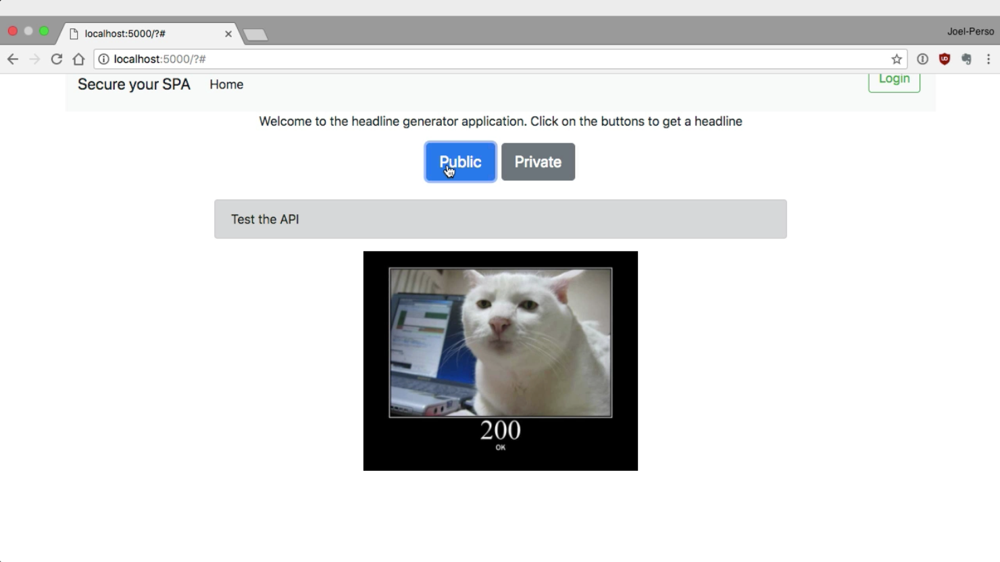
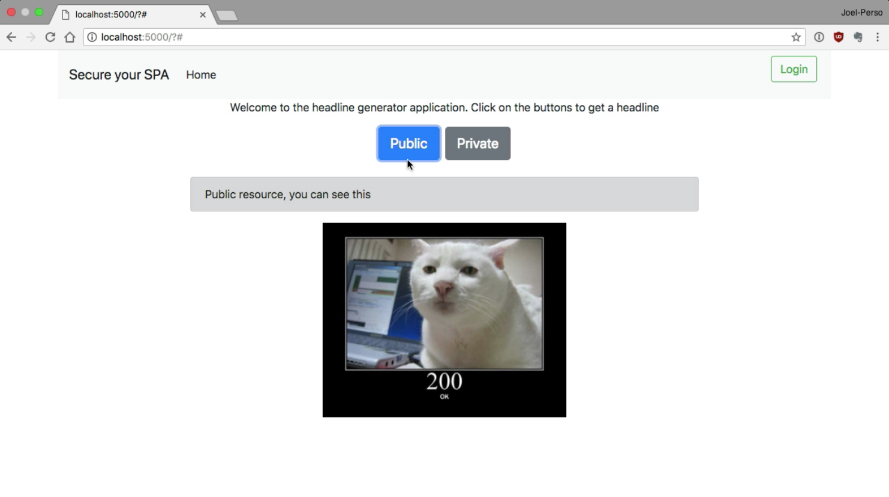
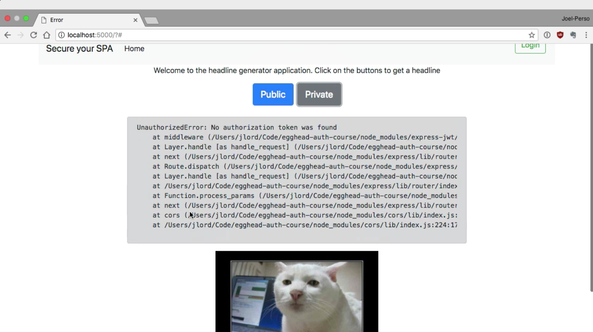
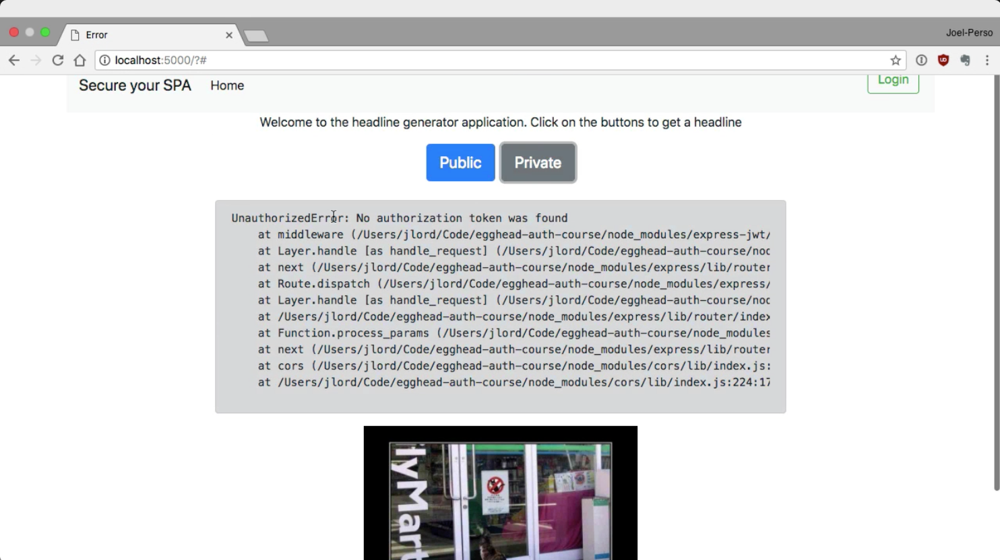
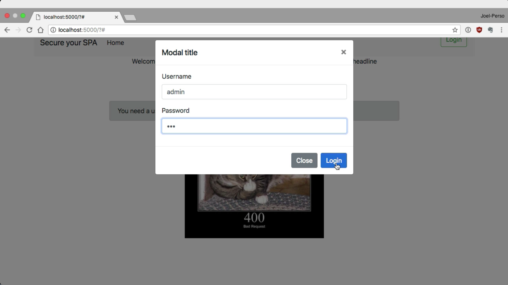
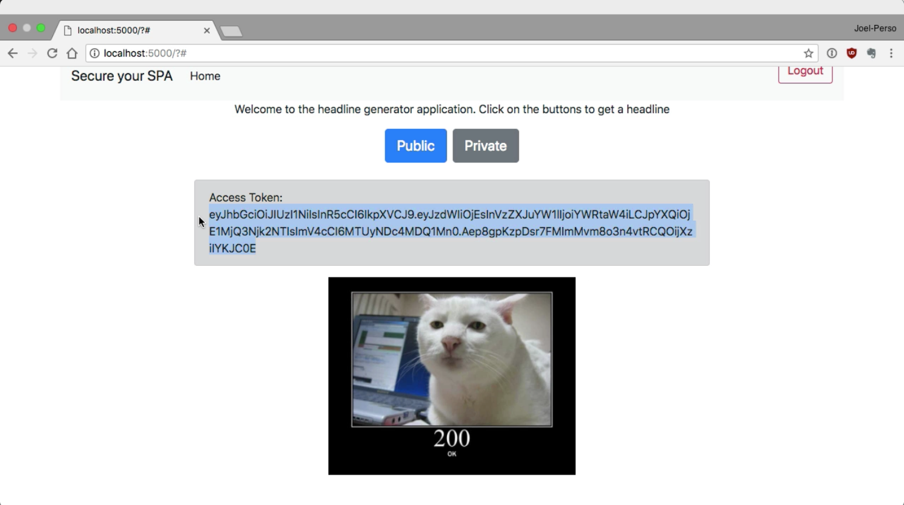
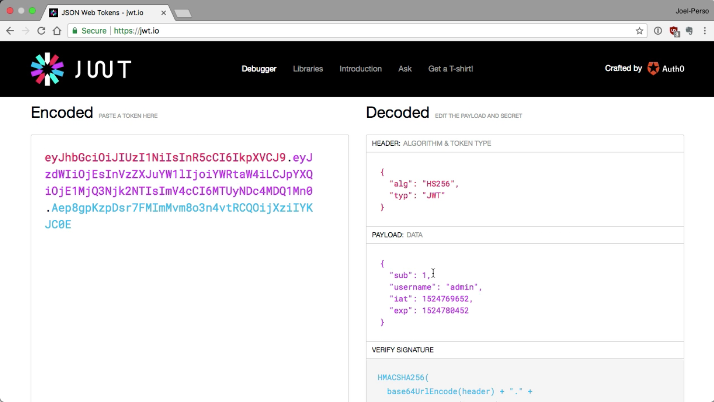
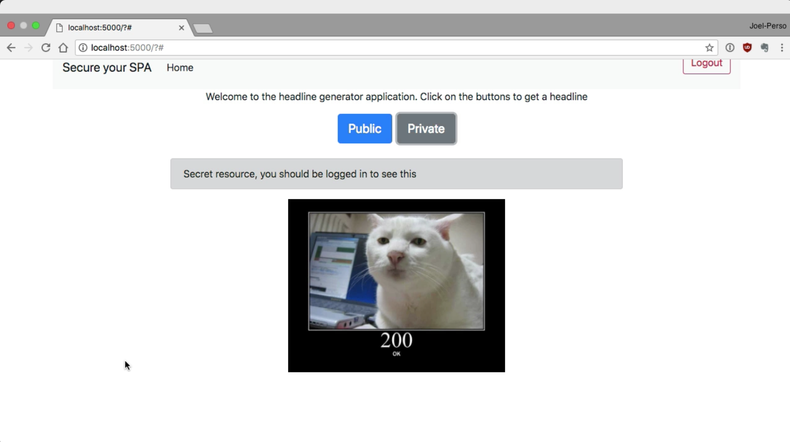

Instructor: 00:00 To connect our front-end to our API in our authentication server, we first need the URL for those. In this case, I started the `API` on `port` `8888`, so we can add that to a `constant`.

#### index.js
```javascript
const API_URL = "http://localhost:8888";
```

00:18 The authentication server is also running a `http://localhost:3000`. Let's add this to the auth URL constant. 

```javascript
const AUTH_URL = "http://localhost:3000";
```

We will keep the `ACCESS_TOKEN` from our authentication server stored in memory. For now, we can initialize the `ACCESS_TOKEN` constant to `undefined`.

```javascript
let ACCESS_TOKEN = undefined;
```

00:36 Let's take a look at the `front-end` that was pre-built for us. There was a `button` labeled `public`, and another labeled `private`. They will both update the jumbotron beneath it with the response that we're getting from our ajax calls.

00:50 The image of the cat will also be update with the status call that we are getting from the server. For the UI updates, the helper functions are already created. We will focus on the actual logic in here.



01:03 For now, none of the buttons do anything. Let's go back to our code. `headlineBtn` here is the button labeled `public`. We will start by doing a `fetch` to our `public` `/resource`, which is on the `API` server at the `/resource` endpoint.

01:23 `fetch` `returns` a `promise`, so we will use the `then` method with the `response` and we will `return` the result of `resp.text`. This will `return` the actual `data` in `text` format to our next chain `.then` method.

01:40 Finally, we can use the `UIUpdate` object and the `alertBox` method to update the jumbotron with the `data` from our `response`.

```javascript
headlineBtn.addEventListener("click", () => {
	fetch(`${API_URL}/resource`).then(resp => {
		return resp.text() ;
	}).then(data => {
		UIUpdate.alertBox(data);
	});
});
```

01:51 We are ready to test our first ajax call. Clicking on the public button shows the public resource. You can see this message. That works.



02:00 Let's now move on to the `second button`, the one labeled `private`. In here, we will do a very similar code. We start by doing a `fetch` to the `API_URL` and `/resource/secret` URL. We return the `.text` from the `response` and we update our `jumbotron` the same way we did for the `public button`.

```javascript
secretBtn.addEventListener("click", (event) => {
	fetch(`${API_URL}/resource/secret`,.then(resp => {
		return resp.text();
	}).then(data => {
		UIUpdate.alertBox(data);
	});
});
```

02:25 If we go and test this, we will see that we are getting an error message instead of the actual response that we are expecting. That is due to the fact that we have not passed in an authorization header.



02:35 Now that we know that this URL will sometimes return us an error code, let's update our `httpCat` with the response that we get from the server. Before we return the parse body of our response, we can use the `UIUpdate.updateCat` method with the `resp.status` code.

```javascript
secretBtn.addEventListener("click", (event) => {
	fetch(`${API_URL}/resource/secret`,.then(resp => {
        UIUpdate.updateCat(resp.status);
		return resp.text();
	}).then(data => {
		UIUpdate.alertBox(data);
	});
});
```

02:52 If we try this again, we see that we're getting a 401, which is the error code for an unauthorized access.



03:00 Before we can pass in a token with our request, we will need to authenticate. Let's go the login button click event listener and do a post request to our authorization server.

03:12 In here, we will do a request to the `${AUTH_URL}/login` endpoint. We will also specify a few options to our request. First, this is not a get, so we will need to add `method` `"POST"`, then we need to specify the `headers` to tell our server that we are sending `Content-type` `"application/json"`.

03:31 We need to specify that we are `accepting` under `response` of type `"application/json"`. The `body` of our request will be the `username` and `password` in `JSON` format provided by our `UIUpdate` helper object.

03:47 We will update our `httpCat` with the `resp.status` code. If we get a `200`, we will send the `JSON` object from our `response` to the next promise. If our `response` was anything else, we will use the `text` of the `response`.

04:01 We can then `chain` with another `.then` and verify the presence of an `access_token`. If we have one, we can store the `access_token` in the `ACCESS_TOKEN` variable that we defined in the beginning.

04:22 We can also overwrite the content of `data` with `Access Token:` and the `content` of the `token`. If we have an `access_token`, this means that we are logged in, so we can use the `UIUpdate.loggedIn` method to update our UI.

04:43 Finally, we will `update` our `jumbotron` with our `data` variable. 

```javascript
loginBtn.addEventListener("click", (event) => {
	fetch(`${AUTH_URL}/login`, {
      method: "POST",
      headers: {
        "Content-type": "application/json",
        "accept": "application/json",
      },
      body: JSON.stringify(UIUpdate.getUsernamePassword())
    }).then(resp => {
    	UIUpdate.updateCat(resp.status);
    	if (resp.status == 200) {
    		return resp.json();
    	} else {
    		return resp.text();
    	}
	}).then(data => {
		if (data.access_token) {
			ACCESS_TOKEN = data.access_token;
			data = `Access Token: ${data.access_token}`;
			UIUpdate.loggedIn();
		}
		UIUpdate.alertBox(data);
	});
});
```

Let's try this out.

04:54 If we click on `login`, we have a `modal` asking for our `credentials`. If we enter nothing, we are getting a 400 bad request error with the message, "You need a username and password."

05:05 Let's try to enter a username `admin`, and `invalid password`. This time, we are getting a 401 unauthorized with the message, "User not found." 



Now, if we use the right username and password combination, we are getting an access token.



05:20 If we copy and paste the access token in jwt.io, we can see the content of the token. It has the right username.



05:30 Back to our application, if we click on private, we are still getting a "No authorization token was found" error message. That's because we are still not passing a token with our request.

05:43 Back to the `secretBtn`, let's start by defining our `headers`. We can start by initializing with an empty object, then we `test` to see `if` `ACCESS_TOKEN` is still `undefined` or if we have an `ACCESS_TOKEN` stored there.

05:58 If we do, we can specify the `headers`. We will add an `"Authorization"` with the `value` of `Bearer` followed by a space, and then 
`${ACCESS_TOKEN}`.

06:13 Now, we can add those through our `request` as a second argument to our `fetch`. 

```javascript
secretBtn.addEventListener("click", (event) => {
	let headers = {};
	if (ACCESS_TOKEN) {
		headers = {
			"Authorization": `Bearer ${ACCESS_TOKEN}`
		};
	}
	fetch(`${API_URL}/resource/secret`, { headers }).then(resp => {
		UIUpdate.updateCat(resp.status);
		return resp.text();
	}).then(data => {
		UIUpdate.alertBox(data);
	});
});
```

Let's test this out. Start by refreshing the app, and then log in using admin and the valid password.

06:27 Now, if you click on private, you'll get the secret resource. You should be logged in to see this message. We now have access to our secret resource.



06:36 Finally, we will need a way to log out. If we go to the `logoutBtn` `"click"` `event handler`, we can simply reset our `ACCESS_TOKEN` to `undefined` and use the `UIUpdate.loggedout` method.

```javascript
logoutBtn.addEventListener("click", (event) => {
	ACCESS_TOKEN = undefined;
	UIUpdate.loggedOut();
});
```

06:51 One last time to our application, and we can now login using a valid credential and get access to the private button. Now, if you log out and try the private button again, you're getting the 401 error with the "No authorization token found" error message again.

07:09 That's it. You now have a front-end that access both public and private data from an API using a JSON web token.