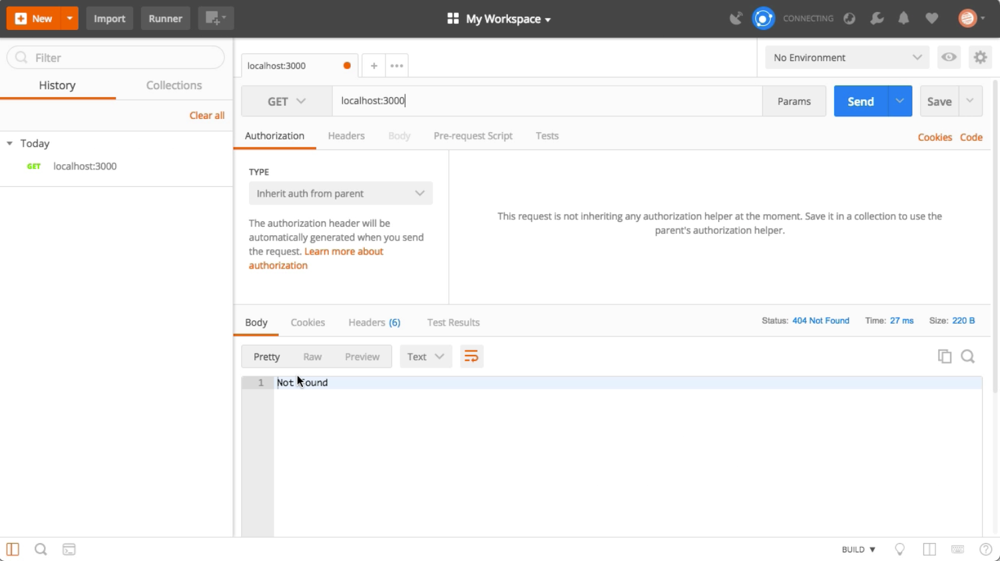
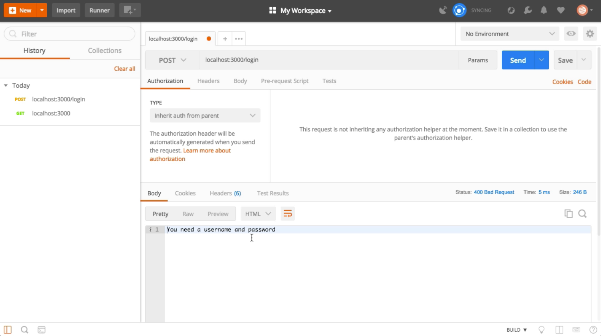
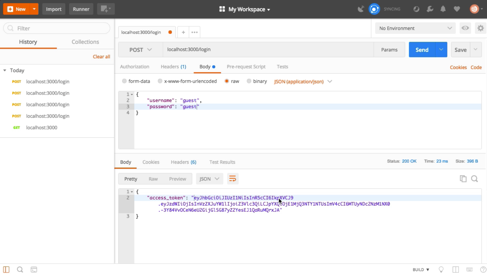
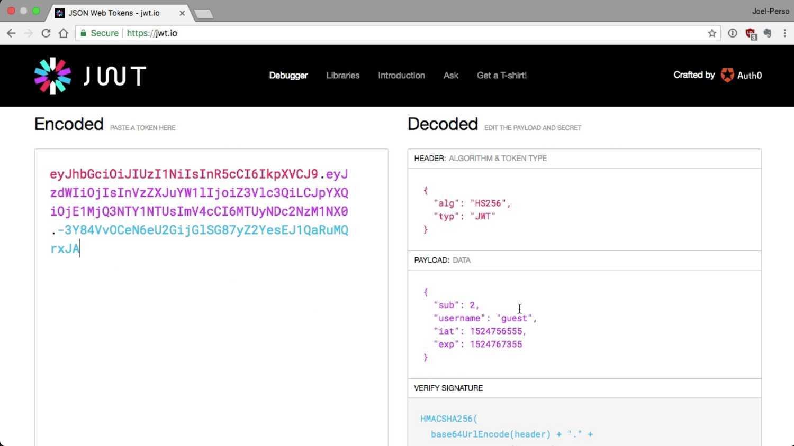

Instructor: 00:00 Since this lesson is all about creating an authentication server, let's start by creating a `user database`. We will use a `user` array that contains all of our `users` and store the `passwords` in plain text right now.

00:11 Warning, do not do this in production. You should always encrypt passwords and ensure that no sensitive information about your users is accessible to potential hackers. For the sake of this lesson, let's just do it this way.

#### lesson4.js
```javascript
const users = [
    {id: 1, username: "admin", password: "admin"},
    {id: 2, username: "guest", password: "guest"}
];
```

00:26 We can now start with our `"/login"` `POST request`. This is the request that will handle user authentication. The first thing to check is `if` the `request` is formatted correctly. We are expecting both a `username` and a `password`.

00:45 If we don't have both, we `return` a `status` code of `400` for invalid request, and we `send` a message to the `user`, saying that `"You need a username and password"`. We can then do a `return` to stop the execution of this callback.

01:08 Now, if we have a valid request, we need to check if the `user` is in our database. Using the `find` method, we will check if we have a `user` that have a `username` and `password` that matches those in the `request`.

01:20 `If` we find a matching `user`, it will be stored in a `constant`, `user`. If we can't find a matching `user`, we can send a response with the `status` of `401` for unauthorized. We can also `send` a message to the `user`, saying `"User not found"`. Once again, we `return` to stop the execution of this callback.

```javascript
app.post("/login", (req, res) => {
    if (!req.body.username || !req.body.password) {
        res
        .status(400)
        .send("You need a username and password");
        return;
    }

    const user = users.find((u) => {
        return u.username === req.body.username && u.password === req.body.password;
    });

    if (!user) {
        res
        .status(401)
        .send("User not found");
        return;
    }
});
```

01:45 If we have a valid user, we will send back a `JSON web token` as a response. 

```javascript
const token = jwt.sign()
```

In order to do so, we will need to require the `jsonwebtoken` library. We will also need to `install` it using `npm install jsonwebtoken`.

```javascript
const jwt = require("jsonwebtoken");
```

#### Terminal
```bash
$ npm install jsonwebtoken
```

02:13 Now that it's installed, we can use the `sign` method to create a `sign token`. We start by passing the payload we want to attach in the `jwt`. We then `pass` a `string` which is the `secret key`. In this case, it's `"mysupersecretkey"`.

02:34 Finally, we can pass some options like in how much time this `token` will `expire`, so we'll say `expires` in `three hours` for us. Finally, we can send back our `response` with a `status` of `200` and a JSON object with our `access_token`.

#### lesson4.js
```javascript
const token = jwt.sign({
        sub: user.id,
        username: user.username
    }, "mysupersecretkey", {expiresIn: "3 hours"});

    res
    .status(200)
    .send({access_token: token});
```

03:01 We can now run the authentication server using `node` and the name of the file. 

#### Terminal
```bash
$ node lesson4
```

Let's now open `Postman` to test this out.

03:10 If we try a `GET` request on the server, we're getting a `404` because we haven't defined any GET route on the server. 



Let's change that to a `POST` and use the `login` endpoint that we just created. Sending a request to that URL without a body will give us a `400` with a message, "`You need a username and password`." Let's try to add those.



03:29 By going in `body`, select `raw` and make sure that the `type` is set to `application/json`. You can now `type` in a `username` and `password` in `JSON` format. If we type your wrong password and we try this, we are getting the `"User not found"` message. If we fix the password to use the right one, we get our `JSON` object with an `access_token`.



03:56 You can copy and paste this `JSON web token` in a website like `jwt.io` and you will be able to see the content. If you try it with another `user` like `guest`, you will get a different `access_token`, and it we go into jwt.io, we can once again see all of the `content` and we can see that it's different this time.



04:28 That's it. You have now created your first authentication server.