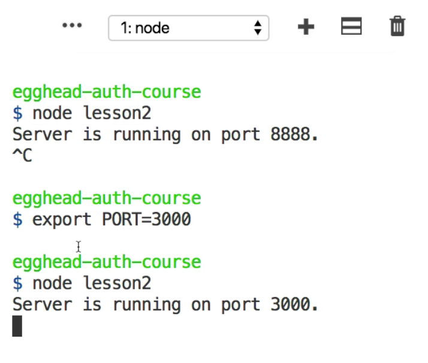

Instructor: 00:00 We'll change the `PORT` that this server is using. We'll use `process.env` for environment, and we'll create a new variable called `PORT`. If the `PORT` environment variable is not defined, we'll still use `8888` as a default.

#### lesson2.js
```javascript
const PORT = process.env.PORT || 8888;
```

00:15 If you run this server, we see that the server is running on `port 8888`. If we do an `export` and we set the `PORT` into our operating system to say `3000` and we run this server again, we can see that the server is now running on `port 3000`.



00:34 If we open our browser, we go to `localhost:8888`, it can't be reached. If we go to 3000, we're getting a 404 in this case. If we go to `localhost:3000/status`, we are getting the server time.

00:48 That's how you set the port inside an environment variable.