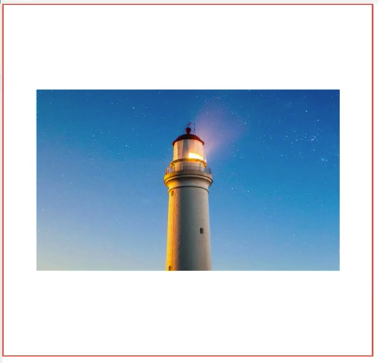

I'll start by selecting the `img`. I'll set its `width` to `90vw` units. I'll set its `height` to `75vh` units.

###style.css
```css
img {
    width: 90vw;
    height: 75vh;
}
```

I'll also add a `border`, so that we can see its boundaries clearly. Now, let's set `object-fit`, to its default value of `fill`. `fill` is going to stretch the image, regardless of its aspect ratio, to fill the container.

Next, I'll change `object-fit` to a value of `contain`. This will increase or decrease the image size to fill the box, but it **won't change the aspect ratio**. You'll see the empty space here at the top and the bottom of the container, confirming that the aspect ratio of the image itself hasn't changed.

###style.css
```css
img {
    width: 90vw;
    height: 75vh;
    border: 3px solid tomato;
    object-fit: contain;
}
```


Now, I'll change `object-fit` to a value of `cover`. This might be the most useful value for `object-fit`. It tells the image to fill the height and width of its container, and to maintain its aspect ratio.


If necessary, the image will be cropped to fit to the container size, which you can see, when I resize my browser down, you'll see the sides of the image being cut off, but the main part of the image keeps its aspect ratio.


You can also set `object-fit` to `none`, which just tells the image to keep its original size.



The last value we can set to `object-fit` is `scale-down`, which will use either `none` or `contain`, whichever one outputs the smallest dimensions of the image. Let's set the `object-fit` value back to `cover`.


Now, we'll look at `object-position`. This property works in the same way as `background-position`, allowing you to move the image around inside of its container.

By default, `object-position` has a value of `50% 50%`, or the exact center of the container. Let's change this to something, like, `20px 10px`. This says set the top left of the image to `20px` from the left edge of the container, and `10px` from the top edge.

