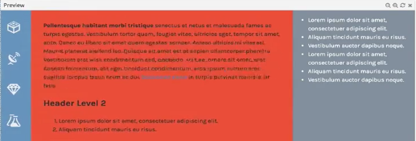

Let's start out by targeting the `main` element. We'll set its `margin-left` property to `5rem`. This `5rem` equals the width of the element. Now for the width, let's take `width` and we'll set that to a `calc()` function of `100% - 25rem`. Here the `25rem` comes from the `5rem` width of the element plus the `20rem` width of the `aside` element.

**style.css**
```css
nav {
    position: fixed;
    top: 0; left: 0;
    width: 5rem;
    height: 100%;
}

aside {
    position: fixed;
    top: 0; right: 0;
    height: 100%;
    width: 20rem;
}

main {
    margin-left: 5rem;
    width: calc(100% - 25rem);
}
```

Now when I resize my window, the `main` element is still positioned in the correct location, and it grows and shrinks depending on the remaining available space.



We can take this one step further by repeating this pattern inside of a `@media` query to ensure that the layout functions properly even when the elements change size.

**style.css**
```css
@media screen and (max-width: 40em) {
    nav {
        width: 3rem;
    }

    main {
        margin-left: 3rem;
        width: calc(100% - 15rem);
    }

    aside {
        width: 12rem;
    }
}
```

If I resize my window, the `nav` and the `side` elements shrink, and the `main` element continues to take up the remaining space thanks to the `calc()` function.