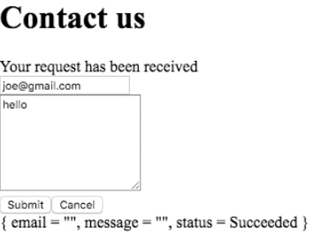

Instructor: [00:00] There are a few more things we need to do in response to the form changing status. For one thing, we would like to disable the Submit button while the request is being submitted. This is in order to avoid, for example, the user clicking on Submit twice. We just say `disabled` on the button. This should be disabled whenever the `status` is `InProcess`.

#### Main.elm
```
footer = div []
    [ button
        [ type_ "submit" 
        , disabled (model.status == InProcess) ] 
        [ text "Submit" ]
    , button 
        [ type_ "button" ]
        [ text "Cancel" ]
    ]
```

[00:29] To do this, I need to pass the `model` into the `footer` function. 

```
view model = 
    Html.form
        [ onSubmit Submit ] 
        [ header model
        , body 
        , footer model
        , div [] [model |> toString |> text]
        ]

    ...

footer model = div []
    ...
```

Our improvement is that upon successfully submitting the `form`, we would like to clear the fields email and message. We can do this in the update function. We change the model to not only have a state of succeeded, but we also change `email` to be empty and `message` to be empty as well.

```
update msg model =
    case msg of 
        InputEmail e ->
            ({model | email = e}, Cmd.none)
        InputMessage m -> 
            ({model | message = m}, Cmd.none)
        Submit -> 
            ({model | submitting = True}, submit model)
        SubmitResponse (Ok ()) -> 
            ({model | status = succeeded
                    , email = ""
                    , message = "" }, Cmd.none)
        SubmitResponse (Err _) -> 
            ({model | status = Failed}, Cmd.none)
```

[01:06] Let me test this here. Let me start the server. If I click Submit, this succeeded. You can see that the model has changed, but these values are still visible in the view. 



We need to update `view` to also read from the `model` both `email` and `textarea`.

[01:33] I pass the `model` to the `body`. 

```
view model = 
    Html.form
        [ onSubmit Submit ] 
        [ header model
        , body model
        , footer model
        , div [] [model |> toString |> text]
        ]

body model = div []
    [ div []
        [ input 
            [ placeholder "your email"
            , type_ "email"
            , onInput InputEmail
            , value model.email
            ] [] ]
        , div []
            [
        ...
        ]
    ]

```

Now you can see that the submission was successful and that the email and message fields have been cleared. I will say that apart of the CSS styling, which is clearly missing, in terms of the behavior of the form, the form is behaving well.