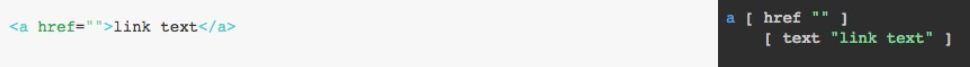

Instructor: [00:00] The normal process is that you will write an Elm view using Elm's functions, and this will produce some HTML. Sometimes, you want to go the other way around. You have some HTML, and you want to create the corresponding Elm code.

[00:15] This can be useful if you have an HTML mockup of your application, or if you are migrating a legacy application written in some other technology.

[00:24] To do this, there's a very convenient application on the Web. It's called [html-to-elm](https://mbylstra.github.io/html-to-elm/). You just type some HTML on the left side, and you'll see the corresponding code on the right side. For example, if I paste in the HTML that's generated for the form I'm building, then you'll see on the right side the corresponding Elm code.



[00:43] Most of the time, you can just copy that and paste it into your Elm code, and it will work. Maybe a couple of fixes are required, and then, of course, you need to add any behavior.

[00:53] To prove this to you, let me copy this code. 

```
form []
    [ div [] 
        [ h1 [] 
            [ text "Contact us" ] 
        ]
    , div [] 
        [ div []
            [ input [ placeholder "your email", type_ "email" ]
                []
            ]
        , div  [] 
            [ textarea [ placeholder "your message", attribute "rows" "7" ]
                []
            ]
        ]
    , div []
        [ button [] 
            [ text "Submit" ]
        ]
    ]
```

Let me go to my editor, and let me copy in the code that was generated by 'HTML to Elm'. I need to put the `html` prefix on `form`, and other than that, the code works just perfectly.