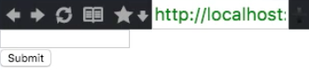
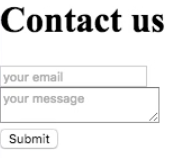
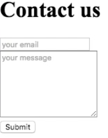

[00:00] Let's start building the view for our form. Instead of a `div`, we can use a `form` function to create the form. We have an empty list of attributes, and we have two child elements. Let's put an `input` there, and let's put a `button` with some `text "Submit"`. 

#### Main.elm
```
import Html exposing (div, text, Html)
import Html.Attributes exposing (id, class)

main : Html a
main = 
    form
      []
      [ input [] []
      , button [] [ text "Submit" ]
      ]
```

Let me save this.

[00:27] You can see this doesn't compile, because the name `form` is ambiguous. Both `Html` and `Html.Attributes` expose a function called `form`. I'm going to disambiguate by saying `Html.form` to specify that I want to use the form element.

```javascript
main = 
    Html.form
      []
      [ input [] []
      , button [] [ text "Submit" ]
      ]
```

[00:46] This now compiles and, indeed, we have an input and a button. 


Let me wrap both of these into a `div`, 

```javascript
main = 
    Html.form
      []
      [ div [] 
        [ input [] [] ]
      , div [] 
        [ button [] [ text "Submit" ] ]
      ]
```

so that these elements are on top of each other.



[01:08] Let me add a few more elements to start building the form. We'll add another `div` with an `h1` element with the `text "Contact us"`. It said that this input will have a `placeholder "your email"`. Let's add another `div` with a `textarea`, with a `placeholder "your message"`. 

```javascript
main = 
    Html.form
      []
      [ div []
        [ h1 [] [ text "Conatact us" ] ]
      , div []
        [ input [ placeholder "your email" ] [] ] 
      , div [] 
        [ textarea [ placeholder "your message" ] [] ]
      , div [] 
        [ button [] [ text "Submit" ] ]
      ]
```

[01:53] Now we have a very simple contact form. 



Let's add just a couple more things. In the input, let's add another attribute. Let's say that the `type` for this input is of type `"email"`. You will see that this doesn't compile, because type is a keyword in Elm. To create the type attribute, the function is actually called type with an underscore at the end, `type_`.

```javascript
main = 
    Html.form
      []
      [ div []
        [ h1 [] [ text "Conatact us" ] ]
      , div []
        [ input [ placeholder "your email" 
        , type_ "email"
        ] [] ] 
      , div [] 
        [ textarea [ placeholder "your message" ] [] ]
      , div [] 
        [ button [] [ text "Submit" ] ]
      ]
```


[02:24] Let's say we want to make this `textarea` a bit taller, so we want to set the `rows` attribute. Let's say we want to make this `7` rows tall. 

```javascript
main = 
    Html.form
      []
      [ div []
        [ h1 [] [ text "Conatact us" ] ]
      , div []
        [ input [ placeholder "your email" 
        , type_ "email"
        ] [] ] 
      , div [] 
        [ textarea [ placeholder "your message" 
        , rows 7 
        ] [] ]
      , div [] 
        [ button [] [ text "Submit" ] ]
      ]
```

Indeed, now we have the view for a very simple contact form.

