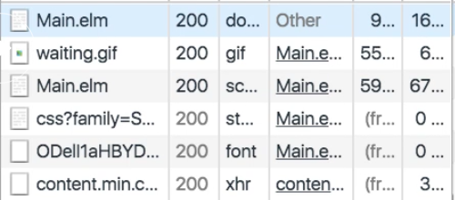
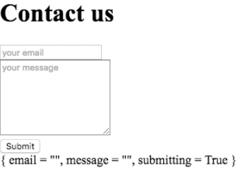

Instructor: [00:01] Now I'd like to react to clicks on the Submit button. I already have a `Msg` of type `Submit`, but this is not being raised anywhere. My first attempt could look something like this.

[00:14] I would `import` the `onClick` function from the `Html.Events` package. 

#### Main.elm
```
import Html.Events exposing (onClick, onInput)
```

Then, when my `view` is being populated, I would go to the `Submit` button. In its attributes, I will say that `onClick` I would like the form to raise the `Submit` message. 

```
footer = div [] 
    [ button 
        [ onClick Submit ]
        [ text "Submit" ]
    ]
```

The effect of this is that when the user clicks on Submit, Elm will call the `update` function with the message of `Submit`.

[00:52] To see if this works, let me make some changes to the `model`. I'm going to say that the `model` changes to have a `submitting` flag set to `True`. 

```
update msg model =
    case msg of 
        InputEmail e ->
            ({model | email = e}, Cmd.none)
        InputMessage m -> 
            ({model | message = m}, Cmd.none)
        Submit -> 
            ({model | submitting = True}, Cmd.none)
```

I'm going to add that to the structure of my `Model`, `submitting` of type `Bool`. In the `initialModel`, we have `submitting` set to `False`. 

```
type alias Model = 
    { email : String
    , message : String
    , submitting : Bool
    }

initialModel : Model
initialModel = 
    { email = ""
    , message = ""
    , submitting = False
    }
```

If I load this in the browser, what I would expect is that when I click Submit, this submitting flag should change to True.

[01:34] What has happened in reality is that the whole page has been reloaded. You can see all of my page has been retrieved. 



Submitting, as a result, is false because we've effectively reloaded the whole Elm application. The reason for this is that my Submit button is within a form. The default behavior of a Submit button is to reload the whole page.

[01:57] How could I prevent this? Firstly, it's worth keeping in mind that this is only true for forms. If I was using a normal `div` in `view model` instead of a `form` -- let me save this -- then you can see that when I click Submit, this changes to True. There's no reload.



[02:13] However, you might still like to use a `form` for a variety of reasons, for example, because you're using a CSS library to render elements within the forms in a different way.

[02:23] Another way to go about this would be to tell the `form` that this is not a Submit button, but it's just a normal button. The way you do this is by saying that the `type_` of this button is `"button"`, so just a regular button. 

```
footer = div []
    [ button 
        [ onClick Submit 
        , type_ "button" 
        ] 
        [ text "Submit" ]
    ]
```

If I save this, again, you see that the behavior is as expected, so it's not reloading the page.

[02:46] The other option -- and that's probably the best option -- is to leave the default button `type_` of `"submit"`,

```
footer = div []
    [ button 
        [ onClick Submit 
        , type_ "submit" 
        ] 
        [ text "Submit" ]
    ]
```

and instead of handling the click event here, handle the submit event on the `form`. Let's additionally `import` the `onSubmit` function. 

```
import Html.Events exposing (onClick, onInput, onSubmit)
```

Then, in the attributes of the `form`, we can say, `onSubmit` create the `Submit` message. 

```
view model = 
    Html.form
        [ onSubmit Submit ]
        [ header 
        , body
        , fotter
        , div [] [model |> toString |> text]
        ]
```

Let me save this. This now works as expected.

[03:21] Keep in mind, however, that any button that you add to a form by default will have type `"submit"`. For example, if I now add a Cancel button, and if I now click on the Cancel button, notice that this has also caused submitting to go to True.

```
footer = div []
    [ button 
        [ onClick Submit 
        , type_ "submit" 
        ] 
        [ text "Submit" ]
    , button [] 
        [ text "Cancel" ]
    ]
```

[03:46] To fix this, let's change the `type_` of the Cancel button to be just `"button"`. 

```
footer = div []
    [ button 
        [ onClick Submit 
        , type_ "submit" 
        ] 
        [ text "Submit" ]
    , button [] 
        [ type_ "button" ]
        [ text "Cancel" ]
    ]
```

Let me try this. If I click Cancel, nothing happens. If I click Submit, submitting has gone to True.

[04:01] The important thing to keep in mind is that when you add a button to a form, any button, by default, its type will be `"submit"`. This will cause the form to reload. When you use the `onSubmit` function on the `form`, this will override this default behavior.