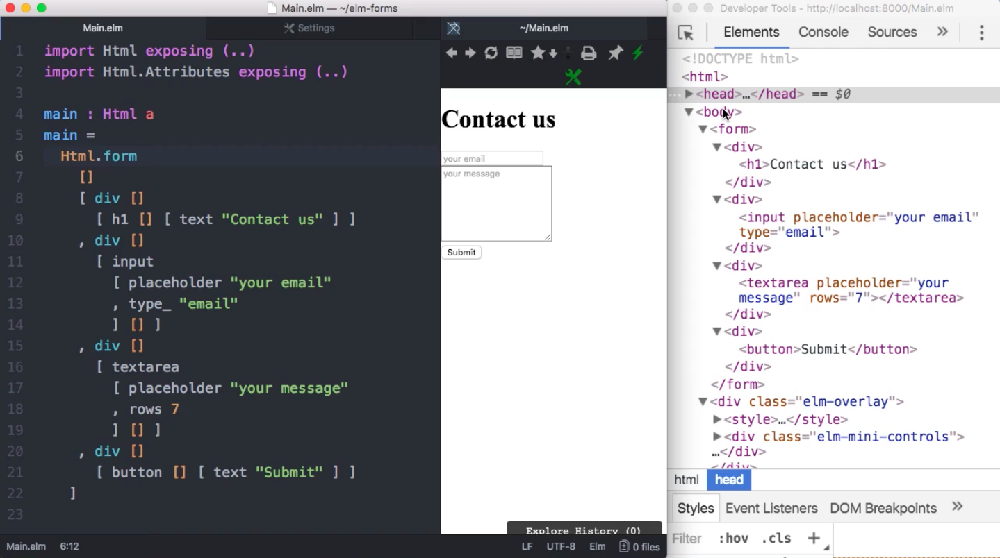

Instructor: [00:03] Here you can see, on the left side, the Elm code that generates our view, a preview in the middle, and, on the right side, the actual HTML that is generated.



[00:12] You can see that there's a very simple, one-to-one correspondence. For our `form` element in the code, we have an outer `form` element in the dev tools and that wraps, a list of `div`'s in the code, and you can find the corresponding `div`'s in the dev tools.

[00:29] When you look at the Elm code, this might seem just a slightly different syntax to write the same thing. The important thing to keep in mind though is that the Elm representation of a view is just normal Elm code. There's nothing special about this div. This is simply a function. This means that you can use variables and refactor things.

[00:49] Let's have a look at that. For example, you could say that this form has a header, a body, and a footer and you might like to express this. For example, let's say that the `div` with the `h1`, that acts as a header. You could put this into a variable that you call `header`. Let's say `let header =`, this `div` that we've just defined.

[01:21] Then you could say that the `body` of the form is this set of fields, the `input` and `textarea` div's. Let's just create a new `div` that wraps those. Finally, the `footer` is this last `div` here that contains the `button`. You could say that the result is a `form` made of its `header`, its `body`, and its `footer`.

#### Main.elm
```javascript
main =
    let 
        header = div []
          [ h1 [] [ text "Contact us" ] ]

        body = div []
          [ div []
            [ input
              [ placeholder "your email"
              , type_ "email"
              ] [] ]
          , div []
            [ textarea
              [ placeholder "your message"
              , rows 7
              ] [] ]
          ]

        footer = div []
          [ button [] [ text "Submit" ] ]

  Html.form []
    [ header
    , body
    , footer
    ]
```

[02:00] Now if we compile this and you see that it looks exactly the same, but somehow, we're giving more meaning to these visual elements. You could also decide that this function is a bit too long for your liking, so you could extract these variables into top-level functions. I can put them down at the bottom. Then your `main` simply returns a `form`.

```javascript
main =
  Html.form []
    [ header
    , body
    , footer
    ]

header = div []
  [ h1 [] [ text "Contact us" ] ]

body = div []
  [ div []
    [ input
      [ placeholder "your email"
      , type_ "email"
      ] [] ]
  , div []
    [ textarea
      [ placeholder "your message"
      , rows 7
      ] [] ]
  ]

footer = div []
  [ button [] [ text "Submit" ] ]
```

[02:34] You can see how you can really write very readable and maintainable code for views.