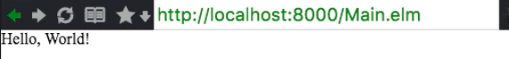
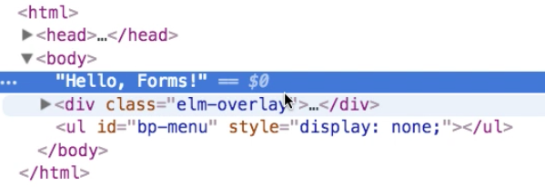
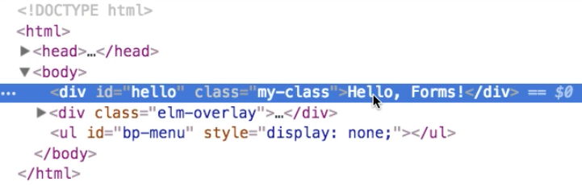

[00:00] Let's start by creating a file where the code for our form will live using the terminal, `touch Main.elm`. Next, I'm going to open it in an editor. Now, I'm simply going to copy some very simple "Hello, World!" code from the Elm website, and paste this into my `Main.elm` file. 

#### Main.elm
```javascript
import Html exposing (text)

main = 
    text "Hello, World!"
```

Back in the terminal, I'm going to start `elm reactor`. This is going to serve Elm files on `http://localhost:8000`.

[00:33] I can now open a browser window and point to `localhost:8000`. This will show me that I have an Elm file. Clicking on it will make elm build it for us. Now we see that our very simple "Hello, World!" program is rendered.



[00:55] You've noticed that I'm using this plugin for Atom that allows me to run a browser window within my editor. This also has a nice option called Live. This will listen for changes. If I change my text to say "Hello, Forms!" and save, it'll rebuild my program.

[01:18] In this very simple program, the main function is just returning a representation of the DOM. To prove this to you, I can say that the type of `main` is `Html a`, where `a` is a type parameter that we're not particularly interested in now.

[01:36] Notice that this doesn't quite compile, because the `Html` type lives in the HTML package. 

```javascript
import Html exposing (text, Html)

main : Html a
main = 
    text "Hello, Forms!"
```

But if I import it, then it does compile. What it means is that text is a function that takes a string. It produces a value that represents a text node that will then be rendered as part of your DOM.

[02:00] Again, to show this to you, let me open the dev tools. Here, you can see this text node. 



To make this a bit more explicit still, let's wrap this in a `div`. I would use a `div`. This `div` is also a function which I would need to `import` at the top. It takes two parameters.

[02:19] The first one is a list of attributes, and the second is a list of elements. 

```javascript
import Html exposing (div, text, Html)

main : Html a
main = 
    div
      []
      []
    text "Hello, Forms!"
```

These are the child elements, so I'm going to put this `text` node as a child element.

```javascript
import Html exposing (div, text, Html)

main : Html a
main = 
    div
      []
      [text "Hello, Forms!"]
```

[02:32] Nothing changed, apparently. But if I look at the HTML that has been produced in the dev tools, you can see that `"Hello, Forms!"` is now indeed wrapped in a `div`. The same is true of attributes, except attributes have their own package. This is called `Html.Attributes`.

[02:49] If I wanted to use `id` and `class` attributes, then I could import these. 

```
import Html.Attributes exposing (id, class)
```

Let's give this div an `id "hello"`, and let's give it a `class "my-class"`. 

```
main = 
    div
      [ id "hello"
      , class "my-class"
      ]
      [text "Hello, Forms!"]
```

If we inspect the resulting HTML, indeed you can see that the ID and the class have been added as attributes on the div.



[03:19] As you build a view, you will be using a lot of these elements and attributes. It's also very common to just import everything, all the values that are exposed by the `Html` and the `Html.Attributes` package.