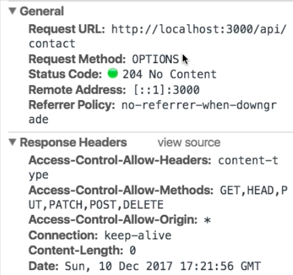
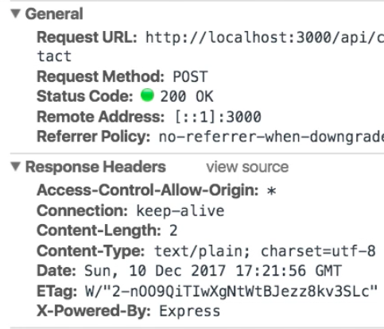
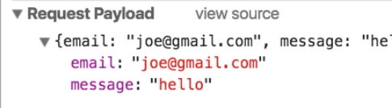

Instructor: [00:01] The first thing we need to do to make HTTP requests is to install the HTTP package. If you look at the files in your current working directory, notice the `elm-package.json` file. I hadn't actually created this file. This has been created for me by elm-reactor the first time it compiled my Elm code.

[00:22] You see that this file lists the dependencies for your project. We now want to add a dependency on the HTTP package. We do this by writing `elm package install elm-lang/http` and just accept. 

#### Terminal
```bash
elm package install elm-lang/http
```

If you view the contents of the elm-package file, you see this reference to `elm-lang/http` has been added. You can now `import` this package by typing `import Http`.

#### Main.elm
```
import Http 
```

[00:52] Let's find the place in our code where we would like our request to be submitted. This would be in the `update` function, where the `Submit` message is received. Notice that at the moment we returned `Cmd.none`. Instead, we would like to submit a request.

[01:07] I will put this logic in a separate function. Let me call this `submit`, which I'll define down here. The type of `submit` needs to be `Cmd Msg` because this is the return type expected by the update function. Also, the data I want to submit is stored in my `model`, so we also need to pass the `model` as a parameter.

```
update msg model =
    case msg of 
        InputEmail e ->
            ({model | email = e}, Cmd.none)
        InputMessage m -> 
            ({model | message = m}, Cmd.none)
        Submit -> 
            ({model | submitting = True}, submit model)

submit : Model Cmd Msg
```

[01:38] Let me temporarily return Cmd.none to make sure that everything compiles. 

```
submit : Model Cmd Msg
submit model = 
    Cmd.none
```

It does. Let me now see how we can go about implementing this.

[01:49] This is the documentation for the [HTTP package](http://package.elm-lang.org/packages/elm-lang/http/latest/Http#post). Here we can see that there is a `post` function that we can use to create post requests. Let me copy this signature and paste it into my Elm file.

```
submit model = 
    post : String -> Body -> Decoder a -> Request a
```

[02:03] I know that I need to call `Http.post` at some point providing these arguments. 

```
submit model = 
    Http.post : String -> Body -> Decoder a -> Request a
```

The first argument of type `String` is a `url`, so let me put this into a variable. Typically, the `url` for posting a contact request may look something like `api/contact`. For the purposes of this demo, I'm going to have a server listening on a different port. I will put the full URL on `localhost:3000`.

```
submit model = 
    let 
        url = "http://localhost:3000/api/contact"

    Http.post : url -> Body -> Decoder a -> Request a
```

[02:36] The first argument to the post function will be `url`. The next argument is the `Body`. This requires a bit more work because we need to encode our Elm data into JSON before we send it. To do this, we also need to `import` a specific package for encoding JSON, which is called `Json.Encode`. I'm going to alias this as just `Encode`.

```
import Json.Encode as Encode
```

[03:02] Back in out `submit model`, I'm going to create some `json`. I'm going to use a function in the `Json.Encode` package that's called `object` which creates a json value given a list of tuples where the first item in each tuple will be the property name, so `"email"`. This will take the email in our `model`, but notice that this is an Elm string. We need to also encode this as a json value. Here, we will use `Encode.string`.

[03:35] The second property will be, of course, the `"message"`. Similarly, we can use `Encode.string` to encode `model.message`. This essentially will create a representation of the json that we want to send.

```
submit model = 
    let 
        url = "http://localhost:3000/api/contact"

        json = Encode.object
            [ ("email", Encode.string model.email)
            , ("message", Encode.string model.message)
            ]

    Http.post : url -> (Http.jsonBody json) -> Decoder a -> Request a
```

[03:57] However, the type of this json variable is JsonValue, so it's not exactly a body yet. We need one further step, and that will be to pass our `json` to a function called `Http.jsonBody` which will convert our json value into a body.

```
Http.post : url -> (Http.jsonBody json) -> Decoder a -> Request a
```

[04:15] You see that the next parameter is a `Decoder`. This would be used to decode the body of the response. We need to `import` another package. This one is called `Json.Decode`. I'm going to alias this as `Json`.

```
import Json.Decode as Json
```

These aliases for these two packages are fairly standard.

[04:37] There is already made a `Decoder` in the `Json.Decode` package that's called `string`. This takes a `Json.string` and decodes it as an Elm string. Now you see that we've provided all the parameters, but the type returned by `Http.post` is `Request a`. In this case, a will be `String` because we're providing a decoder that decodes to a string.

```
Http.post : url -> (Http.jsonBody json) Json.string -> Request a
```

[04:58] Let's put this into a variable. We have a `request :` of type `Request String`. 

```
    request : Request String
```

That's our expression here. Notice, however, that what we need to return is a `Cmd Msg`. What we have is a request. There is one more step missing. That would be the final step, which is to pass our request into the `Http.send` function.

```
submit model = 
    let 
        url = "http://localhost:3000/api/contact"

        json = Encode.object
            [ ("email", Encode.string model.email)
            , ("message", Encode.string model.message)
            ]

        request : Request String
        Http.post : url -> (Http.jsonBody json) Json.string -> Request a
    in request |> Http.send
```

[05:22] If you look at the documentation for [send](http://package.elm-lang.org/packages/elm-lang/http/latest/Http#), you will see that this indeed takes a request, but it takes also another parameter that is a function that will take a result and convert it to a message, `(Result Error a -> msg)`. What this is saying is, "OK. I will send a request. And then, based on the response, I will populate a result."

[05:43] You need to provide a way to convert this result into a message. What we need is a new type of message, which I can add in `type Msg`. I'll call it `SubmitResponse`. This will have as payload a `Result` that in the case of an error will contain an `Http.Error` and in the case of success will contain a `String` because we already called in the body of a response as a string.

```
type Msg
    = InputEmail String
    | InputMessage String
    | Submit
    | SubmitResponse (Result Http.Error string)
```

[06:15] I can now add this parameter to `send`, which is `SubmitResponse`. 

```
in request |> Http.send SubmitResponse
```

Now we start to really see the nature of Elm's update function that returns, of course, an updated model but potentially a command of message. What does that mean? A command is basically an instruction that is telling Elm to do something.

[06:38] The second type message means that this instruction should result in a message of type `Msg` to be constructed. In this particular case, we are telling Elm, "Please, send this post request and then when you get a response, which might be an error or a success, wrap that in a message of type SubmitResponse."

[06:58] Let me now try saving this. I've just forgotten to assign this expression to the `request` variable. This type is Http.Request.

```
request : Http.Request String
request = Http.post : url -> (Http.jsonBody json) Json.string -> Request a
```

Now we get an interesting error. 


What this error is saying that we're not handling all possible messages in our update function. Indeed, we've added this `SubmitResponse` message, but we haven't updated out function accordingly.

[07:26] You can see how the compiler, in a way, is guiding us in our development process. Let me add that `SubmitResponse`, which we have some kind of payload, which I'm going to ignore at the moment, `_`. To get this to compile, I'm going to add `model` and `Cmd.none`. I'm ignoring this message temporarily. 

```
update msg model =
    case msg of 
        InputEmail e ->
            ({model | email = e}, Cmd.none)
        InputMessage m -> 
            ({model | message = m}, Cmd.none)
        Submit -> 
            ({model | submitting = True}, submit model)
        SubmitResponse _ -> 
            (model, Cmd.none)
```

Now our application compiles.

[07:52] To test this, I've written a really simple server in Node.js that listens for this single API route, api/contact. Let me start my server, and go back to my browser, and try submitting again.

[08:09] Now you can see two requests. The first one that's calling Request Method:OPTION only has to do with the fact that we're doing a cross-domain request, because our page is being served by elm-reactor on localhost:8000, whereas the API we're calling is on localhost:3000. Chrome does this preflight request, but other browsers don't.



[08:32] The second one that we can see is the post that we've actually called it for. You can see that we get a status code of 200. 



If we scroll down, here is the payload. 



Indeed, you see a JSON object with our email and message. Here, you can see that also on the server side, the payload has been received correctly.

