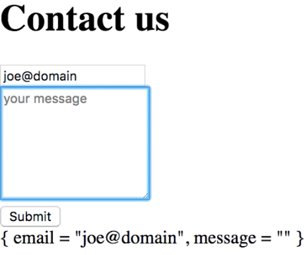

Instructor: [00:00] Now, I've done all the setup to have an interactive program, but the program doesn't really do anything as yet. I have a model that represent the data in my program, fields for email and message that the user may type, and I have the visual components. Now, I just need to bind the two.

[00:20] I'm going to do this through events. Firstly, I'm going to `import` the `Html.Events` package. Particularly, I'm going to use the `onInput` function, which I'm going to use to handle the input event on these text fields.

#### Main.elm
```
import Html.Events exposing (onInput)
```

[00:41] I'm going to go to my `view` and find where I have these fields. I'm going to add some additional attributes. We'll have `onInput`, and now, I need to give it a function that will capture the value of the input. This should additionally be of type message.

```body = div []
  [ div []
    [ input
      [ placeholder "your email"
      , type_ "email"
      ] [] ]
  , div []
    [ textarea
      [ placeholder "your message"
      , rows 7
      ] [] ]
  ]
```

[01:03] I have my message up at the top, `type Msg`, `InputEmail` and `InputMessage`. These will actually take a `String`. 

```
type Msg
    = InputEmail String
    | InputMessage String
    | Submit
```

Back down in the `body`, I can say `onInput InputEmail`. Similarly, on the text area, I can say `onInput InputMessage`. 

```
body = div []
  [ div []
    [ input
      [ placeholder "your email"
      , type_ "email"
      , onInput InputMessage
      ] [] ]
  , div []
    [ textarea
      [ placeholder "your message"
      , rows 7
      ] [] ]
  ]
```

Essentially, what this does is when the input event is raised, it will take the value of the input, and will pass it to `InputMessage`. `InputMessage` will store a string, and it's essentially creating a message.

[01:51] This is also the meaning of this `Msg` parameter in `view`. What this signature is saying is that I'm returning some Html that can raise some messages of type `Msg`. Now, I can use this in my update function.

[02:07] I'm going to switch on the type of message that I've received. If the message was of type `InputEmail`, with an `email`, then, I'm going to return a tuple -- let me reuse this, `(model, Cmd.none)` -- where the `model` will be just like the `model` before, but the `email` field on the model will be this new value `email`. To distinguish these names, because they're all the same, let me call this `e`, and no commands to be executed.

```
update msg model =
    case msg of 
        InputEmail e ->
            ({model | email = e}, Cmd.none)
```

[02:46] Similarly, if the message is `InputMessage` -- let me call this `m` -- then, the `message` on the model should be `m`. Finally, we have the `Submit` message. In this case, I'm just going to return the `model` without any changes, and for the moment, no commands either.

```
update msg model =
    case msg of 
        InputEmail e ->
            ({model | email = e}, Cmd.none)
```

[03:16] What should happen now is that when the user types into the email field, for example, then, `InputEmail` will be called, and this will construct a `message` of `InputEmail`, with the payload of the current value of the input. Then Elm will call the `update` function, and this will essentially put the new value for the email into my model.

[03:41] The thing is, at the moment, there's no good way to check that this is really the case. For the sake of debugging, let me display the model on the form. I'm going to add a new `div`, and I'm going to print the `model`.

```
view model =
  Html.form []
    [ header
    , body
    , footer
    , div [] [model |> toString |> text]
    ]
```

[03:59] Let me open this now in the browser so that you can see this a bit more clearly. You will see below the submit this dump of the current state of the model. If I type some text here, you will see that the model is updated as a result of changes to the inputs.

