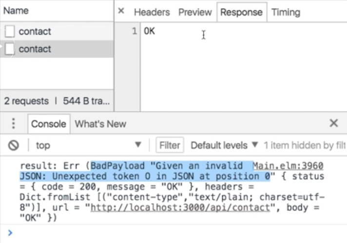
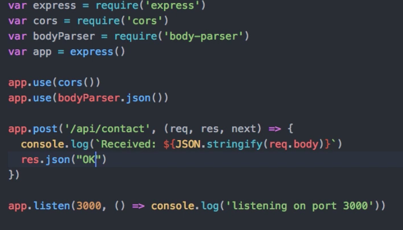

Instructor: [00:00] If I go back to the elm code, there is only one thing that I don't really like about this code which is that, if you look at our messages in submit response we're saying, in case of an error, we get an HTTP error, and in case of success, we get a string.

[00:15] In reality, we don't really expect to receive any string data. We're assuming that, if we get the status code of 200, then that indicates success and we don't need any additional data. The type in `SubmitResponse`, rather than `String` should really be unit, `()`, which is an empty tool port, essentially a structure that contains no data tool.
#### Main.elm
```
type Msg
    = InputEmail String
    | InputMessage String
    | Submit
    | SubmitResponse (Result Http.Error ())
```

[00:33] If I save this, I have a type mismatch. It's because in our `request`, I'm using `Json.string` to decode the response. Instead, what I want is to provide a decoder that will essentially ignore the response completely. This is not as trivial as it sounds, but essentially what we can do is to declare a `decoder` that is based on `Json.string`. We can use `Json.map` to create a decoder that will do something to this string.

[01:04] What do we want to do with the string? Well, whenever we get the string, we essentially want to ignore it and always return unit, and just for readability, when you have such a function that ignores a input, you can just type `always`.

```
decoder = Json.string |> Json.map (always ())
```

[01:18] This `decoder` is now a decoder that will take a `string` and will always return unit, `()`, and the type this request will not be a request typed on unit, `()`. 

```
request : Http.Request ()
```

Now this type-checks, I can also get rid of this type declaration here. 

```
decoder = Json.string |> Json.map (always ())

request = Http.post url (Http.jsonBody json) decoder
```

[01:36] I think we now gain some clarity in that, although we have to write a bit more code, the payload of our message type more accurately represents the data that has been returned from server. Just to ensure that everything works as expected, let me go down to where we handle `SubmitResponse`.

[01:52] Here, I'll receive a result. I would like to print this result out to the console. I can use `Debug.log`, saying that it will print is the `"result"` and pass in the `result`. You need to assign this to a variable. Let me say, `let _ =` the result of this expression in my return value, and list us this out.

```
update msg model =
    case msg of 
        InputEmail e ->
            ({model | email = e}, Cmd.none)
        InputMessage m -> 
            ({model | message = m}, Cmd.none)
        Submit -> 
            ({model | submitting = True}, submit model)
        SubmitResponse _ -> 
            (model, Cmd.none)
```

[02:27] Now we have a little bit surprising situation, because we get a response with the status code of 200, but the result is an error. 



If we look at the details of the error, we see that it has to do with parsing the JSON in response.

[02:41] That's because, if we look at the response we see that we get the string "OK." That's not the valid JSON value, because strings in JSON need to be enclosed in double quotes. To handle this problem purely in elm, we would probably use a [custom request](http://package.elm-lang.org/packages/elm-lang/http/latest/Http#request).

[02:56] Instead of the post function which expects a decoder that receives some JSON, we could use the 'request' function and specify that we expect a string response, rather than a JSON response. However, this is submit for both. For the sake of this demo, I will just change to server to return some Json.

[03:15] Here is my server, and instead of send status, I'm just going to return JSON and the string "OK". 



Let me restart my server. Let me try resubmitting my form. You can see that now the request were successful, and also that the result is `OK ()`.

[03:35] On the other hand, if I stop the server and just submitting the form now, then we get an error and the result is an error with network error as the specific error that occurred. Finally, I can go back and clean up my code, removing the code to `Debug.log`.

```
SubmitResponse result -> 
    (model, Cmd.none)
```