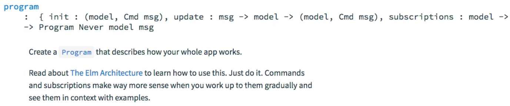

Instructor: [00:00] Elm allows you to write a main function that just returns some HTML. This is useful to write static pages. If you want to write an interactive program, then your main method should return not HTML, but a program.

[00:14] If we look at the documentation for the HTML module, you will see that there are a few types of programs that are available. There's a 'beginnerProgram' that's only useful for very simple applications, and then you have 'program', and 'programWithFlags'.

[00:29] The only difference is that 'programWithFlags' allows you to pass some data when you initialize your Elm application from JavaScript. In this case, we're going to use 'program'.



[00:39] It's really important that we look at the signature for program. Let me copy that, and I'm going to paste this into my editor. What you usually write is that the main function just calls `program`. What this signature is telling us is that `program` is a function that takes a record with certain fields and returns a `program`.

#### Main.elm
```
main = 
    program 
        : { int : (model, Cmd msg) , update : msg ->  model -> (model, Cmd msg), subscriptions: model -> Sub msg, view : model -> Html msg } -> Program Never model msg 
```

[01:05] Also, notice that this `program` has this funny `Never` type, and then it's parameterized with two type arguments, `model` and `msg`. `model` is essentially the state underlying the web application, and `msg` is a representation of the events that the application is going to handle.

[01:25] We could define our model as a record that holds the data from our form. We have a field, `email`, of type `String`, and a field, `message`, also of type `String`. Then, we can replace this type variable `model`, with a lower case, with the type of `Model` that we've just defined.

```
type alias Model = 
    { email : String
    , message : String
    }

main = 
    program 
        : { int : (model, Cmd msg) , update : msg ->  model -> (model, Cmd msg), subscriptions: model -> Sub msg, view : model -> Html msg } -> Program Never Model msg 
```

[01:50] In the case of `message`, we need to represent the events that are going to happen in this application. We could define a `type Msg`, as a union type. We could have `InputEmail`. This represents that the user has typed into the email field, or likewise, `InputMessage`.

[02:09] Finally, `Submit`, indicating that the user has clicked the submit button. We can now further parameterize our program with this type message.

```
type Msg 
    = InputEmail
    | InputMessage
    | Submit

main = 
    program 
        : { int : (model, Cmd msg) , update : msg ->  model -> (model, Cmd msg), subscriptions: model -> Sub msg, view : model -> Html msg } -> Program Never Model Msg 
```

[02:19] This is now the `type` returned by the program function, and therefore also, the `type` returned by the `main` function. Let me write this. The `main` here that we had from the previous version, I'm going to call this `view`, because this function just produces some HTML, it's a `view` function.

```
main: Program Never Model Msg
main = 
    program 
        : { int : (model, Cmd msg) , update : msg ->  model -> (model, Cmd msg), subscriptions: model -> Sub msg, view : model -> Html msg }

view : Html a
view = 
    Html.form []
        ...
```

[02:41] Now, we need to populate this object, which is given as an argument to `program`, and which essentially defines how the `program` works. If I reformat this, you can see that there are four fields, `init`, `update`, `subscriptions`, and `view`.

```
main = 
    program 
        { int : (model, Cmd msg) 
        , update : msg ->  model -> (model, Cmd msg)
        , subscriptions: model -> Sub msg
        , view : model -> Html msg
        }
```

[02:56] Let's begin with `view`. You see that this is a function that takes a `model`. It takes the current state of the application, and returns some html describing how the application should look.

[03:06] Essentially, we have this `view` function here. All we need to do is to say that this `view` takes a `Model`, and its signature is now that of a function that takes a `Model` and returns, but no longer `Html a`, but `Html Msg`, because we now have defined our message type. The `view` field, we can just pass `view`, and here should actually be assignment.

```
main = 
    program 
        { int : (model, Cmd msg) 
        , update : msg ->  model -> (model, Cmd msg)
        , subscriptions: model -> Sub msg
        , view = view
        }

view : Model -> Html Msg
```

[03:32] For `subscriptions`, we need a function that takes the `model` and returns `subscriptions`. In this particular application, we're not going to use `subscriptions`, we can just have an anonymous function that, given a `model`, returns no `subscription`, and it's `Sub.none`.

```
main = 
    program 
        { int : (model, Cmd msg) 
        , update : msg ->  model -> (model, Cmd msg)
        , subscriptions = \model -> Sub.none
        , view = view
        }
```

[03:48] Let's go up to `init`. You can see that this is not a function. It's just a tuple with a `model` and a `Cmd`. This is the initial state of the application. Let me create a variable, call it `initialModel` of type `Model`. I'm going to copy `type alias Model`, and I'm going to say that when the application starts, email is an empty string, and message is also empty string.

```
initialModel : Model
initialModel = 
    { email : ""
    , message : "" 
    }
```

[04:17] When the application starts, the `model` is going to be `initialModel`. `msg` is a command that can be given to Elm as the application starts up. In this particular case, we can just pass `Cmd.none`, as we have no commands that need to be executed when the application initializes.

```
main = 
    program 
        { int = (initialModel, Cmd.none) 
        , update : msg ->  model -> (model, Cmd msg)
        , subscriptions = \model -> Sub.none
        , view = view
        }
```

[04:36] Finally, comes the most interesting part. That's the `update` function. Let me copy the signature. I'm going to write an `update` function with the required signature, although these are now the specific types and no longer the type variables.

```
main = 
    program 
        { int = (initialModel, Cmd.none) 
        , update : update
        , subscriptions = \model -> Sub.none
        , view = view
        }
```

[05:02] I'm going to write the simplest `update` implementation that will satisfy the compiler. Update takes a `msg` and a `model`, and I'm just going to return a tuple with the `model` without any changes, and `Cmd.none`. No commands to execute. 

```
update : Msg -> Model -> (Model, Cmd Msg)
update msg model = (model, Cmd.none)
```

Now, I'm going to save and see what breaks.

[05:25] Here, when you populate the record, it's equals, `=` not `:`.

```
initialModel : Model
initialModel = 
    { email = ""
    , message = "" 
    }
```

Other than that, the code builds.