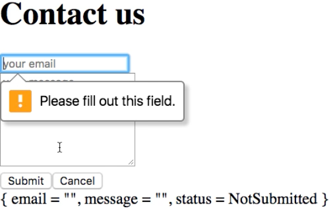
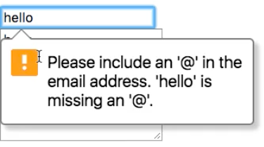

Instructor: [00:01] At the moment, this form performs no validation whatsoever. I can click Submit without even filling out the form. It will happily submit a request where all the fields in the payload are blank.

[00:14] There are different approaches to validation. One of them is to use constrained validation, which is a feature that is supported by all modem browsers. In this approach, you use some attributes on your Html that cause the form to validate before it's submitted.

[00:31] For example, to make sure that the fields are populated, we could add an attribute `required True`. We can do the same on the message `textarea`.

#### Main.elm
```
body model = div []
  [ div []
    [ input
      [ placeholder "your email"
      , type_ "email"
      , onInput InputEmail
      , value model.email
      , required True
      ] [] ]
  , div []
    [ textarea
      [ placeholder "your message"
      , rows 7
      , onInput InputMessage
      , value model.message
      , required True
      ] [] ]
  ]
```

[00:42] If I now try to submit, then notice how I get this balloon that says, "Please fill out this field." 



I didn't need to write any code for this. This is just the behavior of Chrome and would look slightly different in a different browser.

[00:55] Let me try to say, "Hello" and "Hello," and submit now, and see how now we get a message that has to do with email validation. 



The reason we get this is that we have specified that this input is of type email.

[01:11] Notice that just by placing a few attributes on the form, we've effectively achieved validation without the need to implement any logic. There's an advantage in that this type of validation is easily achieved.