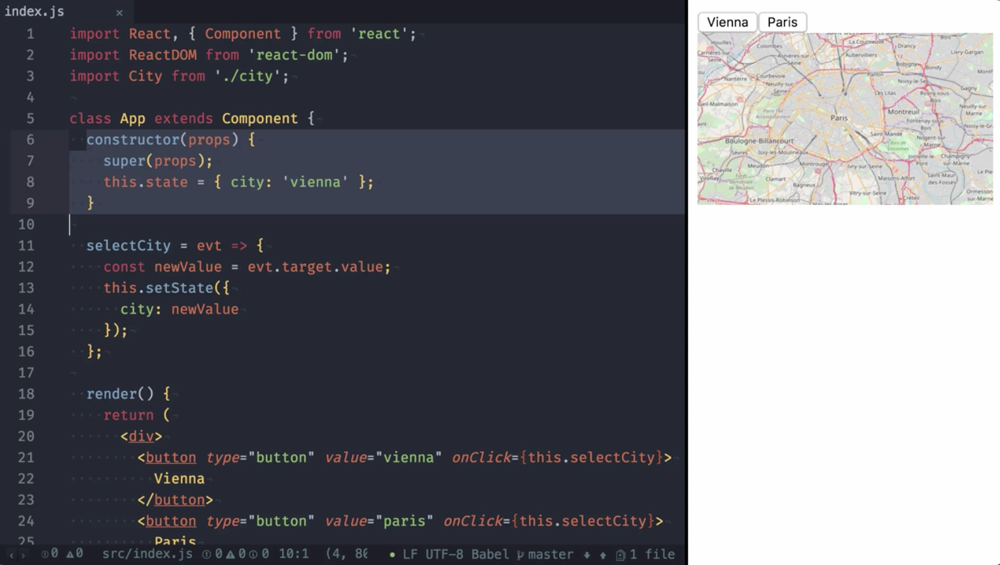

00:00 Here we have an application rendering a map of the selected city. You can switch the city by clicking on one of these buttons. One you do that, a new map is loaded and rendered after loading is complete. The application `initializes` the `city` name, a `state`, and a `constructor`.



00:17 The `city` name is passed to the `City` component, which is actually rendering the map. In addition, we have two buttons allowing us to change the selected city. 

```javascript
render() {
  return (
    <div>
      <button type="button" value="vienna" onClick={this.selectCity}>
        Vienna
      </button>
      <button type="button" value="paris" onClick={this.selectCity}>
        Paris
      </button>
      <City name={this.state.city} />
    </div>
  );
}
```

Unfortunately, the city component doesn't check for changes, and loads the map every time an update is triggered.

00:35 There are multiple ways to solve this. For once, improving the `City` component, but this might be out of your control. An alternative is to prevent the new update. To do so, we can leverage a new feature of React 16.

00:49 We improve our select city method to check the new value is the same as the existing one. When they are the same, we simply `return` `null` for `setState`. This prevents an update being triggered.

```javascript
selectCity = evt => {
    const newValue = evt.target.value;
    this.setState(state => {
      if (state.city === newValue) {
        return null;
      }
      return {
        city: newValue
      };
    });
  };
```

01:04 When clicking on Paris, the city map loads, but when clicking on it a second or even a third time, it won't anymore, since the update was prevented. When clicking on Vienna, it will still switch and load the map.