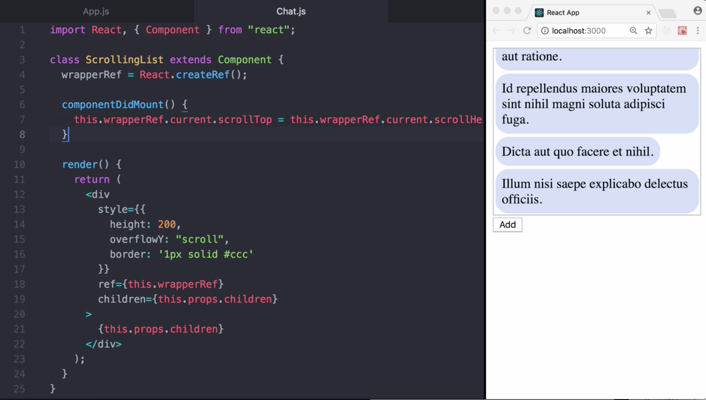

00:00 In this lesson, we are rendering the messages of a chat application. We can scroll up to see previous messages through the use of our chat component. The most recent messages are at the bottom, and therefore the component is scrolling through the bottom of list when componentDidMount is invoked.

00:22 To add a new message, we can use the add button. While this is a good experience in case the user actively scrolled up, this is not comfortable in an active chat, where the user wants to read incoming messages.



00:35 In order to get that experience, we need to capture the scroll position before render happens. Therefore, we can use `getSnapshotBeforeUpdate`, which receives `prevProps` and `prevState`. In our case, we alias the `wrapperRef` to `wrapper` for convenience.

00:51 Then we return the result of a comparison, checking if the current scrolling position is at the end. The returned result is available in `componentDidUpdate` as a `third parameter`. In case the scroll position was at the end, we make sure it's again at the end. In case it wasn't, we don't do anything.

#### chat.js
```javascript
getSnapshotBeforeUpdate(prevProps, prevState) {
  const wrapper = this.wrapperRef.current;
  return wrapper.scrollTop + wrapper.offsetHeight >= wrapper.scrollHeight;
}

componentDidUpdate(prevProps, prevState, snapshot) {
  if (snapshot) {
    this.wrapperRef.current.scrollTop = this.wrapperRef.current.scrollHeight;
  }
}
```

01:12 If we add more different messages, the component always will scroll to the bottom. If we scroll up a bit further, then add one or more to our messages, the scroll position doesn't change. Now we have exactly the experience we are looking for.

01:28 How does it work? `getSnapshotBeforeUpdate` is invoked right before the most recently rendered output is committed to the DOM. It enables your component to capture current values, for example, a scroll position before they potentially changed. In `componentDidUpdate`, which runs after the rendered output is committed to the DOM, we can leverage the snapshot information.