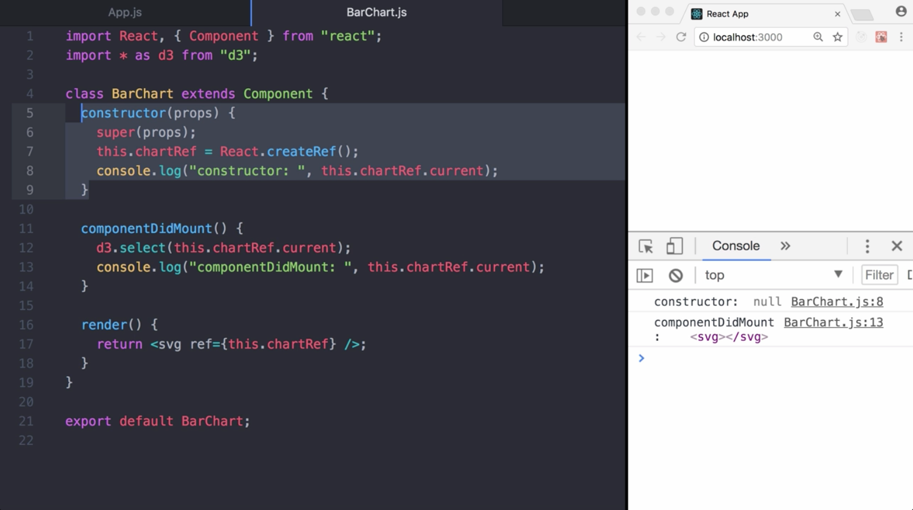
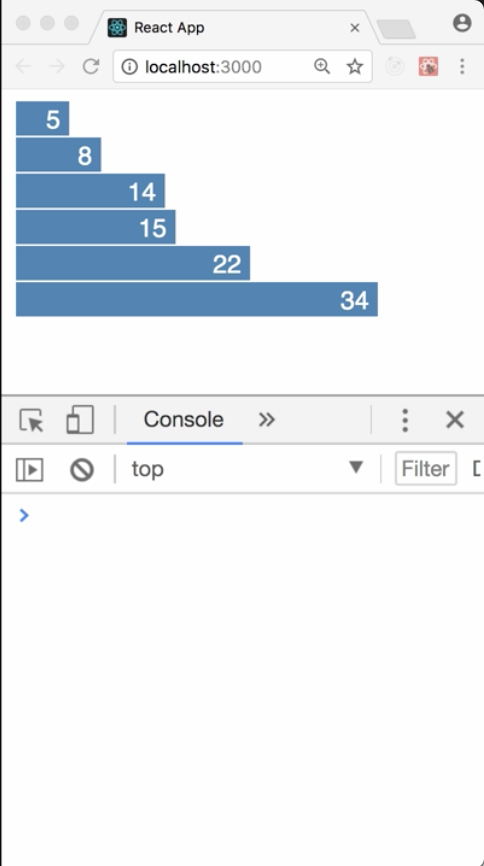
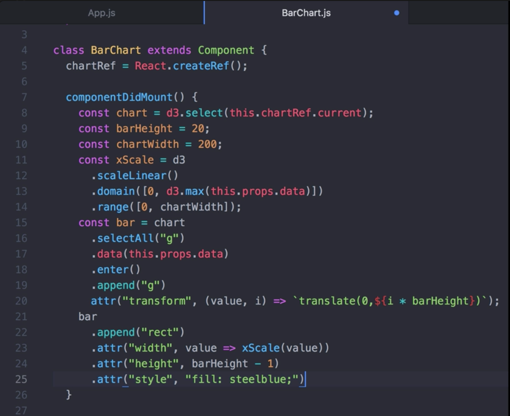
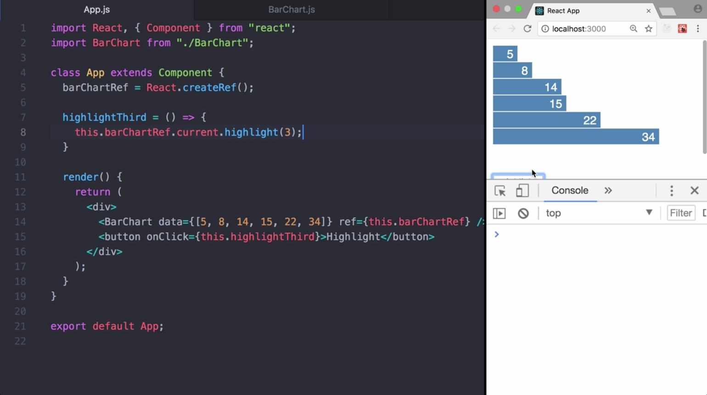
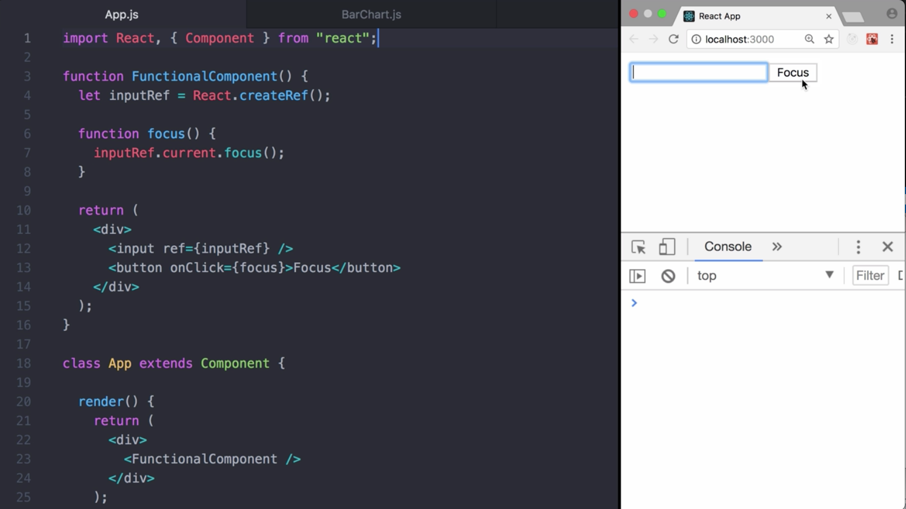

00:00 This application renders a bar chart. The bar chart isn't implemented yet, and only rendering an empty `svg` element at the moment. To implement it, we want to use the charting library D3. It's a great tool but it needs access to the DOM element. To do so, we can `import d3`, add a `className` to the `svg`, and select it using `d3.select` inside `componentDidMount`.

```javascript
import React, { Component } from "react";
import * as d3 from "d3";

class BarChart extends Component {
  componentDidMount() {
    d3.select(".chart");
  }

  render(){
    return <svg className="chart" />;
  }
}
```

00:24 While this is possible, this could cause trouble for our whole application further down the road. For example, to avoid problems, we would need to ensure that this is the only class named chart used in our whole application. Not a great idea. How can we fix it?

00:47 In the typical React data flow, props are the only way that parent components interact with the children. However, there are a few cases like ours where we need to imperatively modify a child outside of the typical data flow. React therefore provides an escape hatch with so-called refs, allowing us to modify an instance of a React component or a DOM element.

01:12 To create a ref, we can use `React.createRef` in the `constructor`. In this case, we assign it to `this.chartRef`. Using ref, we can bind our `chartRef` to the `svg`. In order to access it, we can then use `this.chartRef.current`. Let's log out ref to get a better understanding of what's happening here.

01:47 First, we create the chart ref, but inside the constructor the current property is set to `null`. The ref is not bound yet. Since render didn't yet run, the changes haven't been committed to the DOM. Once that's done, `componentDidMount` run and we finally could access the ref. 





By the way, as an alternative, you also can instantiate the ref directly as a property of this class.

02:15 Now that we can access the `svg`, let's write a bunch of code to actually `render` a `bar chart`. I'm not going to go into detail here, as this isn't the purpose of this lesson. To give you a glimpse of it, we create the `xScale` function that helps us calculating the width. Then, we add a couple of `rectangles` and `texts` for the bars.



02:54 Looks good. Previously, I briefly mentioned that we can also ref instances of React components. Let's try this with our `BarChart` component. We add a function `highlight` and when invoked it will fade the color of the selector bar to orange and back to steel blue.

```javascript
highlight = index => {
    const transition = d3
      .transition()
      .duration(450)
      .ease(d3.easeLinear);
    d3
      .select(this.chartRef.current)
      .select(`g:nth-child(${index}) rect`)
      .transition(transition)
      .style("fill", "orange")
      .transition(transition)
      .style("fill", "steelblue");
  };
```

03:22 In `App`, we create a `Ref` for the `BarChart`. Then `add a button`, use the `Ref` to `invoke highlight`. Worked as expected and not that complicated after all. 



What you should know though is that you may not use the ref attribute on functional components simply because they don't have instances. For example, if you have a `FunctionalComponent` containing an `input`, use the `ref` on it and it will stay `null`.


04:11 Keep in mind, we can use Ref for a `FunctionalComponent`, but for sure can use Refs inside it. For example, here, we create a `ref` for the `input` and provide a `button` that once clicked will switch the focus to the `input`.

04:38 React also provides the callback Refs which will continue to be supported in addition to the createRef API. While less convenient, this is likely more flexible in the sense that you have a lot more control.

