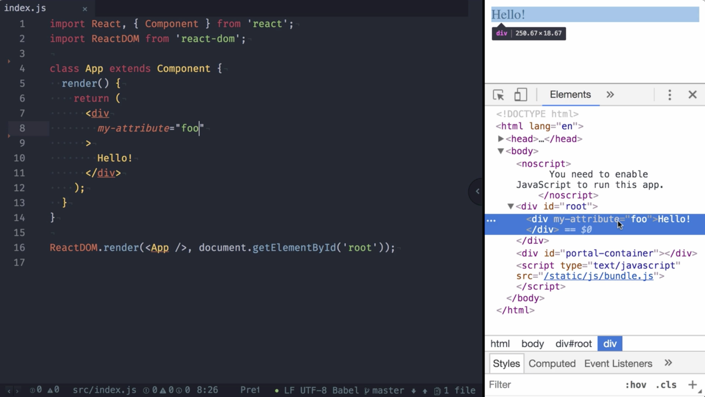
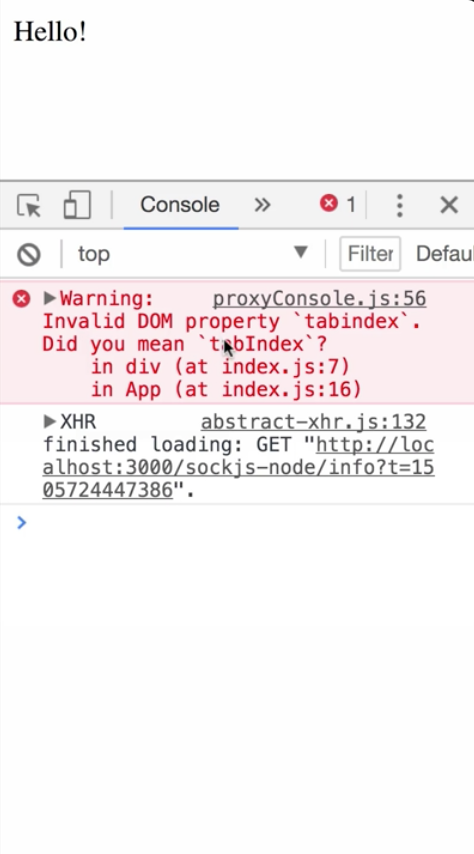
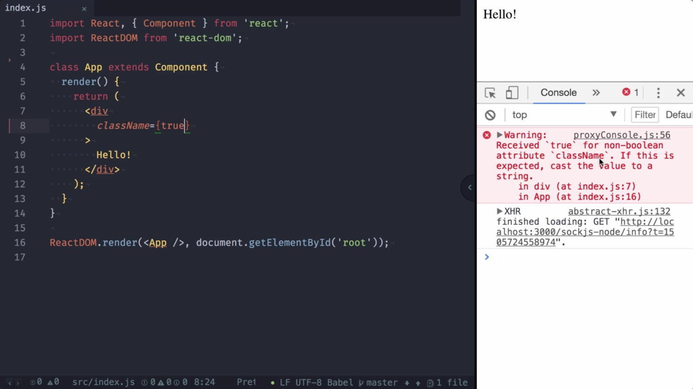
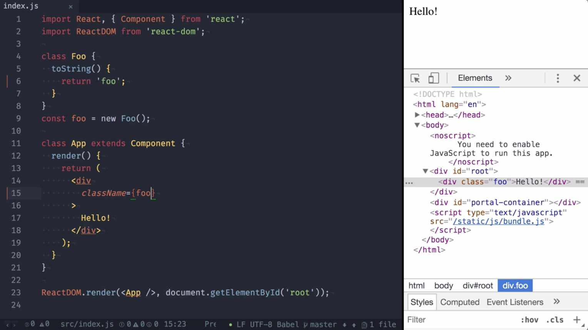
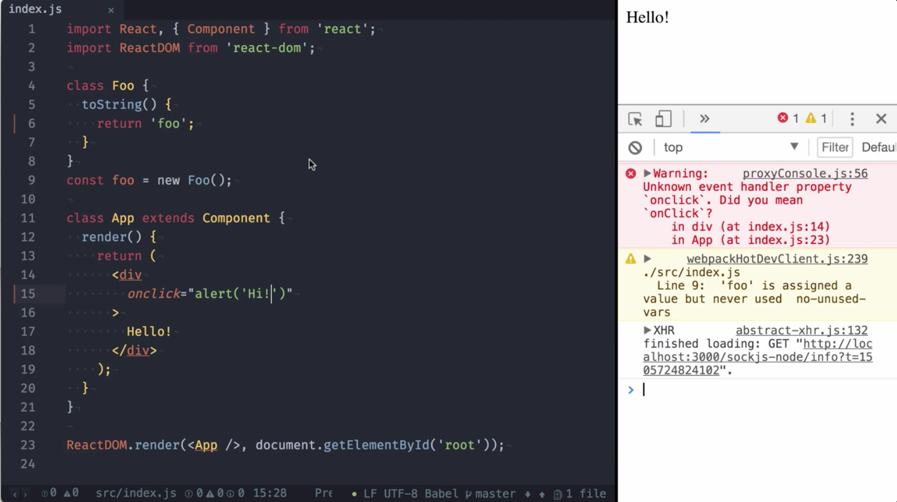

00:00 Since React 16, you now can provide custom attributes to DOM components, like a div. For example, we can add `my-attribute` and set it to `foo`. After rendering the page, we inspect the DOM and see the attribute is there. This wasn't the case in React 15, as it used to ignore unknown DOM attributes.

00:21 While React 16 now allows you rendering custom attributes, you should still use the canonical React naming for known attributes. For example, in HTML, tabindex is all lowercase. If you provide that to a DOM component, React will render it, but also warn you that you should use `tabIndex` with an uppercase `I`.

00:43 After changing it to that, the warning is gone. This also means from now on, it's possible to pass the attribute class, which makes it possible to simply copy and paste standard HTML from anywhere for experimentation. Still, you should convert `class` to the React name `className`.

01:05 While custom attributes are possible now, keep in mind that there are a couple of cases where React will not render your attributes and warn you in the console. For example, if the value provided (`true`) to the attribute is a `Boolean`. Same goes for functions as well as symbols.

01:30 Valid values are `strings`, as we have shown before. `Objects` are shown as well. Same goes for `numbers`, even if the value is not a number value, although this will show you a warning. Normal numbers like five are rendered and no warning is shown.

01:52 All of these valid values are converted to `strings` using `toString`, and this can be leveraged by, for example, creating a type with a custom `toString` method. To demonstrate this, we create the class `Foo` and provide a `toString` method that `returns` `foo` as a `string`.

02:10 If you create an instance of this `foo class` and `pass` it to an `attribute`, it will `render` the `value returned` by `toString`. 

02:19 There is one last exception, `attributes` staring with "`on`" are not passed through, as this could become a potential security hole.

