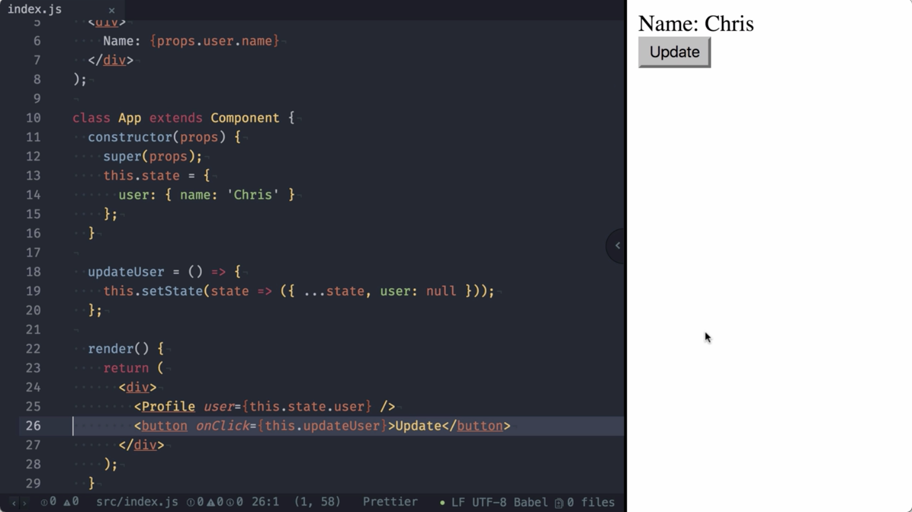
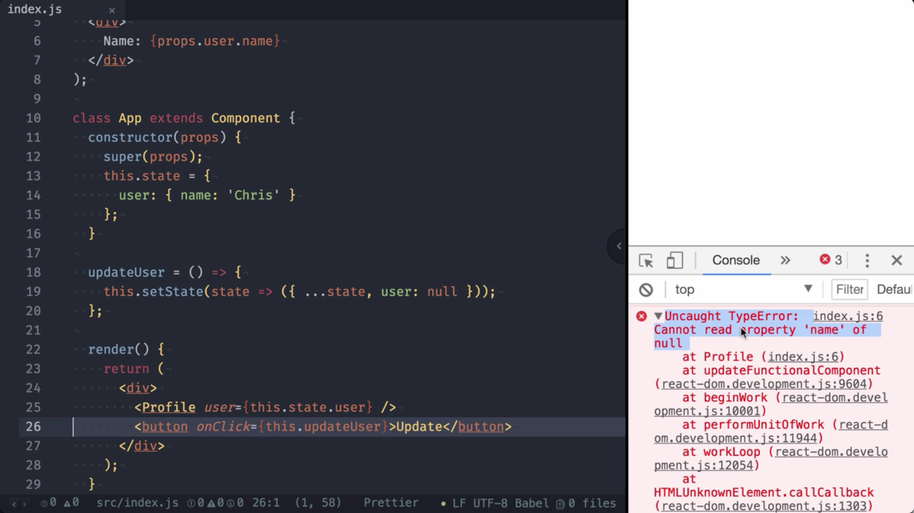
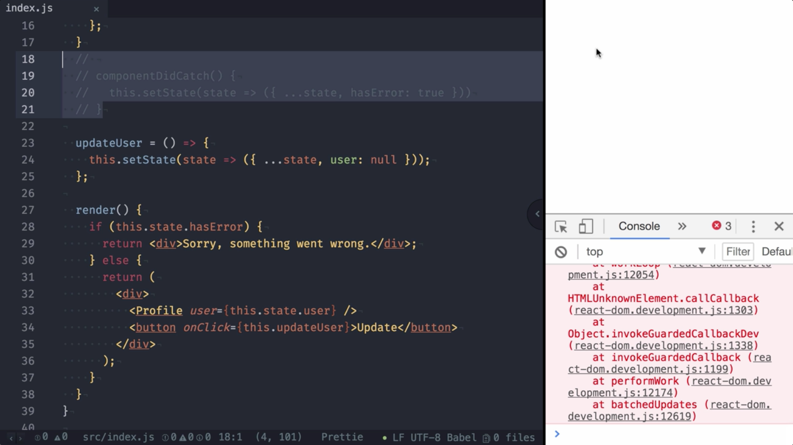
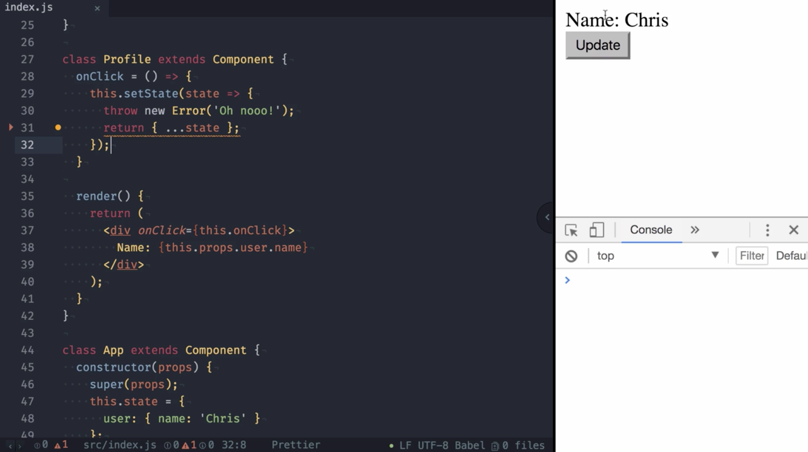

00:00 Here, you can see an application rendering a profile. The profile component expects that a `user` object with the property name is passed in to render the name. Further, render button to update the `user`. As you can see, this works perfectly fine.



00:15 Unfortunately, it doesn't work if the profile receives `null` for the `user`, since it will try to access the property name on null, which then throws an `Uncaught TypeError` seeing that it cannot read property name of null.



00:28 To handle such errors. React 16 introduces the life-cycle log, `componentDidCatch`. It allows us to catch JavaScript errors from anywhere in a component's child component tree. In order to inform the user that something went wrong, we're going to update the `state`, and then indicate that an `error` happened.

```javascript
class App extends Component {
constructor(props) {
  super(props);
  this.state = {
    user: { name: 'Chris' }
    hasError: false
  };
}

componentDidCatch() {
  this.setState(state => ({ ...state, hasError: true }))
}
```

00:51 In `render`, we had a check for the `state` and `render fallback UI`. When using React 16 or above, it's important, for a good user experience, to include this behavior since errors that were not caught will result in unmounting of the whole React component tree.

```javascript
render() {
  if (this.state.hasError) {
    return <div>Sorry, something went wrong.</div>;
  } else {
    return (
      <div>
        <Profile user={this.state.user} />
        <button onClick={this.updateUser}>Update</button>
      </div>
    );
  }
}
```

01:17 Let me demonstrate this by commenting out `componentDidCatch`, refresh the page, and updating the user. As you can see, the content has been removed. The whole component tree is gone.



01:27 This wasn't the case in React 15 and lower, as the UI stayed untouched there. This behavior changed as, based on experiences that the React team made, it holds the view that it is worse to leave corrupted UI in place rather than to completely remove it.

01:44 Let's bring back `componentDidCatch` and explore it further. It receives two arguments that allow us to track and investigate the errors further.

01:52 The first argument is the `error` instance itself. The second one is `info` containing the `component stack`. 

```javascript
componentDidCatch(error, info) {
  console.log(error);
  console.log(info);
  this.setState(state => ({ ...state, hasError: true }));
  sendToErrorReporting(error, info);
}
```

When running in production, this especially is useful to send to an error reporting service to identify where your application breaks down.

```javascript
import sendToErrorReporting from './sendToErrorReporting';
```

02:21 In its current state, our app component became what the React team describes as an error boundary. It is defined by the following three traits.

02:30 (1)It catches JavaScript errors anywhere in the child component tree, (2) logs these errors, and (3) display fallback UI instead of the component tree when it crashes.

02:40 As the next step, we want to extract the error boundary functionality to a separate component in order to separate the error handling into a reusable unit. We create a new component, `MyErrorBoundary`. It includes the state `hasError`, as well as our `componentDidCatch` functionality.

```javascript
class MyErrorBoundary extends React.Component {
constructor(props) {
  super(props);
  this.state = {
    hasError: false
  };
}

componentDidCatch(error, info) {
  this.setState(state => ({ ...state, hasError: true }));
  sendToErrorReporting(error, info);
}
```

03:17 In the render method, make sure to `render` the `fallback UI` if an error occurred. Otherwise, we just render the component's children.

```javascript
render() {
  if (this.state.hasError) {
    return <div>Sorry, something went wrong.</div>;
  } else {
    return this.props.children;
  }
}
}
```

03:31 We can now `wrap` our `profile` inside our `MyErrorBoundary`, and as expected, this results in the same behavior, where we now have a reusable `MyErrorBoundary` component.

03:56 This allows us also to decide if, for example, the update button is in or outside the error boundary. Another example would be multiple profiles, each of them wrapped in their own error boundary.

04:09 Since error boundaries work with deeply nested component structures, it's probably best to put it in a few strategic places, rather than every level. Keep in mind to have at least one error boundary in place since, as already mentioned, uncaught errors result in unmounting of the whole component tree.

```javascript
render() {
  return (
    <div>
      <MyErrorBoundary>
        <Profile user={this.state.user} />
        <button onClick={this.updateUser}>Update</button>
      </MyErrorBoundary>
    </div>
  );
}
}
```

04:28 Last but not least, we want to explore which errors are caught. First of all, any error in a function component, but also in the render method of class component. We `change` our `profile` to a `class component`, and as you can see, the same effect.

04:50 In addition to that, any `error` thrown in a `constructor` will also `render` the `fallback UI`. Further, any lifecycle method thrown in error will also be caught by a parent's `componentDidCatch`.

05:12 We introduce a `componentDidMount`, and throw an `error` in there. As expected, the fallback UI is rendered.

05:22 It's important to know that error` thrown in event handlers aren't caught by `componentDidCatch`, with one exception -- an error that is thrown inside a function passed to setState. Let me demonstrate this.

05:36 First, we add a `onClick` handler throwing an `Error`. As you can see, the Error is not caught. Now, we add `setState`, and pass in a function `throwing` an `error`. 

```javascript
class Profile extends Component {
onClick = () => {
  this.setState(state => {
    throw new Error("Oh nooo!");
    return { ...state };
  });
};
```


As you can see, the error is caught, and the fallback UI is rendered.

