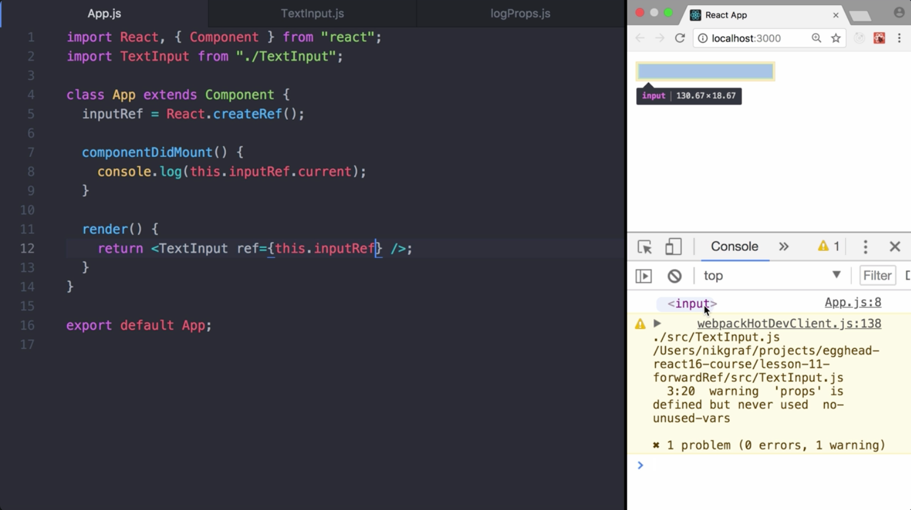
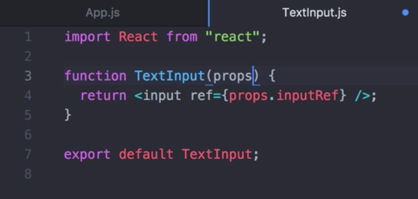
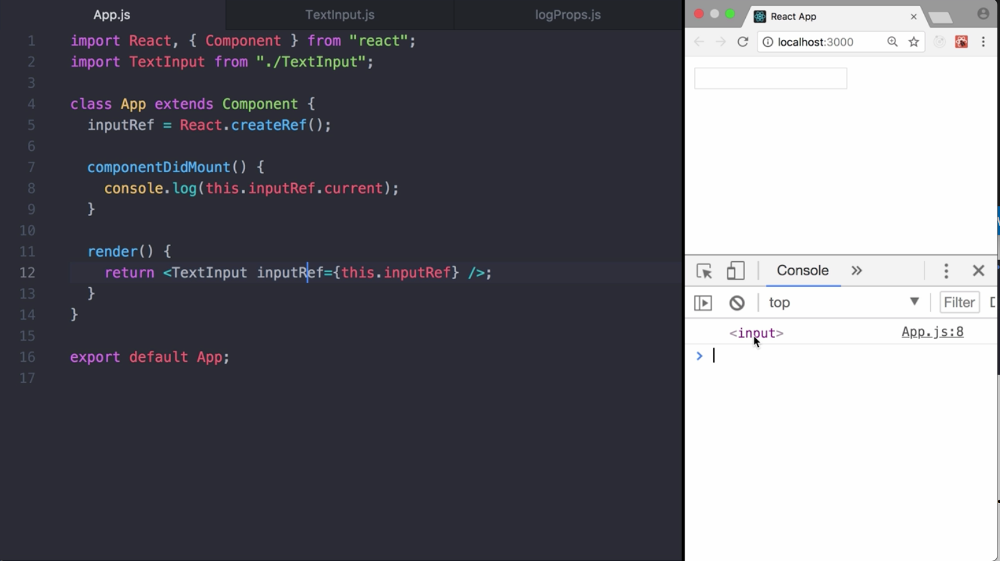
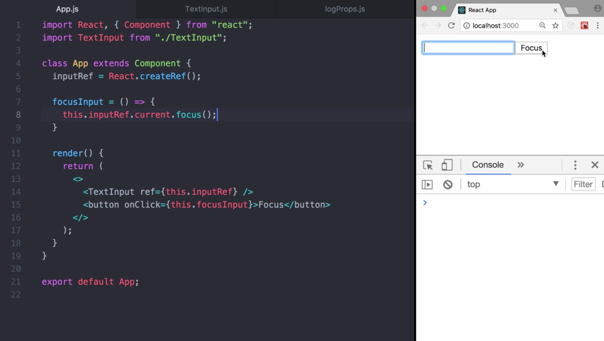
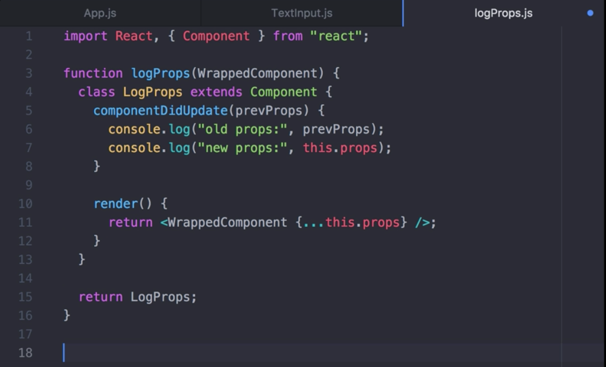
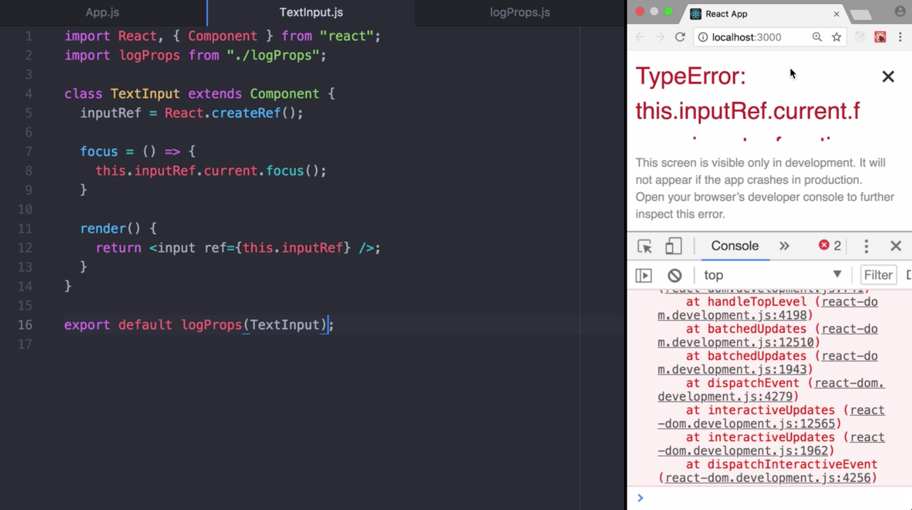
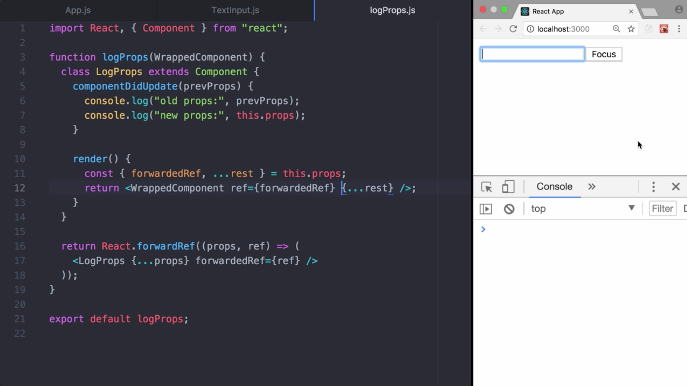
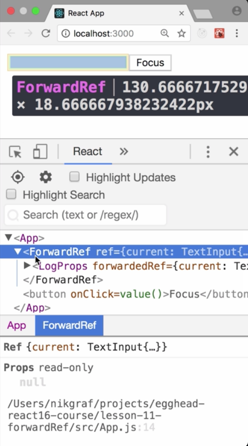
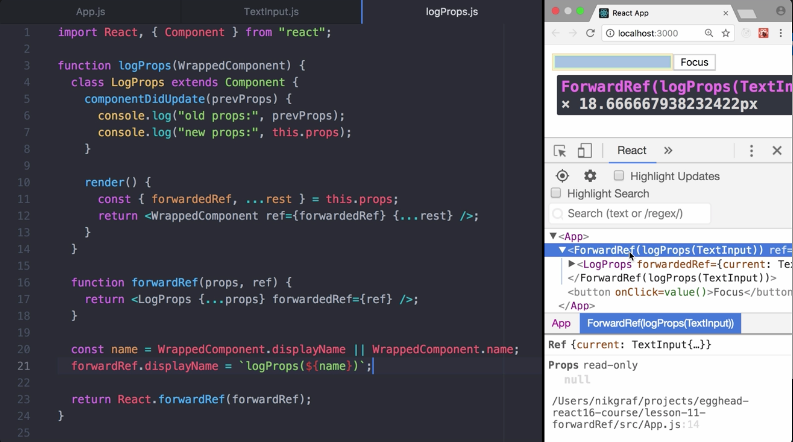

Instructor: 00:02 The function `forwardRef` allows us to pass a `ref` through a `component` to one of its descendants. It accepts a function with the argument's `props` and `ref`. Accordingly, we update our `TextInput` component. While this is possible, make sure to avoid this pattern. Someone using the text input without knowing its internals would expect that they receive an instance of text input while we currently provide them with the DOM element.

00:28 See here when we log out the `inputRef`. In general, it's not recommended to provide access to a child's DOM node from the parent component because it breaks component encapsulation. Nevertheless, it can occasionally be useful for triggering focus or measuring the size or position of a child DOM node.

00:48 In case you want to provide access, the React team recommends to expose a prop on the child, for example `inputRef`. 

The child component can then `forward the prop` to the DOM node as a ref attribute. This lets the parent pass its ref to the child's DOM node through the component in the middle.

01:08 ForwardRef should be avoided in such a case. Still, it can be a useful tool, particularly with higher order components. 

Let me demonstrate it by an example. We first rewrite our `TextInput` a bit and add a `focus` function.

01:32 In the `App` component, we `rendered` a `TextInput` and a `button`. Once the button is pressed, we programmatically set `focus` on the `TextInput` using a `ref`. Works fine. 

Next up, we create the `logProp`'s higher order `component`. It allows us to `render` a `wrapped component`, `logging` its `props`, and all of that without changing the text input component itself.

02:03 Let's use it to enhance our `TextInput`. Rendering works perfectly fine. There's one issue though. Our focus button stopped working. 

This is the case because ref is referring to the `LogProps` component inside the `logProps` function. Because it's spreading all props automatically, someone could think ref is passed down, as well. Ref is not a prop. Like key, it's handled differently by React.

02:30 To get our example working again without removing `logProps`, we can use ref for hoarding. Instead of returning `logProps`, we use `React.forwardRef`. We `pass the ref` as `forwardedRef` prop to the `LogProps` component. Inside the `render` function, we extract `forwardedRef` from the `props` and `pass it as a ref`. In addition, we spread all the other props. If you try the focus button again, it works. Pretty cool.

02:57 Before we wrap up, there's one more refactoring I want to show you in order to give the component a better display name in the dev tools. Currently, it's `forwardRef`. This isn't very descriptive though. It doesn't show that the higher order component `LogProps` is involved. We can do better.

03:15 As a first step, we extract the function. Next up, we extract the name of the component and attach a custom `displayName` for our `forwardRef` function using `LogProps` and wrapping the original component name.

03:45 As you can see in the dev tools, the structure became much more clearer since it shows `ForwardRef`, `LogProps` of `TextInput`.

