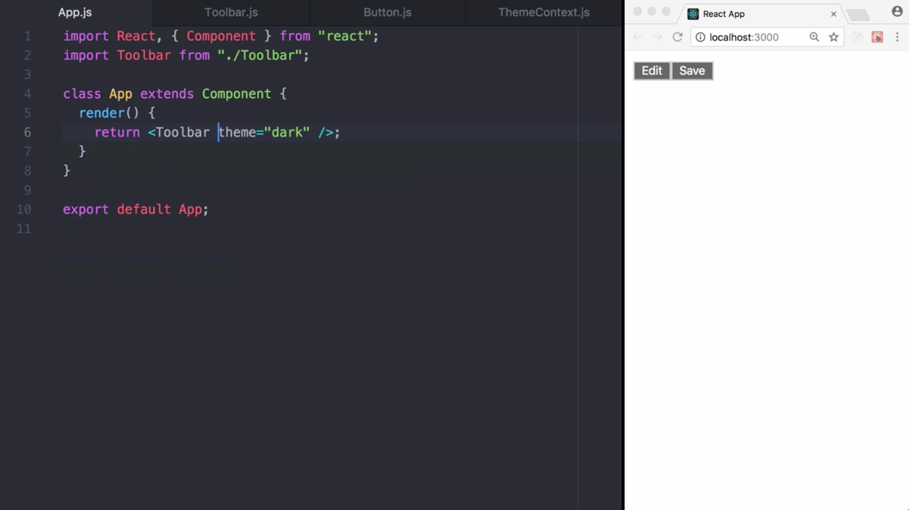
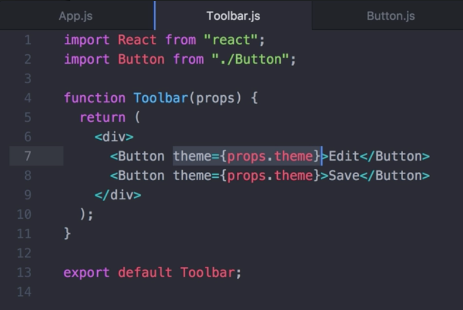
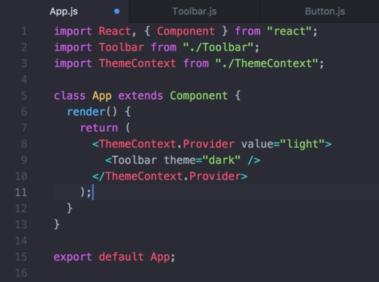
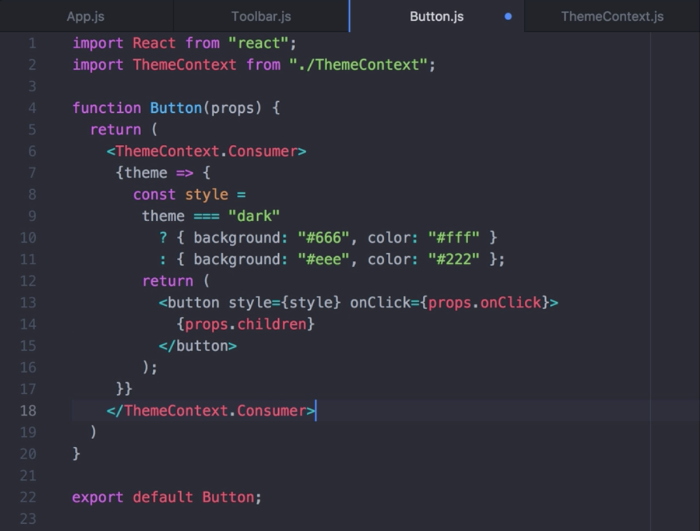
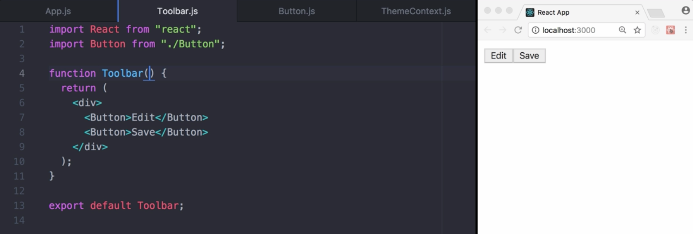
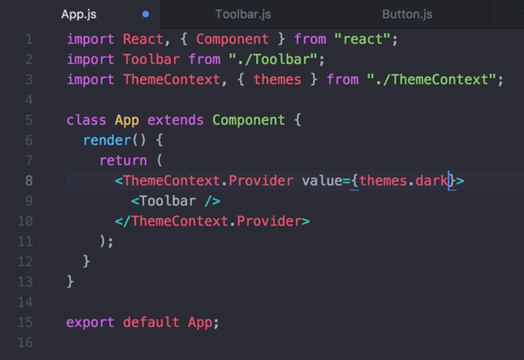
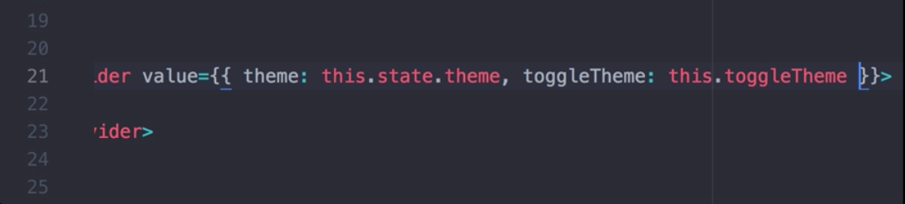
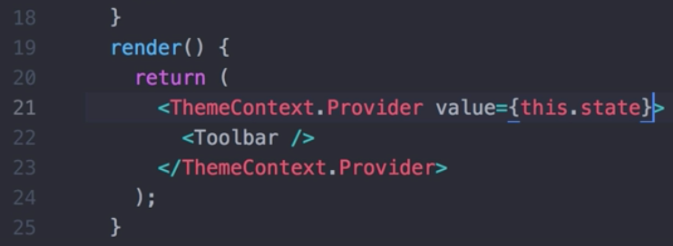
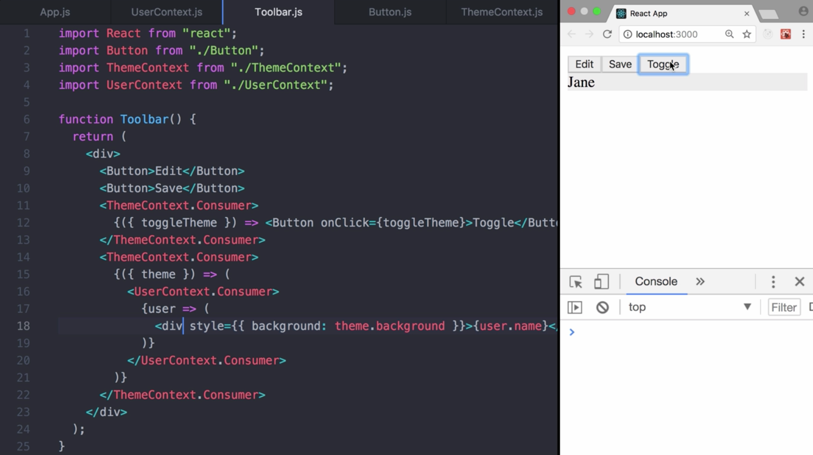

00:00 Here, we have an application rendering two buttons inside a toolbar. 



The button component accepts a `theme` property, which can be either dark or light. Choose the same theme and the whole application will manually pass the `theme` prop for toolbar in order to style the button components. 



This can become painful if every single button in the app needs to know the theme because it would have to be passed through all components.

00:25 Context can help here since it's designed to share data that can be considered global for a whole tree of React components. Examples would be the currently authenticated user, the theme, or a preferred language. In order to create the context, we call `React.createContext`. It will `return` an `object` containing the `Provider` and the `Consumer`. `createContext` accepts one `parameter`, the `default value`. In our case, we're going to set it to `dark`.

00:56 Instead of destructuring, we're going to assign it to `ThemeContext` and `export` it. 

#### ThemeContext.js
```javascript
import React from "react";

const ThemeContext = React.createContext("dark");

export default ThemeContext;
```

We now wrap our `toolbar` in the `ThemeContext.Provider` and provide the value `light`. The value is passed down to the component tree below and any component can read it, no matter how deep it is.



01:18 Inside `button`, we can use a `ThemeContext.Consumer`. A consumer requires a function as a child. The function receives current context value and returns a React node. For our `theme` parameter, React will find the closest theme `Provider` in the tree above and use its value.



01:49 In `Toolbar`, we can remove the `theme` props. Success. As you can see, the buttons are now themed light using the context API. 



By the way, if you remove the theme context provider in the App component, deprecation will still work properly.

02:07 The consumers simply will fall back to the default value we provided when creating the context. This is especially helpful for testing components in isolation without wrapping them. 


We can also remove the prop `theme` on `Toolbar` since we don't use it anymore.

02:24 What's next? Of course, a value can be more complex. For example, instead of just passing down a string value, we could pass down a more complex data structure like an object, `themes`.

#### ThemeContext.js
```javascript
export const themes = {
  dark: {
    foreground: "#fff",
    background: "#666"
  },
  light: {
    foreground: "#222",
    background: "#eee"
  }
};
```

02:43 In `App`, we also have to update the value, `themes.dark`. We import `{ themes }` and provide the `dark` theme to the `Provider`. 



In the `Button`, we leveraged a `themes` object to update our button `style`. So far so good.

#### button.js
```javascript
function Button(props) {
  return (
    <ThemeContext.Consumer>
      {({ theme }) => {
        const style = {
          background: theme.background,
          color: theme.foreground
        };
        return (
          <button style={style} onClick={props.onClick}>
            {props.children}
          </button>
        );
      }}
    </ThemeContext.Consumer>
  );
}
```

 Sometimes, it is necessary to update the context from a component that is nested somewhere deeply in the component tree.

03:07 In this case, we can pass a function down through the context as part of the object to allow the consumer to update the context. We'll replace the `theme` with an object containing the properties `theme` and `toggleTheme`. 

#### ThemeContext.js
```javascript
const ThemeContext = React.createContext({
  theme: themes.dark,
  toggleTheme: () => {}
});
```

In `App`, we add `state`, keeping track of the current theme, as well as a `theme` target function for updating `state`.

03:36 Both are passed to the `ThemeContext.Provider` as part of the `state` object. 

#### App.js
```javascript
class App extends Component {
  constructor(props) {
    super(props);
    this.state = {
      theme: themes.dark,
      toggleTheme: this.toggleTheme
    };
  }

  toggleTheme = () => {
    this.setState(state => ({
      theme: state.theme === themes.dark ? themes.light : themes.dark
    }));
  };

  render() {
    return (
      <ThemeContext.Provider value={this.state}>
        <Toolbar />
      </ThemeContext.Provider>
    );
  }
```

Next up, we updated our `Button` component. We structured a `Consumer` function parameter and extract the `theme`. 

#### button.js
```javascript
function Button(props) {
  return (
    <ThemeContext.Consumer>
      {({ theme }) => {
        const style = {
          background: theme.background,
          color: theme.foreground
        };
        return (
          <button style={style} onClick={props.onClick}>
            {props.children}
          </button>
        );
      }}
    </ThemeContext.Consumer>
  );
}
```

We add another `ThemeContext.Consumer` to the `Toolbar`, destructure the parameter to get the `toggle` theme, and add a `button` that toggles the theme once clicked.

#### Toolbar.js
```javascript
import React from "react";
import Button from "./Button";
import ThemeContext from "./ThemeContext";

function Toolbar() {
  return (
    <div>
      <Button>Edit</Button>
      <Button>Save</Button>
      <ThemeContext.Consumer>
        {({ toggleTheme }) => <Button onClick={toggleTheme}>Toggle</Button>}
      </ThemeContext.Consumer>
    </div>
  );
}
```

04:03 Let's give it a try. Works fine. There's one gotcha though I want to make you aware of. When passing a value to `Provider`, avoid doing this. It can lead to unintentional renders in `Consumers` since every time the provider is rendered, a new object for the context value is created. The root cause here is that context uses reference identity to determine when to rerender all the `Consumers`.



 Let's undo our change and move on.

 

04:35 For clarification, consumers and providers from different context instances are independent of each other. In order to use multiple providers and consumers, you need to nest them. Let's see an example. Here, we create a `UserContext` containing a `name`.

#### UserContext.js
```javascript
import React from "react";

const UserContext = React.createContext({ name: "Joe" });

export default UserContext;
```

 In `App`, we can `import` the `UserContext` and pass the `user` to the `UserContext.Provider`.

 #### App.js
 ```javascript
import React, { Component } from "react";
import Toolbar from "./Toolbar";
import ThemeContext, { themes } from "./ThemeContext";
import UserContext from "./UserContext";

const user = { name: "Jane" };

class App extends Component {
  constructor(props) {
    super(props);
    this.state = {
      theme: themes.dark,
      toggleTheme: this.toggleTheme
    };
  }

  toggleTheme = () => {
    this.setState(state => ({
      theme: state.theme === themes.dark ? themes.light : themes.dark
    }));
  };

  render() {
    return (
      <UserContext.Provider value={user}>
        <ThemeContext.Provider value={this.state}>
          <Toolbar />
        </ThemeContext.Provider>
      </UserContext.Provider>
    );
  }
}

export default App;
```

05:09 In `Toolbar`, we can use the `ThemeContext.Consumer` and inside it the `UserContext.Consumer` to `render a div`.

05:30 Voila. Now, we can also switch to theme for the div while the user is provided through the user context. I hope this lesson was a good introduction to the context API. Keep in mind in real world cases don't use context just to avoid passing down props a few levels. Stick to cases where the same data needs to be accessed in many components at many levelT.

