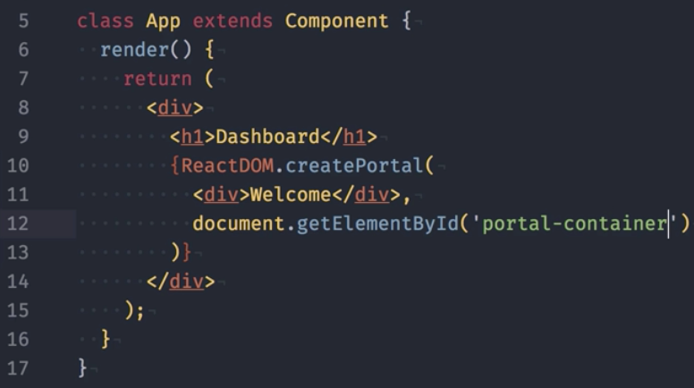
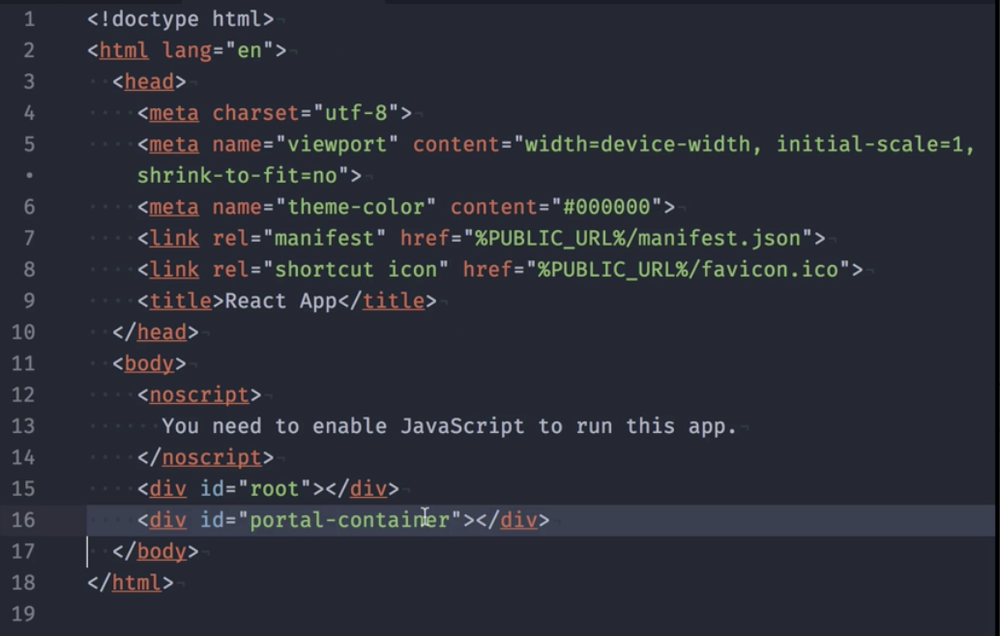
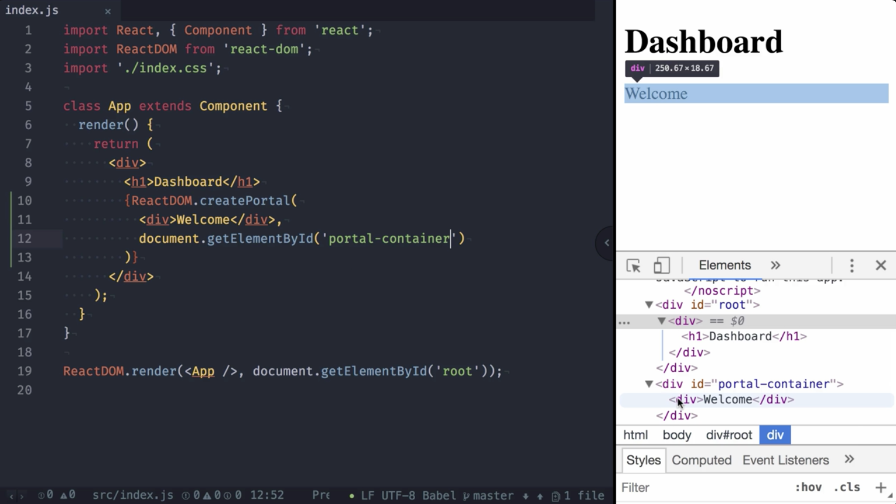
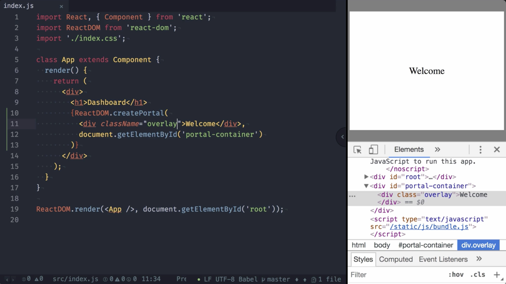
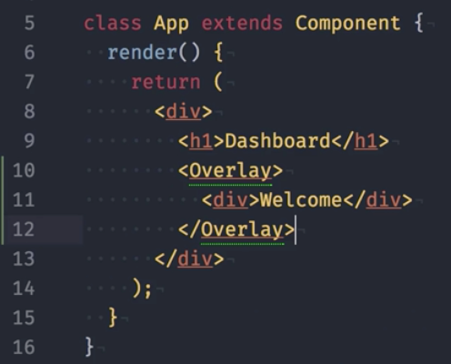
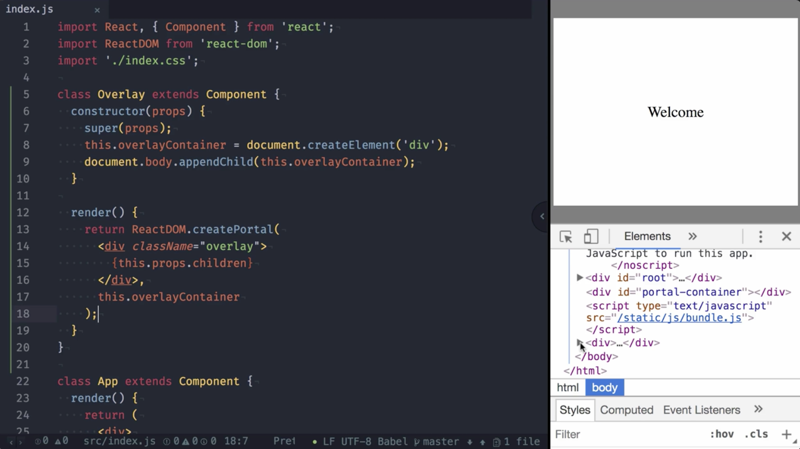
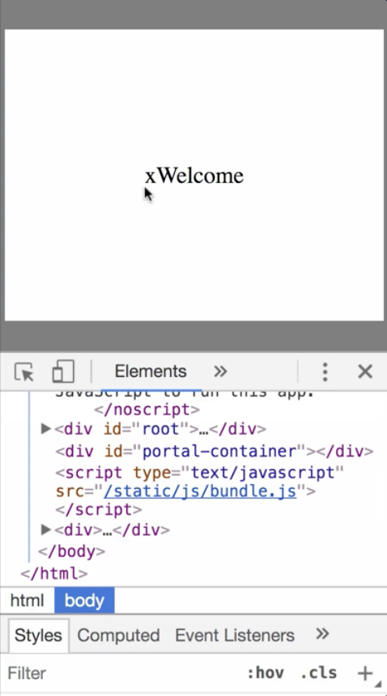

00:00 We can leverage the new `ReactDOM` function `createPortal`. It accepts two arguments. The first one is the new subtree containing components. In our case, we simply provide a `div` containing the text `Welcome`. The second argument is the `target container`.



00:17 Here we're going to query for the element with the ID `portal-container`, which I already added inside the index.html right after our React root. 



00:28 As you can see, our welcome box is now rendered, although the code for the welcome text is inside the `App` component, which is located inside the container root.

00:38 If you look at the DOM structure, it's actually rendered inside the `portal-container`. This comes in very handy for things like overlays. 



00:48 Let me demonstrate this by adding the `className` `overlay` that I prepared previously to a `div`. It appears like an overlay. So far, so good.



00:58 The current approach requires us to extend index.html. We can give the component itself the control to add and remove new DOM elements right at the end of the body. To do this, we're going to extract our `functionality` to an `Overlay` component.



01:22 In the constructor, we call `super`, and right after that, `create` an `overlayContainer` using `createElement`. Right after its creation, we `append` this `div` to the `document body`. In the render function, we don't need a wrapping element. We can return the portal right away.

01:42 Its rendered content is the `overlay`, and then the `children` passed to the `Overlay` component. The target is the `overlayContainer` that we created in the constructor. By inspecting the DOM, we can verify that the div was created, and the overlay attached to it. Pretty cool.



02:06 When using this technique, I recommend you to also properly clean up, meaning to remove the div that we created in the constructor. Otherwise, you might create a lot unused divs that bloat your DOM tree unnecessarily.

02:20 We add the React life cycle method, `componentWillUnmount`, and in there, `remove` the `overlayContainer` using `document.body.removeChild`. In addition, we add a closing `X` inside the `overlay`. The idea is to remove the overlay component when the X is clicked.

```javascript
class Overlay extends React.Component {
  constructor(props) {
    super(props);
    this.overlayContainer = document.createElement('div');
    document.body.appendChild(this.overlayContainer);
  }

  componentWillUnmount() {
    document.body.removeChild(this.overlayContainer);
  }

  render() {
    return ReactDOM.createPortal(
      <div className="overlay">
        <span onClick={this.props.onClose}>x</span>
        {this.props.children}
      </div>,
      this.overlayContainer
    );
  }
}
```

02:42 To make that happen, in the `App` component, we add the `state`, `overlayActive`, and set it to `true`. Then we add a `closeOverlay` function, setting `overlayActive` to `false`.

03:02 At last, we add the condition that the `overlay` is only rendered when the `overlayActive` is set to `true`, as well as the handler `onClose`. 

```javascript
class App extends React.Component {
  constructor(props) {
    super(props);
    this.state = { overlayActive: true };
  }

  closeOverlay = () => {
    this.setState({ overlayActive: false });
  };

  render() {
    return (
      <div>
        <h1>Dashboard</h1>
        {this.state.overlayActive &&
          <Overlay onClose={this.closeOverlay}>
            <div>Welcome</div>
          </Overlay>}
      </div>
    );
  }
}
```

Switching back to the browser, you can see once we click X, the overlay is gone.



03:21 Let's refresh and do it one more time, but take a closer look at the DOM. As you can see, then check the container div is removed.
 
