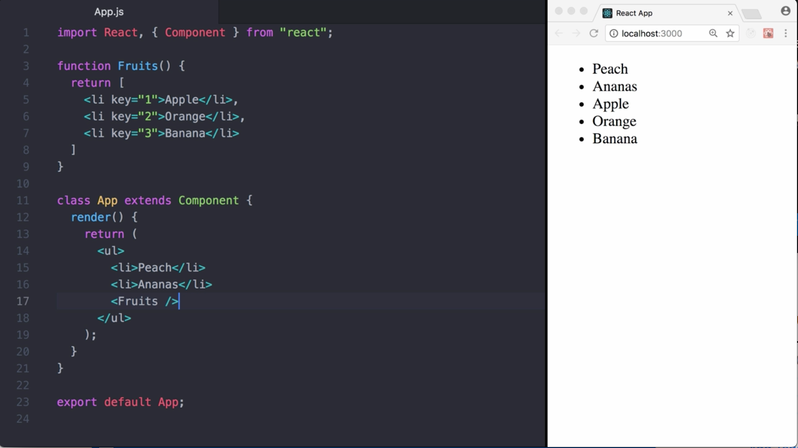
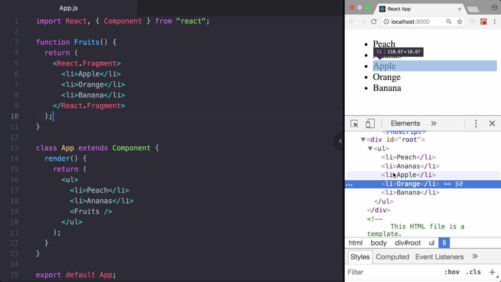
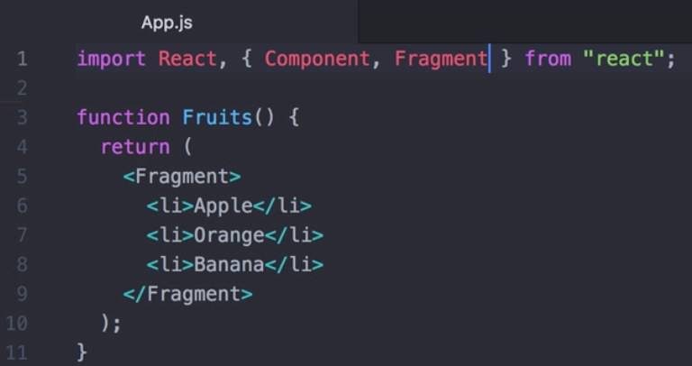
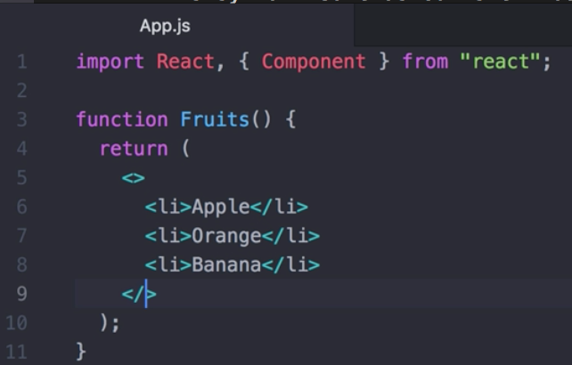

00:00 You can see an app rendering a list of fruits. We can extend this list using a `Fruits` component returning an `array`.



00:17 In React 16.2, the Fragment component was added. We can `access` it using `React.Fragment`, and use it to `wrap` a `set of element`s.

```javascript
function Fruits() {
  return (
    <React.Fragment>
      <li>Apple</li>
      <li>Orange</li>
      <li>Banana</li>
    </React.Fragment>
  );
}
```

00:28 When using Fragment, no DOM element is rendered, and behaves as if your work return an array of elements. One definite benefit here is that you can omit the keys.

00:41 As you can see, all fruits show up. By inspecting the DOM, we can see all of them are rendered inside the same unordered list element. 



If desired, we can also `import Fragment` from `react` and use it directly.



00:58 To make the offering experience as convenient as possible, the reacting addicts from syntactical sugar for `Fragment` to JSX, since that of using `React.Fragment`, or importing it, we can simply use this syntax. Same as our shell before, since it automatically desugars to `React.Fragment`.



01:17 In case you need a kit Fragment, we have to use `Fragment` directly. You define a `Glossary` component, rendering for each item, a pair of HTML elements -- `dt` and `dd`. To avoid wrapping elements like a div, we use a `fragment`. Because we `provide` a `key`, we have to type out "`Fragment`."

```javascript
function Glossary(props) {
  return (
    <dl>
      {props.items.map(item => (
        <Fragment key={item.id}>
          <dt>{item.term}</dt>
          <dd>{item.description}</dd>
        </Fragment>
      ))}
    </dl>
  );
}

class App extends Component {
  render() {
    return (
      <div>
        <ul>
          <li>Peach</li>
          <li>Ananas</li>
          <Fruits />
        </ul>
        <Glossary
          items={[
            {
              id: 1,
              term: "HTML",
              description:
                "Is a descriptive language that specifies webpage structure"
            },
            {
              id: 2,
              term: "CSS",
              description:
                "Is a declarative language that controls how webpages look in the browser"
            }
          ]}
        />
      </div>
    );
  }
}
```