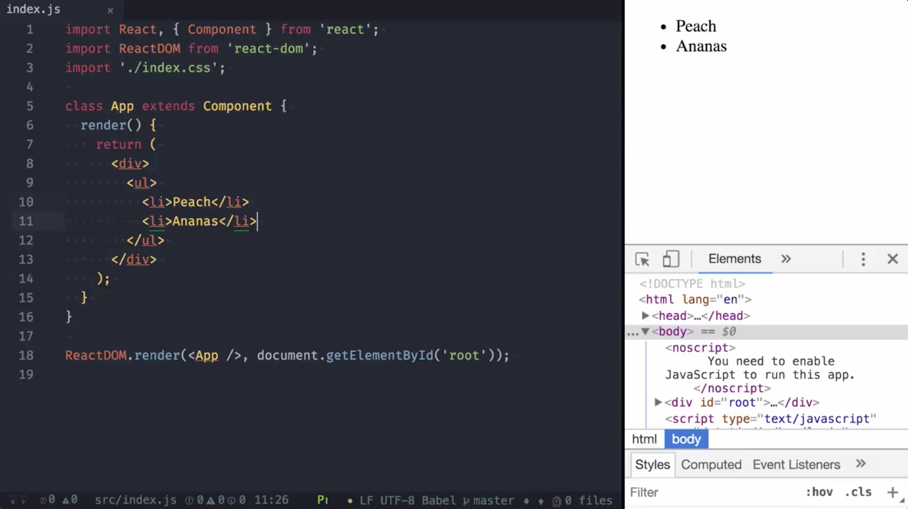
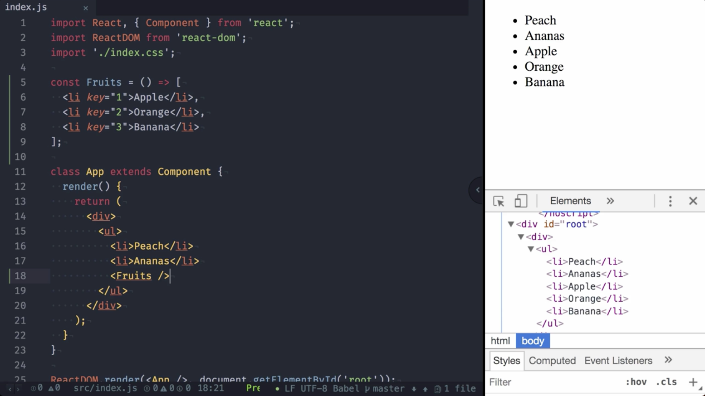
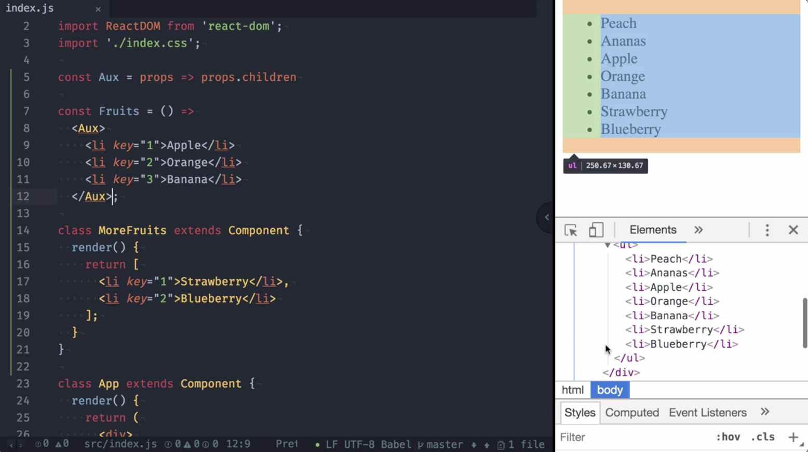
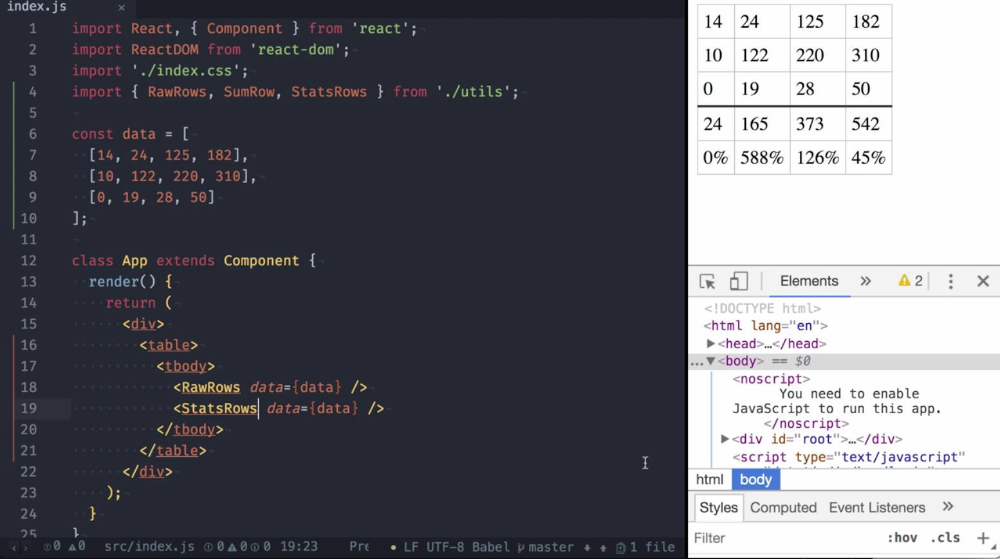
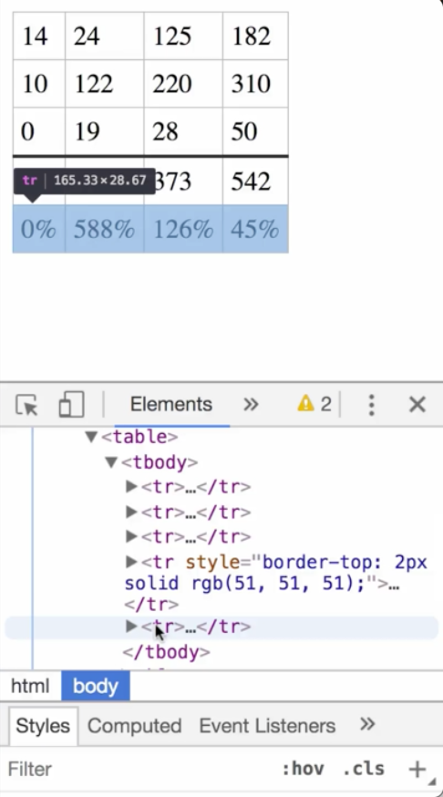

00:00 Here you can see an app rendering a list of fruits. 



In React 16, it's now possible to extend this list with a component containing multiple new entries. Let me demonstrate this by creating a function component, `Fruits`, a simple transitive array of multiple `<li>` elements.

```javascript
const Fruits = () => [
  <li key="1">Apple</li>,
  <li key="2">Orange</li>,
  <li key="3">Banana</li>
];
```

00:30 We rendered the component, `Fruits`, inside the unordered list, and as you can see, all fruits show up. When expecting the DOM, we can see all of them are rendered inside the same unordered list element.



00:42 Of course, rendering the list inside a class component also works. We add a `class` component, `MoreFruits`, and `render` two more fruits. One notable thing to mention here is that I use the `same keys` in the `Fruits` as well as in the `MoreFruits` component. Although they end up in the same DOM element, this works fine without any key warning shown in the console.

```javascript
class MoreFruits extends Component {
  render() {
    return [
      <li key="1">Strawberry</li>, 
      <li key="2">Blueberry</li>
    ];
  }
}
```

01:11 All right, so far, so good. One more feature of React 16 is that you can also return the past children themselves without a wrapping element. Let's create a `component` named `Aux`. It just returns `props.children`.

```javascript
const Aux = props => props.children
```

01:27 We can use this component, for example, to wrap all the list entries in our fruits component. This way, you don't need to use commas to render multiple elements, but the result will be exactly the same in the DOM.



01:45 These new possibilities allow you to create new component libraries that were impossible before. For example, you could create a table library where you have various components to render different kind of rows based on the same data set. I prepared a couple of components to demonstrate this. First, we have to `import` them.

```javascript
import { RawRows, SumRow, StatsRows } = './utils';
```

02:14 Then we create the `data` set. 

```javascript
const data = [
  [14, 24, 125, 182], 
  [10, 122, 220, 310], 
  [0, 19, 38, 50]
];
```

We add a `table` with a `table body`. Now, for example, `render` the `raw data` using the `RawRows` component. If you want to know the `sum`, we simply `append` another `row` using the `sum` component.

```javascript
class App extends Component {
  render() {
    return (
      <div>
        <table>
          <tbody>
            <RawRows data={data} />
            <SumRows data={data} />
          </tbody>
        </table>
      </div>
    );
  }
}
```

02:46 As you see in the DOM, all rows are still listed in the same table body. Now, we can take this even further by using our `StatsRows` component. This component renders the sum row as well as a trend row indicating the growth rate.



03:03 Now, let's have a look at the DOM. As you can see, we have multiple rows rendering the raw data. We have a sum row and we have the trend row, all in the same table body.

