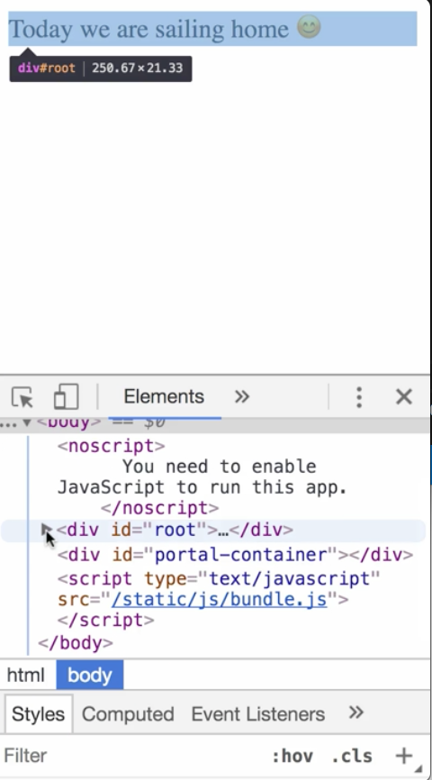

00:00 Here, you can see a `Comment` Component rendering some `text`. 

```javascript
class App extends Component {
  render() {
    return (
      <div>
        <Comment text="Today we are sailing home :)" />
      </div>
    );
  }
}
```

00:05 The comment's purpose is to modify the `text`, mainly replacing text smileys with smile emojis. It currently contains a wrapping `span`. Such wrapping elements were needed for components in React 15 or lower.

```javascript
const Comment = ({ text }) => {
  const emojifiedText = text
    .replace(':)', '😊')
    .replace(':D', '😀')
    .replace(':(', '🙁');
  return (
    <span>
      {emojifiedText}
    </span>
  );
};
```

00:19 Let's explore a DOM structure. As you can see, our component is wrapped in a `div`, then once more in a `span`. While the span doesn't cause any problems, it also doesn't add any value, and the whole DOM would be cleaner and a bit more lightweight without it.

React 16 makes this possible. We can update our `Comment` component to `return` just plain `text`. 

```javascript
const Comment = ({ text }) => {
  const emojifiedText = text
    .replace(':)', '😊')
    .replace(':D', '😀')
    .replace(':(', '🙁');
  return emojifiedText;
};
```

Let's refresh the page, and as you can see, the comment will still be rendered. When we inspect the DOM, you can see the unnecessary span is gone.

