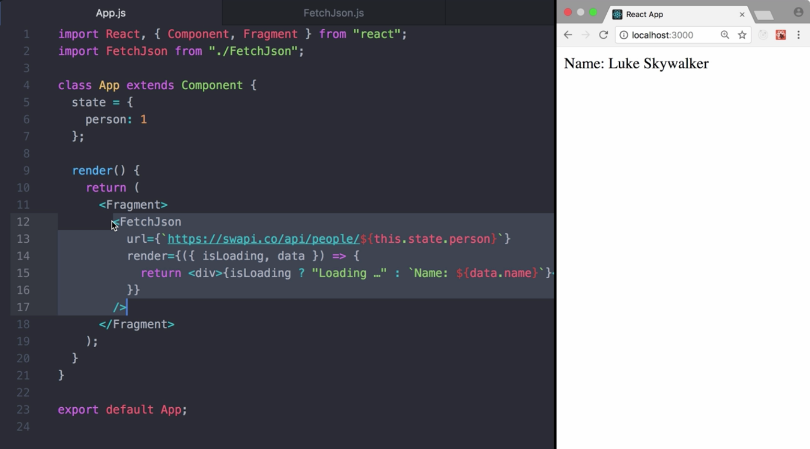
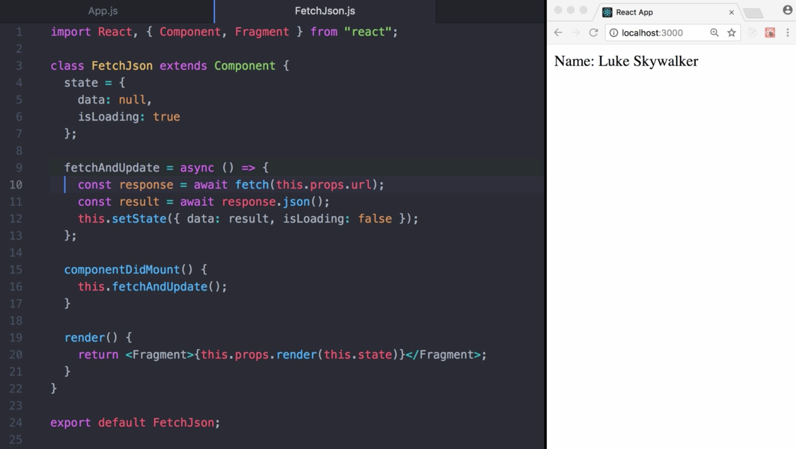
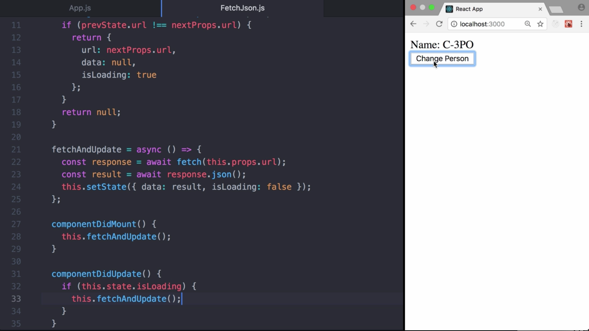
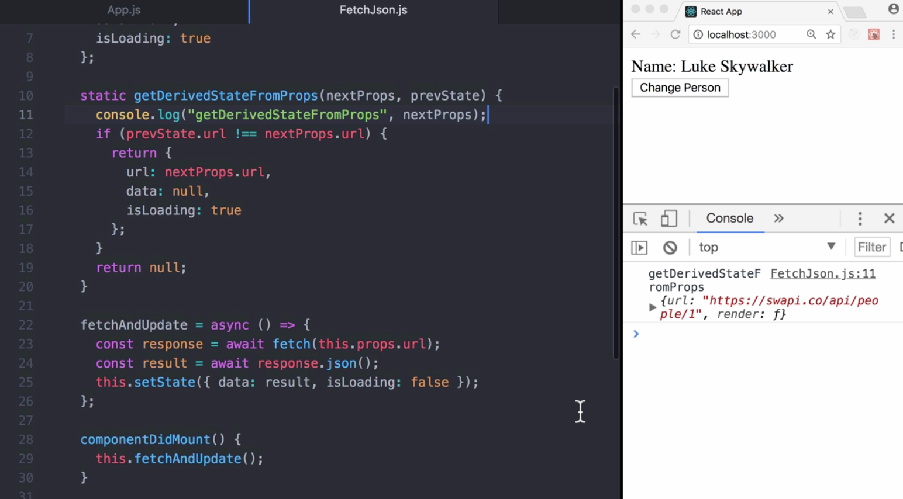
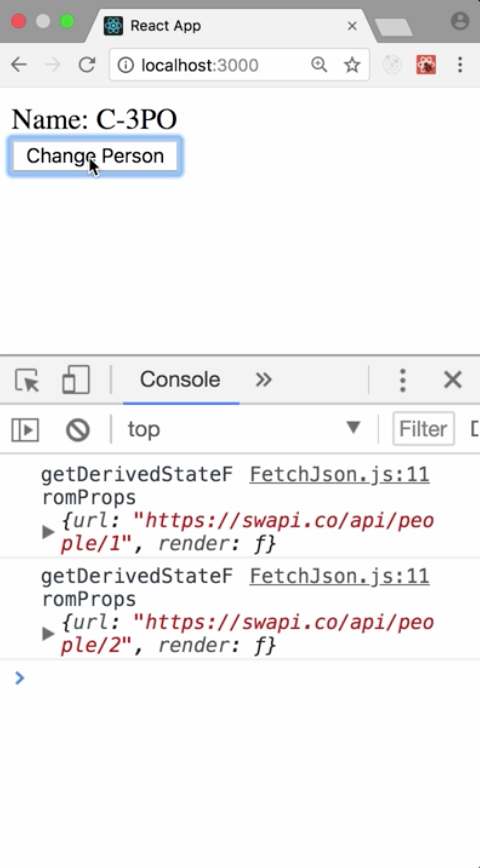
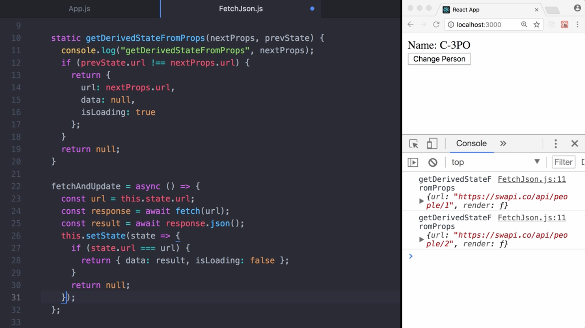
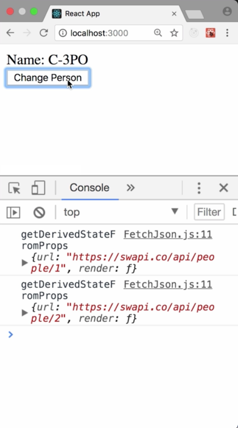

00:00 Here, we have an application fetching `person: 1` from the `Star Wars API` using a `FetchJson` component. This component accepts a render prop function. Its parameters are `isLoading` and `data`.

00:10 This way, we can show a loading indicator until the request is finished loading, and the name, once it's done. 



The `FetchJson` component stores `isLoading`, as well as `data` in the `state`. Both are updated once the request is finished.



00:28 So far so good. Now, we implement a `button` to change the person to be fetched in our application. When we click the button, nothing happens. This is the case because the component `FetchJson` only triggers a request on `componentDidMount`.

#### App.js
```javascript
class App extends Component {
  state = {
    person: 1
  };

  changePerson = () => {
    this.setState({ person: 2 });
  };

  render() {
    return (
      <Fragment>
        <FetchJson
          url={`https://swapi.co/api/people/${this.state.person}`}
          render={({ isLoading, data }) => {
            return <div>{isLoading ? "Loading …" : `Name: ${data.name}`}</div>;
          }}
        />
        <button onClick={this.changePerson}>Change Person</button>
      </Fragment>
    );
  }
}
```

00:48 To trigger a new request on every URL update, we can leverage `getDerivedStateFromProps`. It's a static function that receives two parameters, `nextProps` and `prevState`. It should `return` an object to update the `state`, a `null` to indicate that the new props do not require any state updates.

01:06 Our goal is to reset the state once a new url has been provided. Since we can't access previousProps, we have to stop the `url` in `state`. In `getDerivedStateFromProps`, we compare the previous url with the next one. Only if it changed, we reset data to `null` and `isLoading` to `true`.

#### FetchJson.js
```javascript
class FetchJson extends Component {
  state = {
    url: null,
    data: null,
    isLoading: true
  };

  static getDerivedStateFromProps(nextProps, prevState) {
    console.log("getDerivedStateFromProps", nextProps);
    if (prevState.url !== nextProps.url) {
      return {
        url: nextProps.url,
        data: null,
        isLoading: true
      };
    }

    return null;
  }
```

01:27 Last but not least, we need to make sure the new `url` is fetched inside `componentDidUpdate`. 

```javascript
componentDidUpdate() {
    if (this.state.isLoading) {
      this.fetchAndUpdate();
    }
  }
```

Voila. Our component works as expected. 



When is `getDerivedStateFromProps` invoked? Right after component is instantiated, as well as when it receives new props.

01:58 Note that if a parent component causes a component to rerender, this method will be called even if props have not changed. You may want to compare new and previous values if you only want to handle changes.





02:11 Keep in mind, because `getDerivedStateFromProps` is a static function, you won't have access to the component instance using this. While it has nothing to do with `getDerivedStateFromProps`, there's one more buck I want to highlight.

02:27 Clicking the button while another request is loading can lead to the situation that multiple requests are in process, and can finish. As you could see, briefly, `Luke Skywalker` was rendered.

02:38 Therefore, in `fetchAndUpdate`, it's best to store the url, and in the `setState` function, we can check if the `url` we fetched is the last one in the current state.



This time, `Luke Skywalker` wasn't rendered.

