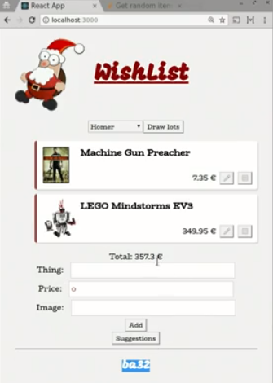

We now have multiple users in our application and multiple wish lists, but an important feature is missing. It's not possible yet to draw lots and to see what gifts you should buy for somebody else, which is, of course, the best part of the whole thing.

Let's introduce an action on our `Group`. We call it `drawLots`. 

#### Group.js

```javascript
.actions(self => ({
    drawLots() {

    })
)
```

We need to be able to store whose lots you draw, who's the recipient of your gifts. That sounds like the `recipient` of a user is another `User`. That looks quite nice, but this won't work.

```javascript
const User = types
    .model({
        id: types.identifier(),
        name: types.string,
        gender: types.enumeration("gender", ["m", "f"]),
        wishList: types.optional(WishList, {}),
        recipient: User
    })
```

The problem is that our data model is wrong. We model the `User` as having a `recipient` which is another `User`. However, the `User`, the `Recipient`, isn't a user per se. It's just a reference to another user. If we would put a new user in there, that would be weird. Then the user would own another user, which is not appropriate here.

On the other hand, if we assign a `User` to the `recipient` property, that means that our whole model tree is no longer a tree. That would make that `User` occur in two places in our state -- one, in the collection of our `users`, in the Group over here, and it will also be stored as the `recipient` over here.

mobx-state-tree will definitely throw if you try to do something like this, because everybody should be uniquely contained. That guarantees that we can serialize with the snapshots, that patches can be properly located, et cetera.

Instead of storing a user, we actually want to store a reference of the user. We could be storing its ID. We could change this to a `types` of `string`. 

```javascript
const User = types
    .model({
        id: types.identifier(),
        name: types.string,
        gender: types.enumeration("gender", ["m", "f"]),
        wishList: types.optional(WishList, {}),
        recipient: types.string
    })
```

This whole process of drawing lots is not trivial, I'm just going to paste in an implementation. Let's save this and see it in action.

```javascript
export const Group = types
    .model({
        users: types.map(User)
    })
    .actions(self => ({
        drawLots() {
            const allUsers = self.users.values()

            // not enough users, bail out
            if (allUsers.length <= 1) return

            // not assigned lots
            let remaining = allUsers.slice()

            allUsers.forEach(user => {
                // edge case: the only person without recipient
                // is the same as the only remaining lot
                // swap lot's with some random other person
                if (remaining.length === 1 && remaining[0] === user) {
                    const swapWith = allUsers[Math.floor(Math.random() * (allUsers.length - 1))]
                    user.recipients = swapWith.recipient
                    swapWith.recipient = self
                } else
                    while (!user.recipient) {
                        // Pick random lot from remaing list
                        let recipientIdx = Math.floor(Math.random() * remaining.length)

                        // If it is not the current user, assign it as recipient
                        // and remove the lot
                        if (remaining[recipientIdx] !== user) {
                            user.recipient = remaining[recipientIdx]
                            remaining.splice(recipientIdx, 1)
                        }
                    }
            })
        }
    }))
```


If we now draw the lots, we have recipient, but it's not the most readable. 



This is apparently the person with this ID. Probably we should be rendering the user's name here, but we just stored an ID. To get back the name, we could introduce a view function on the `User`, which returns the person we drew.

For example, we call it `other`, and we just say in our parent -- which is the map place -- "Get me the person who's ID I'm using." 

```javascript
.views(self => ({
    get other() {
        return getParent(self).get(self.recipient)
    }
}))
```

Now we can simply say, "Does the user have another person?" Then we render his `name`. 

#### App.js
```javascript
<h2>{user.other ? user.other.name : ""}</h2>
```

We created a small function to do a look-up, and now we see a nice name, `Lisa`.

Now this works. In the model, we now have `recipients`, stored as string, which is basically the foreign key of the user we want to have here. Then, we created a view that looks up the parents. You can even imagine creating actions, where you can assign `recipients` the same way, and then actually store their ID. That would look like this.

#### Group.js
```javascript
.actions(self => ({
    setRecipient(recipient) {
        self.recipient = recipient.id
    }
}))
```

You can imagine this view and setter for each foreign reference you have becomes a bit boiler-plating. That is why mobx-state-tree has first-class support for this mechanism. My original problem was that we couldn't set the User here, because this would break that tree model.

We can assign, as recipients, a `reference` to a `User`. A `reference` is a very special type, which does all the `reference` resolving for us in the background. Behind the scenes, it stores the ID of the `User` we're talking about. You don't have to do all the view and action fluff, you can lose that.

```javascript
recipient: types.reference(User)
```

To know whether your ID is of a type, you need to identify one attribute as being an `identifier`, which is a special type expressing, "This ID uniquely identifies my instance."

```javascript
id: types.identifier()
```

Now, we can simplify our code, because we just directly assign `recipients`. Now, reading and writing uses first class, but still, in the background, if we would check out the snapshots, just the ID would be stored.

We get one error, and that is the fact that it says, "Hey, user is not defined yet." That's because this constant in JavaScript is not yet assigned, while we refer it here. Basically, we have a recursive type definition, because the type of `User` needs to be known to construct the reference, which needs to be known to construct the `User` type.

```javascript
const User = types
    .model({
        id: types.identifier(),
        name: types.string,
        gender: types.enumeration("gender", ["m", "f"]),
        wishList: types.optional(WishList, {}),
        recipient: types.reference(User)
    })
```

Luckily, there's a simple fix for it. We can defer knowing the type. We can simply say `types.late`, and return `User` from that. 

```javascript
recipient: types.reference(types.late(() => User))
```

This signals only when you actually really needed to know the type. It then evaluates this expression. That fixes the issue that the `User` type is not know up front and that the type is circular. Now, we have a circular type definition without issues that the type cannot be resolved.

Now the issue is that, when we start our state, we don't have a `recipient`, so the reference is empty. We need to express in our type system that we allow a reference to be empty. We can do that by using the `maybe` type again. A `recipient` is either null or it's a reference to a User.

```javascript
recipient: types.maybe(types.reference(types.late(() => User)))
```

Now, in our component, we also can get rid of that whole `other` thing and we can just make `user.recipient` here again. 

#### App.js
```javascript
<h2>{user.recipient ? user.recipient.name : ""}</h2>
```

Now, if we have Homer, then we have a really nice reference to Lisa.

Now, we can also improve our actual rendering a bit and actually show you what gifts we have to buy. We can just reuse the `WishListView`, and this time, we render the wish list of the `recipient`. Ideally, we should render this wish list `readonly`. 

```javascript
 {user.recipient && <WishListView wishList={user.recipient.wishList} readonly />}
```
After all, it shouldn't be edited by this user. If we now view Homer, then he can also see Lisa's list with the gifts he has to buy.

#### WishListView.js

```javascript
const WishListView = ({ wishList, readonly }) => (
    <div className="list">
        <ul>
            {wishList.items.map((item, idx) => (
                <WishListItemView key={idx} item={item} readonly={readonly} />
            ))}
        </ul>
        Total: {wishList.totalPrice} €
        {!readonly && <WishListItemEntry wishList={wishList} />}
    </div>
)
```

#### WishListItemView.js

```javascript
 constructor() {
    super()
    this.state = { isEditing: false }
}

render() {
    const { item, readonly } = this.props
    return this.state.isEditing ? (
        this.renderEditable()
    ) : (
        <li className="item">
            {item.image && }
            <h3>{item.name}</h3>
            <span>{item.price} €</span>
            {!readonly && (
                <span>
                    <button onClick={this.onToggleEdit}>✏</button>
                    <button onClick={item.remove}>❎</button>
                </span>
            )}
        </li>
    )
}

renderEditable() {
    return (
        <li className="item">
            <WishListItemEdit item={this.state.clone} />
            <button onClick={this.onSaveEdit}>💾</button>
            <button onClick={this.onCancelEdit}>❎</button>
        </li>
    )
}
```