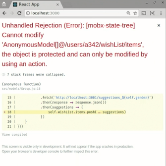
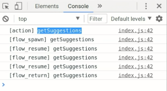

Now our application has multiple users, but all the wish lists are empty, which is a bit sad. Let's create a small service that can do us some suggestions for our wish list so that we don't have to type them all during this tutorial.

To create a service, I'm going to using a small utility, and it's called `json-server`. `json-server` basically takes a small database, a JSON file, and it generates REST service around that. I'm going to fill this database with some data.

I have suggestions for women. I know my wife likes the notebooks, so that's probably a good suggestion. Everybody loves Mindstorms. There's also a list of suggestions for males.

Now I can simply start the `json-server`, based on this file, and I give the different port, because create-react-app already uses 3000. 

#### Terminal
```bash
yarn run json-server --port 3001 db.json
```

Now I can simply go to these resources, and this gets me my suggestions. 

#### json-sever

```javascript
http://localhost:3001/suggestions_f
http://localhost:3001/suggestions_m
```

Let's go to the User model, and I'll introduce a new action. I call it `getSuggestions`.

#### Group.js

```javascript
 .actions(self => ({
        getSuggestions() {}
    }))
```

We'll implement it bit later, but first we're going to call it from the UI. We go back to our `App`, and you say, if there's a `selectedUser`, then I want a `button`. When we click the button, we simply call the action we just introduced. Obviously, this doesn't do anything yet, so let's implement it.

#### App.js
```javascript
 {selectedUser && <button onClick={selectedUser.getSuggestions}>Suggestions</button>}
```

Here we have our empty action and we need to fetch the data. We can do that by using `windows.fetch`. For now, it just hard-codes the URL. The suggestions we need depends on the gender of our user, so we insert `self.gender` over here.

It returns as a promise of a `response`. From this `response`, we need a `json`, pass the JSON, and then we actually have our `suggestions` displaying data.

#### Group.js
```javascript
.actions(self => ({
    getSuggestions() {
        window.fetch(`http://localhost:3001/suggestions_${self.gender}`)
        .then(response => response.json())
        .then(suggestions => {
            alert(JSON.stringfy(suggestions))
        })
    })
}))
```

Let's try. If you press the button, we get some raw data back, so that seems right.


Let's add these `suggestions` to the wish list. We can simple pass in the `suggestions`, and it will take the `suggestions` and turn them into `wishList` entries based on the model definitions of `wishList.items`. 

```javascript
.actions(self => ({
    getSuggestions() {
        window.fetch(`http://localhost:3001/suggestions_${self.gender}`)
        .then(response => response.json())
        .then(suggestions => {
            self.wishList.items.push(...suggestions)
        })
    })
}))
```

However, if we try this, you'll see we can get an exception. An exception is that we cannot modify without using an action.



The problem is that, because this whole process is asynchronous, this block of code is no longer executed in the context of an action. By default, mobx-state-tree forbids that, so we should have a separate action to add the item. Let's rewrite this to `self.addSuggestions` and pass in the `suggestions`.

Now we have an explicit action. 

```javascript
.actions(self => ({
    getSuggestions() {
        window.fetch(`http://localhost:3001/suggestions_${self.gender}`)
        .then(response => response.json())
        .then(suggestions => {
            self.addSuggestions(suggestions)
        })
    },
    addSuggestions() {
        self.wishList.items.push(...suggestions)
    }
    )
}))
```

This works. We've now got the suggestions added.

Of course, we could also rewrite this using async/await. We could write `async` suggestions, and then the responses `awaits` the fetch, and suggestions `awaits` response of JSON. Now we can call `self.addSuggestions`. We now use async/await and it still works the same.

```javascript
.actions(self => ({
    async getSuggestions() {
        const response = await window.fetch(`http://localhost:3001/suggestions_${self.gender}`)
        const suggestions = await response.json()
        self.addSuggestions(suggestions)
    },
    addSuggestions() {
        self.wishList.items.push(...suggestions)
    }
    )
}))
```

However, the sad thing is that we still cannot inline this over here. The reason is that only the first tick of an async process is part of the action. The rest is still asynchronous.

However, mobx-state-tree has something more powerful than async/await. It can use generators.

Generators are very powerful, because MobX can track a generator and make sure that each tick inside a generator is part of the original action. Let's change this to MobX using generators. To use generators, you need a small utility called `flow` form mobx-state-tree. It basically stands for this is an asynchronous process flow.

```javascript
import { types, flow } from "mobx-state-tree"
```

`getSuggestions` will be a `flow`, a generation function. You can recognize generator functions from the star index. The goal is to inline these assignments. In generators, you cannot use `await`, but you can use `yield`. Semantically, they do the same.

Where we first had async/await, we now have, instead of async, `flow` generator function. Instead of await, we have `yield`. Now our new action looks like this.

```javascript
.actions(self => ({
    getSuggestions: flow(function * () {
        const response = yield window.fetch(`http://localhost:3001/suggestions_${self.gender}`)
        const suggestions = yield response.json()
        self.wishList.items.push(...suggestions)
    })
}))
```

It's still an asynchronous action, but every part of it is executed within the context of the current instance. We can now add `suggestions`.

This works as expected, without exception, and we can safely make those assignments, even though it happens in the far future. `yield`, in combination with the generator, makes sure that we re-enter this action and continue executing code in the context of the action we defined.

This is how you write asynchronous processes in mobx-state-tree. It works semantically the same as async/await, so you can wait promises and do all the things you typically do. It's just syntactically a little bit different, but it has lots of potential power.

Just to give you a very small sneak preview of that, we're going to log what the `flow` does at run time. We add quickly a very simple middleware as sneak preview, and we log some basic information of this invocation. Let's see what happens.

```javascript
addMiddleware(group, (call, next) => {
    console.log(`[${call.type}] ${call.name}`)
    next(call)
})
```



The `getSuggestions` action starts. Later on, it resumes after the first yield, it resumes after the second yield, and then it returns.

Then the process is finished. We have a very fine-grain control over what happens in our asynchronous processes.