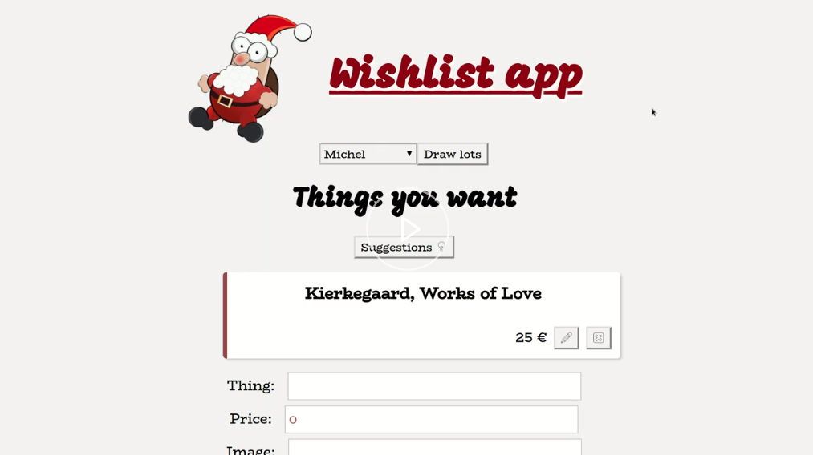
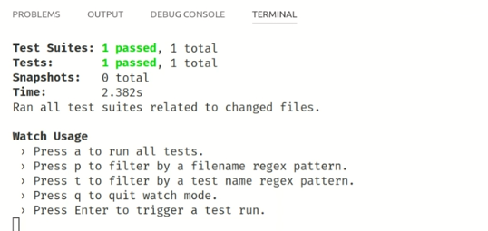
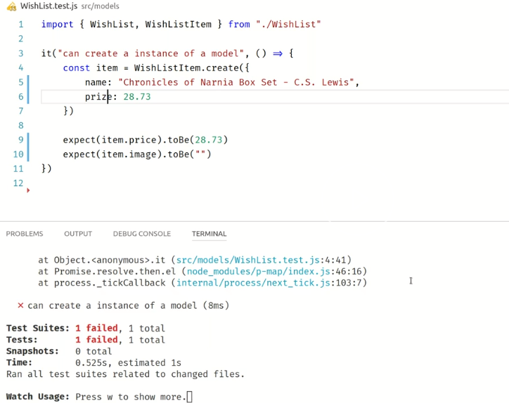
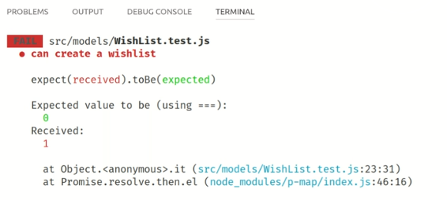
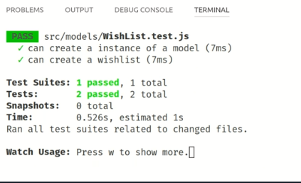
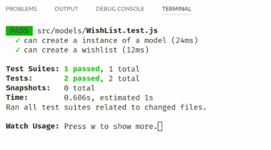

Hi there, and welcome to this introduction tutorial to MobX State Tree. MobX State Tree is basically a library that helps you to organize your application states in a very structured manner. Basically, it allows you to create a component model, but for your data.

In this tutorial, we will be building a small wish list application, very applicable to the current season. What you can do is add some items to the list of things you wish. You can even get some suggestions.



After that, when all the users have entered their lists, you can draw lots. Then you can see which things you have to buy and for whom, so that you can have a great exchange of gifts.

This tutorial will be based on the `create-react-app`, especially because it gives us a modern development environment. Later on, we will be looking into React, but first we will be purely focusing on the data. We'll be starting by generating an initial application.

Now our initial application is generated, and we will be adding some dependencies by `mobx`, `mobx-react`, and `mobx-state-tree`. `mobX-state-tree` is all about models, so we will be starting by opening our recently generated project.

Here we have our empty project, and we'll start by adding new folders to contain the `models` of our application. A model simply describes what your data looks like. Let's start very simple by describing what our data or our model of an item in our wish list looks like.

Here is a piece of data that might describe, in JSON, what one single item might look like. 

#### WishList.js

```javascript
import { types } from "mobx-state-tree"

const data = {
    "name": "Chronicles of Narnia Box Set",
    "price": 28.73,
    "image": "https://images-na.ssl/....png"
}
```

These pieces of plain data is what we refer to in `mobx-state-tree` or MST terms as snapshots. With that, we can start describing the shape of our data.

We're going to model an object. An object has a few properties. 

```javascript
const WishListItem = types.model({

});
```
You might know that this is very similar to how, for example, prop types work in React. Each item has a `name`, which is a `string`. It has a `price`, which is a `number`.

```javascript
const WishListItem = types.model({
    name: types.string,
    price: types.number
});
```

It has an `image`, which is also a `string`, but since it's not always set, we want to define that this piece of information can be skipped in our data. We can mark it as `optional`. We say if it's not available in the snapshot, in the data, then just use an empty string.

```javascript
const WishListItem = types.model({
    name: types.string,
    price: types.number,
    image: types.optional(types.string, "")
});
```

We can write this more efficiently by just saying this field defaults to an empty string, and MST will infer that to being an optional string.

```javascript
const WishListItem = types.model({
    name: types.string,
    price: types.number,
    image: ""
});
```

With that, we can already create a first test. Let's set up a simple test suite. Since `create-react-app` comes already with jest built in and preconfigured, it's pretty easy to get started with testing. In this file, we `export` the definition of our wish list item. 

```javascript
export const WishListItem = types.model({
    name: types.string,
    price: types.number,
    image: ""
})
```
Then, in our test, we can just import it.

#### WishList.test.js

```javascript
import { WishList } from "./WishList"
```
Now we can describe a simple test that says it can `create an instance of a model`. We use the type we just created and call the `create` model on it, and its create method expects a snapshot. We can put in this piece of data we have over here, and then we can create some assertions on it.

```javascript
it("can create a instance of a model", () => {
    const item = WishListItem.create({
        name: "Chronicles of Narnia Box Set - C.S. Lewis",
        price: 28.73,
        image:
            "https://images-na.com/sometestimage.gif"
    })

    expect(item.price).toBe(28.73)
})
```

This might look like a very boring test to you so far, but let's try it. 

```javascript
yarn test
```
We see that it nicely passes the test. 



However, we could change the test a bit. We could, for example, skip that whole `image` field. If it's not set, then we expect it to become an empty string.

```javascript
expect(item.image).toBe("")
```

Because we defined the shape of our data, `mobx-state-tree` can actually verify the data we pass in. If we would have wrongly spelled the `price`, we would be getting an exception. 



It says, `at path /price`, the value is `undefined` and `not assignable`.

Of course, this is not very interesting so far. You'll understand that this data model doesn't suffice for our application. Actually, what we need is a list of these items, so let's go back to our model definition and let's also start to define the type of our `WishList`.

The wish list which powers this application is a model. It has `items`, and these `items` are an array of the type we just defined earlier. 

#### WishList.js

```javascript
export const WishList = types.model({
    items: types.array(WishListItem)
})
```

What we now did is we built a type composition, so `WishList` is expressed in terms of WishListItems.

Of course, we can define this one as `optional`, as well and say, if it's not provided in the data when we instantiate this model, it's initialized with an empty array.

```javascript
export const WishList = types.model({
    items: types.optional(types.array(WishListItem), [])
})
```

Let's put this to the test again. We still have our test running here. Now we know for sure that we `can create a wish list`. The wish list consists of `items`, and we can already provide the data for some of these `items` by just copy/pasting this.

#### WishList.test.js

```javascript
it("can create a wishlist", () => {
    const list = WishList.create({
        items: [
            {
                name: "Chronicles of Narnia Box Set - C.S. Lewis",
                price: 28.73
            }
        ]
    })
})
```

Now we are pretty sure that the amount of items in this list is zero. 

```javascript
expect(list.items.length).toBe(0)
```



No, of course not. It is one, because we provided an initial piece of data to the model instance. 

```javascript
expect(list.items.length).toBe(1)
```


The list is just a normal JavaScript object, so we can navigate to the list we constructed. It has `items`, and items have a `price`.

```javascript
 expect(list.items[0].price).toBe(28.73)
```



What we did so far is that we just transformed JSON into model instances. We will see how powerful this is when we move on.