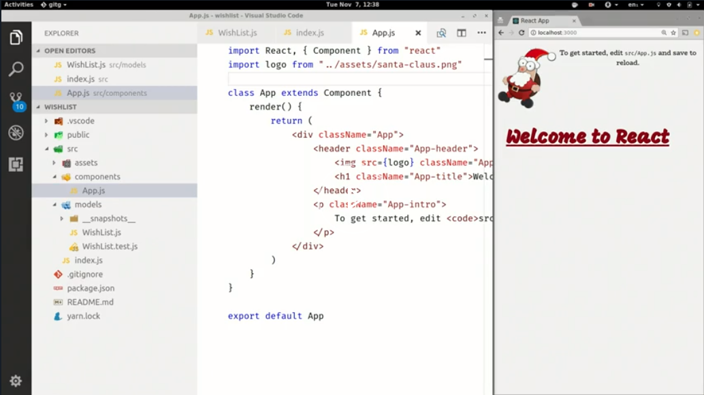

Now, after those first few lessons, I can imagine you get a little bit bored by looking at just the churn or output. Let's start using our models in a React application and build some UI.

We have a React application and our codes, side by side. Let's just quickly modify our default set a bit.

`mobx-state-tree`, as you saw, is not very much related to React itself. Actually, it doesn't do anything specifically for React. Because it's powered by MobX behind the scenes, we can use the default MobX-React bindings and have a user interface that automatically reacts to any change you made.



This doesn't do anything, of course, yet. Let's expand the `App`. Let's introduce some additional components that render our data.

First, I'm going to create a component that renders a single `WishList` entry. I call it a `WishListItemView`. I put this in this tutorial to make it easily distinguished from the model files. Of course, that's usually less of an issue.

This is not too complicated, a simple function component that renders an individual `item`. I give it a `className`, which basically gives it at least decent styling. We render the image whenever there's something, a URL provided.

#### WishListItemView.js
```javascript
import React from "react"

const WishListItemView = ({ item }) => (
    <li className="item">
        {item.image && }
        <h3>{item.name}</h3>
        <span>{item.price}</span>
    </li>
)

export default WishListItemView
```

Let's render a list of those items. That, of course, needs the component we just created. 

#### WishListView.js
```javascript
import React from "react"

import WishListItemView from "./WishListItemView"
```

If in a `wishList` model, this is how it would render it. We map over all of the `items` and we render them.

For now, for simplicity, I use `idx` index, which is not something you would normally do. We'll get back to that later. We pass the `item`. This instance should render to the `WishListItemView` component.

```javascript
import React from "react"

import WishListItemView from "./WishListItemView"

const WishListView = ({ wishList }) => (
    <div classname="list">
        <ul>{wishList.items.map((item, idx) => <WishListItemView key={idx} item={item} />)}</ul>
    </div>
)

export default WishListView
```

Now, we carry this component, as well. We just have to use it in our `App` component. 

#### App.js
```javascript
import React, { Component } from "react"
import logo from "../assets/santa-claus.png"

import WishListView from "./WishListView"

class App extends Component {
    render() {
        return (
            <div className="App">
                <header className="App-header">
                    
                    <h1 className="App-title">WishList</h1>
                </header>
               
            </div>
        )
    }
}

export default App
```

Of course, we should make sure that we pass these properties in, as well. Let's pass it to the `WishList` we created here in the index, to the application.

#### index.js
```javascript
import { WishList } from "./models/WishList"
```

We populate our `wishList` with some initial data, with things that I would find cool to receive at Christmas. 

```javascript
const wishList = WishList.create({
    items: [
        {
            name: "LEGO Mindstorms EV3",
            price: 349.95,
            image: "https://images-na.ssl-images-amazon.com/images/I/71CpQw%2BufNL._SL1000_.jpg"
        },
        {
            name: "Miracles - C.S. Lewis",
            price: 12.91,
            image:
                "https://images-na.ssl-images-amazon.com/images/I/51a7xaMpneL._SX329_BO1,204,203,200_.jpg"
        }
    ]
})
ReactDOM.render(<App wishList={wishList} />, document.getElementById("root"))
```

There we have it, my super favorite, `WishListView`.

#### App.js
```javascript
 render() {
        return (
            <div className="App">
                <header className="App-header">
                    
                    <h1 className="App-title">WishList</h1>
                </header>
                <WishListView wishList={this.props.wishList} />
            </div>
        )
    }
```

That is that. Actually, it doesn't do much interesting stuff. It's just rendering static data out to the dom. What we could do, for example, to prove this, we could create an interval that's every second. Make this product more expensive.

#### index.js
```javascript
setInterval(() => {
    wishList.items[0].changePrice(wishList.items[0].price + 1)
}, 1000)
```

That's a pretty stupid feature, but it's just to demonstrate that this UI is, so far, completely static. Nothing happens here. However, that is something that can easily be changed by levering the `mobx-react` bindings.

What we do is we go to the `WishListView`, and we `import { observer } from "mobx-react"`. `observer` makes sure that whenever data is changed -- data that was relevant for the rendering of component -- that component re-renders.

#### WishListView.js
```javascript
import React from "react"
import { observer } from "mobx-react"

import WishListItemView from "./WishListItemView"

const WishListView = ({ wishList }) => (
    <div classname="list">
        <ul>{wishList.items.map((item, idx) => <WishListItemView key={idx} item={item} />)}</ul>
        Total: {wishList.totalPrice} €
    </div>
)

export default observer(WishListView)
```

If we save these changes, we'll now see that this price and the items are consistently changing. Every second, the price increases, so both components are re-rendering.

If you use, for example, the MobX devtools, which you can find in the Chrome or Firefox extension stores, you can actually see the components re-rendering. While it's a bit hard to see on this resolution, this component and the other one are both re-rendering. Relevant data changes, but this book-item doesn't.

If I just remove this line, so I don't render the list anymore, it refreshes. You'll see just this component updates every second. It is because of how MobX works. It tracks where there's something relevant for the observer component changes, and only re-renders in that case.

Connecting `mobx-state-tree` to React is as simple as using `observer` from the `mobX-react` package.